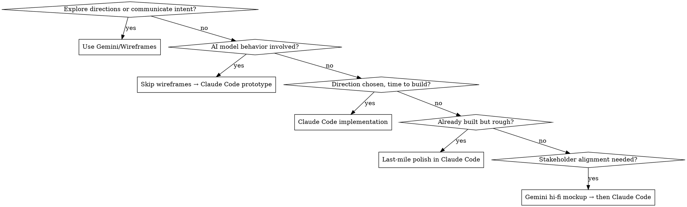

# AI-Era Design Process

## Overview

Traditional design process (discovery → diverge/converge → mock → iterate) is largely dead. Two types of design work now exist:

1. **Execution Support** — Helping engineers implement, polish, and stay aligned as they ship rapidly using AI coding tools
2. **Direction Setting** — Creating 3–6 month prototyped visions (not decks) that point teams toward a coherent north star

Based on frameworks from Jenny Wen (Head of Design at Anthropic/Claude).

## When to Use

- Deciding between mockups vs code prototypes
- Advising design teams on AI tool adoption
- Evaluating designer hiring/roles
- Setting quality standards for fast-shipping teams
- Navigating designer-engineer collaboration
- Planning design vision cycles

## Tool Decision Framework

## Tool Stack

| Tool | Purpose | When |
|------|---------|------|
| **Claude Code** | Implementation, last-mile polish, AI feature prototypes, codebase edits | Anything that needs to exist in code |
| **Gemini/Image Gen** | Design exploration, mockups, wireframes (lo-fi and hi-fi) | Non-linear visual exploration, direction divergence, communicating intent before coding |

**Handoff Rule:** Gemini owns work until direction is chosen and layout is agreed. Claude Code takes over when it's time to build, prototype AI behavior, or polish live implementation.

## Core Principles

### 1. Stop Gatekeeping Shipping
Engineers can spin up scrappy versions with AI tools. Steer quality and direction — don't approve before anything ships.

### 2. Explain Why, Not Just What
- ❌ "Move this button here."
- ✅ "We need a button here because research shows users don't realize they can prompt this."

### 3. Prototype AI Features in Code
Non-deterministic AI behavior cannot be accurately mocked in static designs. Build real prototypes to see actual states, edge cases, and failure modes.

### 4. Last-Mile Polish Is a Design Task
When engineers ship first versions, go directly into the codebase to polish spacing, color, micro-interactions. This is a core design responsibility.

### 5. Point Engineers to the Design System
Claude Code won't always pick up design system components automatically. Include coded components, tokens, and documentation in your prompts.

### 6. Build Trust Through Speed
- Ship early with "Research Preview" label if value outweighs roughness
- Publicly commit to iterating and make commitment visible
- Respond to user feedback fast
- Trust erodes when you ship rough then go silent — not from shipping rough itself

### 7. Shorten Vision Cycles
- Retire 2–5 year vision decks — technology changes too fast
- Replace with 3–6 month working prototypes
- Run quarterly direction sessions

## Time Allocation Shift

| Activity | Old | New |
|----------|-----|-----|
| Mocking/prototyping | 60–70% | 30–40% |
| Jamming with engineers | 20–30% | 30–40% |
| Direct code implementation | ~10% | Remaining |

## Designer Archetypes (Hiring)

| Archetype | Description | Best For |
|-----------|-------------|----------|
| **Execution Partner** | Comfortable in Claude Code, works with engineers, does last-mile polish directly | High-velocity shipping |
| **Direction Setter** | Systems thinker, builds 3–6 month prototyped visions, aligns teams | Complex products with parallel contributors |
| **Craft Specialist** | Deep visual/interaction taste, high-quality output on flagship surfaces | Brand-defining features |

## Feature Maturity Tiers

| Tier | Description | Requirements |
|------|-------------|--------------|
| **Research Preview** | Early, known flaws, ships with promise to iterate | Public acknowledgment + visible fix cadence |
| **Polished Release** | Full design coverage, production-ready | Complete design coverage |

## Common Mistakes

| Mistake | Fix |
|---------|-----|
| Using Gemini for AI feature prototypes | Skip wireframes → Claude Code prototype with real model |
| Creating 2–5 year vision decks | Build 3–6 month working prototypes instead |
| Approving before engineers ship | Steer quality and direction instead of gatekeeping |
| Leaving polish to engineers | Do last-mile polish in Claude Code yourself |
| Generic "move this here" feedback | Always explain the principle behind the change |

## Tone

Direct, experienced, practical. No jargon for jargon's sake. Give concrete examples. Default to recommending action over discussion. Acknowledge the process is still evolving — "this might look different in 3 months" is okay.
