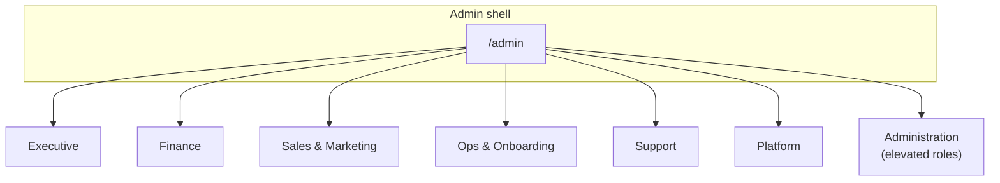

# Admin Navigation Map

> Generated from `lib/admin/feature-registry.ts` (sidebar source of truth)  
> Date: 2026-07-26  
> Host: Contabo VPS (`/home/circletel`)  
> UI pages on disk: **170** under `app/admin`

This document maps the admin console as rendered by the workspace-scoped sidebar.
Deep-link and orphan routes (pages on disk but not in nav) are listed at the end.

---

## Workspace overview



| Workspace | ID | Roles |
|---|---|---|
| Executive | `executive` | super_admin, product_manager, editor, viewer |
| Finance | `finance` | super_admin, product_manager, editor |
| Sales & Marketing | `sales` | super_admin, product_manager, editor |
| Ops & Onboarding | `ops` | super_admin, product_manager, editor |
| Support | `support` | super_admin, product_manager, editor, viewer |
| Platform | `platform` | super_admin, product_manager, editor |
| Administration | `admin` | super_admin, product_manager only |

---

## Full nav tree (sidebar)

```mermaid
flowchart LR
  subgraph EXEC["1 ? Executive"]
    DASH["Dashboard ? /admin"]
  end

  subgraph FIN["2 ? Finance"]
    BR["Billing & Revenue"]
    BR --> BR1["Dashboard /admin/billing"]
    BR --> BR2["Customers /admin/billing/customers"]
    BR --> BR3["Invoices /admin/billing/invoices"]
    BR --> BR4["Outstanding /admin/finance/outstanding"]
    BR --> BR5["AR Analytics /admin/finance/ar-analytics"]
    PAY["Payments"]
    PAY --> P1["Provider Monitoring"]
    PAY --> P2["Transactions"]
    PAY --> P3["Reconciliation"]
    PAY --> P4["Webhooks"]
    PAY --> P5["Settings"]
  end

  subgraph SALES["3 ? Sales & Marketing"]
    PROD["Products"]
    PROD --> PR1["Product Workspace"]
    PROD --> PR2["Add Product"]
    QT["Quotes"]
    QT --> Q1["All Quotes"]
    QT --> Q2["Pending Approval"]
    QT --> Q3["Accepted"]
    SUPP["Suppliers"]
    SE["Sales Engine"]
    SE --> SE1["Dashboard"]
    SE --> SE2["Briefing"]
    SE --> SE3["Zones"]
    SE --> SE4["Lead Scoring"]
    SE --> SE5["Pipeline"]
    SE --> SE6["Demographics"]
    SE --> SE7["Heat Map"]
    SE --> SE8["Execution Plan"]
    FEAS["B2B Feasibility"]
    COVCHK["Coverage Checker"]
    CPQ["CPQ Builder"]
    PART["Partners"]
    PART --> PA1["All Partners"]
    PART --> PA2["Pending Approvals"]
    COMP["Competitor Analysis"]
    COMP --> C1["Dashboard"]
    COMP --> C2["Providers"]
    COMP --> C3["Matching"]
    MKT["Marketing"]
    MKT --> M1["Dashboard"]
    MKT --> M2["Promotions"]
    MKT --> M3["Campaigns"]
    MKT --> M4["No Coverage Leads"]
    MKT --> M5["Campaign Builder"]
    MKT --> M6["Analytics"]
    CMS["CMS Management"]
    CMS --> CM1["Pages"]
    CMS --> CM2["Media Library"]
    CMS --> CM3["Page Builder"]
  end

  subgraph OPS["4 ? Ops & Onboarding"]
    CON["Contracts"]
    CON --> CO1["All / Pending Signature / Active"]
    ORD["Orders ? /admin/orders"]
    FUL["Order Fulfillment"]
    FUL --> F1["Dashboard"]
    FUL --> F2["Device Stock"]
    FUL --> F3["Dispatch Queue"]
    FUL --> F4["Pending Activation"]
    FO["Field Operations"]
    FO --> FO1["Dashboard"]
    FO --> FO2["Technicians"]
    FO --> FO3["Jobs"]
    FO --> FO4["Installation Schedule"]
    B2B["B2B Customers"]
    B2B --> B1["Clinic Onboarding"]
    B2B --> B2["Manual Onboarding"]
    B2B --> B3["Document Vetting"]
    B2B --> B4["All B2B Customers"]
    B2B --> B5["Site Details"]
    B2B --> B6["Journey / Blocked"]
    CORP["Corporate Clients"]
    CORP --> CR1["All Corporates"]
    CORP --> CR2["Add Corporate"]
    APPR["Approvals ? /admin/workflow"]
    KYC["KYC Review"]
    KYB["KYB Compliance"]
    DOCS["Document Reviews"]
  end

  subgraph SUP["5 ? Support"]
    CUST["Customers ? /admin/customers"]
    CDEV["Customer Devices"]
    DIAG["Diagnostics"]
  end

  subgraph PLAT["6 ? Platform"]
    COV["Coverage"]
    COV --> CV1["Dashboard"]
    COV --> CV2["Analytics"]
    COV --> CV3["Testing"]
    COV --> CV4["Providers"]
    COV --> CV5["Maps"]
    COV --> CV6["Base Stations"]
    COV --> CV7["DFA Buildings"]
    NET["Network Management"]
    NET --> N1["Devices"]
    NET --> N2["System Health"]
    NET --> N3["Analytics"]
    NET --> N4["Network Map"]
    NOTIF["Notifications"]
    INT["Integrations"]
    INT --> I1["Overview"]
    INT --> I2["Zoho CRM / Sign"]
    INT --> I3["WhatsApp Campaign"]
    INT --> I4["Interstellio RADIUS"]
    INT --> I5["OAuth / Webhooks"]
    INT --> I6["API Health / Cron"]
  end

  subgraph ADM["7 ? Administration"]
    ORCH["Orchestrator"]
    USR["Users"]
    USR --> U1["All Users"]
    USR --> U2["Roles & Permissions"]
    USR --> U3["Activity Log"]
    SET["Settings"]
  end
```



---

## Compact hierarchy

```
/admin
??? 1 Executive
?   ??? Dashboard                          ? /admin
?
??? 2 Finance
?   ??? Billing & Revenue
?   ?   ??? Dashboard                      ? /admin/billing
?   ?   ??? Customers                      ? /admin/billing/customers
?   ?   ??? Invoices                       ? /admin/billing/invoices
?   ?   ??? Outstanding                    ? /admin/finance/outstanding
?   ?   ??? AR Analytics                   ? /admin/finance/ar-analytics
?   ??? Payments
?       ??? Provider Monitoring            ? /admin/payments/monitoring
?       ??? Transactions                   ? /admin/payments/transactions
?       ??? Reconciliation                 ? /admin/finance/reconciliation
?       ??? Webhooks                       ? /admin/payments/webhooks
?       ??? Settings                       ? /admin/payments/settings
?
??? 3 Sales & Marketing
?   ??? Products
?   ?   ??? Product Workspace              ? /admin/products
?   ?   ??? Add Product                    ? /admin/products/new
?   ??? Quotes
?   ?   ??? All Quotes                     ? /admin/quotes
?   ?   ??? Pending Approval               ? /admin/quotes?status=pending_approval
?   ?   ??? Accepted                       ? /admin/quotes?status=accepted
?   ??? Suppliers                          ? /admin/products?section=suppliers
?   ??? Sales Engine
?   ?   ??? Dashboard                      ? /admin/sales-engine
?   ?   ??? Briefing                       ? /admin/sales-engine/briefing
?   ?   ??? Zones                          ? /admin/sales-engine/zones
?   ?   ??? Lead Scoring                   ? /admin/sales-engine/leads
?   ?   ??? Pipeline                       ? /admin/sales-engine/pipeline
?   ?   ??? Demographics                   ? /admin/sales-engine/demographics
?   ?   ??? Heat Map                       ? /admin/sales-engine/map
?   ?   ??? Execution Plan                 ? /admin/sales-engine/execution-plan
?   ??? B2B Feasibility                    ? /admin/sales/feasibility
?   ??? Coverage Checker                   ? /admin/coverage/checker
?   ??? CPQ Builder                        ? /admin/cpq
?   ??? Partners
?   ?   ??? All Partners                   ? /admin/partners
?   ?   ??? Pending Approvals              ? /admin/partners/approvals
?   ??? Competitor Analysis
?   ?   ??? Dashboard                      ? /admin/competitor-analysis
?   ?   ??? Providers                      ? /admin/competitor-analysis/providers
?   ?   ??? Matching                       ? /admin/competitor-analysis/matching
?   ??? Marketing
?   ?   ??? Dashboard                      ? /admin/marketing
?   ?   ??? Promotions                     ? /admin/marketing/promotions
?   ?   ??? Campaigns                      ? /admin/marketing/campaigns
?   ?   ??? No Coverage Leads              ? /admin/marketing/no-coverage-leads
?   ?   ??? Campaign Builder               ? /admin/marketing/campaign-builder
?   ?   ??? Analytics                      ? /admin/marketing/analytics
?   ??? CMS Management
?       ??? Pages                          ? /admin/cms
?       ??? Media Library                  ? /admin/cms/media
?       ??? Page Builder                   ? /admin/cms/builder
?
??? 4 Ops & Onboarding
?   ??? Contracts
?   ?   ??? All Contracts                  ? /admin/contracts
?   ?   ??? Pending Signature              ? /admin/contracts?status=pending_signature
?   ?   ??? Active                         ? /admin/contracts?status=active
?   ??? Orders                             ? /admin/orders
?   ??? Order Fulfillment
?   ?   ??? Fulfillment Dashboard          ? /admin/fulfillment
?   ?   ??? Device Stock                   ? /admin/fulfillment/devices
?   ?   ??? Dispatch Queue                 ? /admin/fulfillment/dispatch
?   ?   ??? Pending Activation             ? /admin/fulfillment/activation
?   ??? Field Operations
?   ?   ??? Dashboard                      ? /admin/field-ops
?   ?   ??? Technicians                    ? /admin/field-ops/technicians
?   ?   ??? Jobs                           ? /admin/field-ops/jobs
?   ?   ??? Installation Schedule          ? /admin/orders/installations
?   ??? B2B Customers
?   ?   ??? Clinic Onboarding              ? /admin/unjani/onboarding
?   ?   ??? Manual Onboarding              ? /admin/b2b/manual-intake
?   ?   ??? Document Vetting               ? /admin/b2b/vetting
?   ?   ??? All B2B Customers              ? /admin/b2b-customers
?   ?   ??? Site Details                   ? /admin/b2b-customers/site-details
?   ?   ??? Journey Overview               ? /admin/b2b-customers?view=journey
?   ?   ??? Blocked                        ? /admin/b2b-customers?status=blocked
?   ??? Corporate Clients
?   ?   ??? All Corporates                 ? /admin/corporate
?   ?   ??? Add Corporate                  ? /admin/corporate/new
?   ??? Approvals                          ? /admin/workflow
?   ??? KYC Review                         ? /admin/kyc
?   ??? KYB Compliance                     ? /admin/compliance/kyb
?   ??? Document Reviews                   ? /admin/compliance/documents
?
??? 5 Support
?   ??? Customers                          ? /admin/customers
?   ??? Customer Devices                   ? /admin/support/devices
?   ??? Diagnostics                        ? /admin/diagnostics
?
??? 6 Platform
?   ??? Coverage
?   ?   ??? Dashboard                      ? /admin/coverage
?   ?   ??? Analytics                      ? /admin/coverage/analytics
?   ?   ??? Testing                        ? /admin/coverage/testing
?   ?   ??? Providers                      ? /admin/coverage/providers
?   ?   ??? Maps                           ? /admin/coverage/maps
?   ?   ??? Base Stations                  ? /admin/coverage/base-stations
?   ?   ??? DFA Buildings                  ? /admin/coverage/dfa-buildings
?   ??? Network Management
?   ?   ??? Devices                        ? /admin/network/devices
?   ?   ??? System Health                  ? /admin/network/health
?   ?   ??? Analytics                      ? /admin/network/analytics
?   ?   ??? Network Map                    ? /admin/network/map
?   ??? Notifications                      ? /admin/notifications
?   ??? Integrations
?       ??? Overview                       ? /admin/integrations
?       ??? Zoho CRM                       ? /admin/zoho
?       ??? Zoho Sign                      ? /admin/integrations/zoho-sign
?       ??? WhatsApp Campaign              ? /admin/integrations/whatsapp-campaign
?       ??? Interstellio RADIUS            ? /admin/integrations/interstellio
?       ??? OAuth Tokens                   ? /admin/integrations/oauth
?       ??? Webhooks                       ? /admin/integrations/webhooks
?       ??? API Health                     ? /admin/integrations/apis
?       ??? Cron Jobs                      ? /admin/integrations/cron
?
??? 7 Administration (super_admin / product_manager)
    ??? Orchestrator                       ? /admin/orchestrator
    ??? Users
    ?   ??? All Users                      ? /admin/users
    ?   ??? Roles & Permissions            ? /admin/users/roles
    ?   ??? Activity Log                   ? /admin/users/activity
    ??? Settings                           ? /admin/settings
```

---

## Source of truth

| Piece | Path |
|---|---|
| Feature registry / nav data | `lib/admin/feature-registry.ts` |
| Sidebar UI | `components/admin/layout/Sidebar.tsx` |
| Workspace access helpers | `lib/admin/workspace-access.ts` |
| Admin pages | `app/admin/**/page.tsx` |

Workspaces are defined in `WORKSPACES`. Top-level items map via `ITEM_WORKSPACE`. Tenant modules gate visibility via `ITEM_MODULE` + `getWorkspaceNav()`.

---

## Page inventory by top-level folder (170 total)

| Section | Pages |
|---|---:|
| products | 15 |
| coverage | 13 |
| integrations | 12 |
| sales-engine | 11 |
| network | 11 |
| billing | 8 |
| marketing | 7 |
| quotes | 5 |
| orders | 5 |
| competitor-analysis | 5 |
| support | 4 |
| suppliers | 4 |
| payments | 4 |
| customers | 4 |
| corporate | 4 |
| b2b-customers | 4 |
| users | 3 |
| settings | 3 |
| partners | 3 |
| finance | 3 |
| field-ops | 3 |
| cpq | 3 |
| contracts | 3 |
| compliance | 3 |
| cms | 3 |
| b2b | 3 |
| sales | 2 |
| mtn-dealer-products | 2 |
| mits-cpq | 2 |
| kyc | 2 |
| diagnostics | 2 |
| singles (dashboard, audit-logs, login, etc.) | 16 |

---

## Nav vs disk gap

| Metric | Approx. |
|---|---:|
| UI pages on disk | 170 |
| Unique paths linked in sidebar | ~95 |
| Orphan / deep-link-only routes | ~75 |

### Auth (outside main shell nav)

- `/admin/login`
- `/admin/signup`
- `/admin/forgot-password`
- `/admin/reset-password`
- `/login/admin` (alternate entry)

### Example orphan / deep-link surfaces (exist as `page.tsx`, not primary nav leaves)

- Detail routes: `*/[id]`, invoice preview, site detail, quote edit/analytics
- Network: outages, mikrotik
- Billing: whatsapp, cron-logs, payment-methods
- Products: hardware, drafts, archived, approvals, unified-console, mtn-deals, relationships
- Marketing: assets, announcements, contract-map
- Coverage: configuration, monitoring, mtn-maps, base-stations/map, dfa-buildings/map
- Integrations: zoho-billing, zoho-books, `[slug]`, logs
- Other: `mits-cpq`, `mtn-dealer-products`, `audit-logs`, `zoho-sync`, sales-engine pipeline health/loss-analysis/zone-discovery
- Fulfillment nav children (`/devices`, `/dispatch`, `/activation`) ? verify `page.tsx` exists for each

---

## Module gating (`ITEM_MODULE`)

| Module | Nav items |
|---|---|
| `core` | Dashboard, Notifications, Users, Settings |
| `billing` | Billing & Revenue, Payments |
| `offers` | Products, Quotes, Suppliers, CPQ Builder |
| `sales` | Sales Engine, Partners, Competitor Analysis, Marketing, CMS |
| `coverage` | B2B Feasibility, Coverage Checker, Coverage |
| `network` | Network Management |
| `orders` | Contracts, Orders, Order Fulfillment |
| `field` | Field Operations |
| `crm` | Customers, B2B Customers, Corporate Clients, Customer Devices, Diagnostics |
| `compliance` | Approvals, KYC, KYB, Document Reviews |
| `integrations` | Integrations |
| `workflows` | Orchestrator |

---

## Maintenance

1. Edit nav labels/hrefs/children in `lib/admin/feature-registry.ts` (`featureSections` / `bottomSections`).
2. Assign workspace via `ITEM_WORKSPACE` (keyed by **item.name** ? must be unique).
3. Assign sellable module via `ITEM_MODULE`.
4. Use maturity `hidden` / `internal` to keep routes out of the sidebar.
5. Re-run a page inventory if you add many routes:

```bash
find app/admin -name page.tsx | wc -l
find app/admin -name page.tsx | cut -d/ -f3 | sort | uniq -c | sort -rn
```
