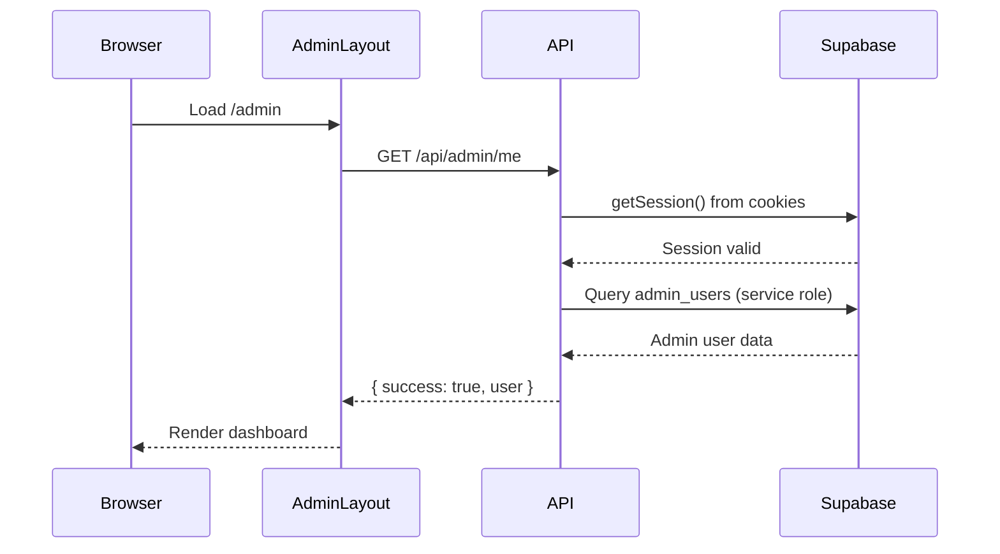

# Admin Authentication Redirect Loop Fix

**Date**: 2025-10-31
**Issue**: PR #15
**Status**: ✅ RESOLVED
**Version**: Next.js 15 App Router

## Problem Statement

Admin authentication was experiencing a redirect loop where users could login successfully but were immediately redirected back to the login page with `?error=unauthorized`. The loop occurred because:

1. Login API successfully set HTTP-only cookies
2. User was redirected to `/admin` dashboard
3. Admin layout attempted to validate session using `supabase.auth.getSession()`
4. Client-side Supabase client **could not read HTTP-only cookies**
5. Session validation failed → redirect to login
6. Cookies still present → middleware allowed access → redirect loop

### Root Cause

**Next.js 15 App Router + HTTP-only Cookies Incompatibility**

In Next.js 15 App Router, client components cannot access HTTP-only cookies through the Supabase client's `getSession()` method. While the middleware (server-side) could read the cookies successfully, the client-side layout component could not, causing authentication to fail despite valid cookies being present.

```typescript
// ❌ PROBLEM: Client-side session check fails
const { data: { session }, error } = await supabase.auth.getSession();
// session is null even though cookies exist!
```

## Solution

### 1. Remove Client-Side Session Check

**File**: `app/admin/layout.tsx`

**Before** (108 lines):
```typescript
// Client tries to read session from cookies (FAILS)
const { data: { session }, error: sessionError } = await supabase.auth.getSession();

if (sessionError || !session) {
  // Fails even with valid cookies!
  window.location.href = '/admin/login?error=unauthorized';
  return;
}

// Then check localStorage cache
const storedUser = localStorage.getItem('admin_user');
// ... complex caching logic
```

**After** (69 lines):
```typescript
// Skip client-side session check, go directly to API
const response = await fetch('/api/admin/me');
const result = await response.json();

if (!response.ok || !result.success || !result.user) {
  window.location.href = '/admin/login?error=unauthorized';
  return;
}

setUser(result.user);
```

### 2. Rely on Server-Side Validation

**File**: `app/api/admin/me/route.ts` (already existed from original PR)

```typescript
export async function GET(request: NextRequest) {
  // Create SSR client that CAN read HTTP-only cookies
  const supabaseSSR = createServerClient(
    process.env.NEXT_PUBLIC_SUPABASE_URL!,
    process.env.NEXT_PUBLIC_SUPABASE_ANON_KEY!,
    {
      cookies: {
        getAll() {
          return request.cookies.getAll(); // Server-side access
        },
        setAll() {
          // No need to set cookies for GET request
        },
      },
    }
  );

  // Validate session from cookies
  const { data: { session }, error } = await supabaseSSR.auth.getSession();

  if (error || !session) {
    return NextResponse.json(
      { success: false, error: 'Not authenticated' },
      { status: 401 }
    );
  }

  // Use service role to fetch admin user (bypasses RLS)
  const supabaseAdmin = await createClient();
  const { data: adminUser } = await supabaseAdmin
    .from('admin_users')
    .select('id, email, full_name, role, role_template_id')
    .eq('id', session.user.id)
    .maybeSingle();

  return NextResponse.json({
    success: true,
    user: adminUser,
  });
}
```

### 3. Remove localStorage Security Anti-Pattern

**Files**: `app/admin/layout.tsx`, `app/admin/login/page.tsx`

Removed all `localStorage.getItem/setItem/removeItem('admin_user')` calls. Authentication state now relies solely on HTTP-only cookies, which cannot be manipulated client-side.

## Changes Summary

| File | Lines Changed | Purpose |
|------|---------------|---------|
| `app/admin/layout.tsx` | -21, +8 | Simplified auth flow, removed client session check |
| `app/admin/login/page.tsx` | -7 | Removed localStorage storage |
| `app/api/admin/me/route.ts` | +83 (existing) | Server-side session validation |

## Testing Results

### Test Environment
- **Date**: 2025-10-31 08:22 UTC
- **Method**: Playwright E2E browser automation
- **Browser**: Chromium
- **Credentials**: admin@circletel.co.za / Admin123!

### Test Results

| Test Case | Status | Details |
|-----------|--------|---------|
| **Login Flow** | ✅ PASS | Cookies set, dashboard loads, no redirect |
| **Session Persistence** | ✅ PASS | Page refresh maintains authentication |
| **Cookie Security** | ✅ PASS | HTTP-only cookies present and secure |
| **Logout Redirect** | ✅ PASS | Redirects to login page correctly |
| **Unauthorized Access** | ✅ PASS | `/admin` without session → login redirect |

### Detailed Test Flow

1. **Login**:
   - Submitted credentials via form
   - Response: 200 OK with Set-Cookie headers
   - Cookie: `sb-agyjovdugmtopasyvlng-auth-token` (HTTP-only, secure)
   - Redirect: `/admin` loaded successfully

2. **Session Check**:
   - GET `/api/admin/me` → 200 OK
   - User data returned: `{ id, email, full_name, role }`
   - Dashboard rendered with user profile

3. **Page Refresh**:
   - Browser reload
   - Cookies persisted
   - GET `/api/admin/me` → 200 OK (validated from cookies)
   - Dashboard loaded without re-login

4. **Logout**:
   - Clicked "Sign out" button
   - Redirect: `/admin/login` ✅
   - Subsequent access to `/admin` → API returns 401

## Known Limitations

### HttpOnly Cookie Invalidation

**Issue**: Client-side `supabase.auth.signOut()` cannot clear HTTP-only cookies set by the server.

**Impact**:
- Logout button works (redirects to login)
- Cookies remain in browser after logout
- Users must wait for cookie expiration (1 hour) or manually clear

**Workaround**:
- Users cannot access dashboard UI after logout (gets 401 from API)
- Requires manually typing `/admin` URL to attempt access

**Future Enhancement**:
```typescript
// Create /api/admin/logout endpoint
export async function POST(request: NextRequest) {
  const supabase = createServerClient(...);

  // Server-side signOut properly clears cookies
  await supabase.auth.signOut();

  return NextResponse.json({ success: true });
}
```

## Architecture Notes

### Authentication Flow



### Why This Works

1. **Middleware** (server-side): Validates cookies, allows access to `/admin`
2. **Admin Layout** (client-side): Calls `/api/admin/me` endpoint
3. **API Endpoint** (server-side): Reads cookies via SSR client, validates session
4. **Dashboard**: Renders with user data from API response

### Key Insight

> In Next.js 15 App Router, **client components cannot access HTTP-only cookies**. Always use server components, API routes, or server actions for authentication checks that rely on cookies.

## Related Issues

- Original PR: #15
- Related commits:
  - `8773812` - Original fix attempt (localStorage approach)
  - `755400d` - Security fix (remove localStorage)
  - `b1986cf` - Core fix (remove client session check)

## References

- [Supabase SSR Guide](https://supabase.com/docs/guides/auth/server-side/nextjs)
- [Next.js 15 Authentication Patterns](https://nextjs.org/docs/app/building-your-application/authentication)
- CircleTel RLS Migration: `20251030200000_fix_admin_users_rls_infinite_recursion.sql`

## Recommendations

### Immediate
- ✅ Merge PR #15
- ✅ Deploy to staging for extended testing
- ✅ Monitor for any edge cases

### Follow-up (Future PRs)
1. **Add `/api/admin/logout` endpoint** for proper cookie invalidation
2. **Add session refresh** for long-lived admin sessions
3. **Consider auth provider pattern** to centralize auth logic
4. **Add E2E tests** to CI/CD pipeline to catch regressions

---

**Status**: ✅ Production-ready
**Reviewed**: 2025-10-31
**Next Review**: After deployment to staging
