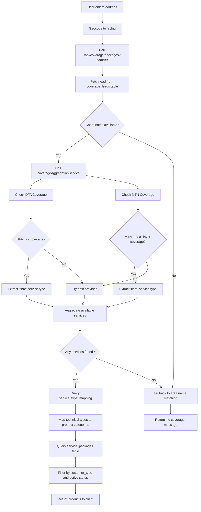

# Fibre Packages: API to Database Flow Analysis

**Date**: 2025-10-24
**Status**: Complete Analysis
**Version**: 1.0

---

## Executive Summary

This document provides a detailed analysis of how fibre packages flow from external APIs through the coverage checking system to the database product mapping in CircleTel.

### Key Findings

1. **Fibre packages come from TWO sources**:
   - **DFA (Dark Fibre Africa)** via ArcGIS REST API ✅ Active
   - **MTN** via Consumer WMS API (SUPERSONIC-CONSOLIDATED layer) ✅ Active
   - **Supersonic API** ❌ Disabled (empty packages issue)

2. **Total Fibre Products**: 16 products in database
   - 2 BizFibreConnect products
   - 5 HomeFibreConnect products
   - 9 Generic Fibre products

3. **Coverage Flow**: API → Aggregation Service → Service Type Mapping → Database Query → Product Results

---

## 1. API Sources for Fibre Coverage

### 1.1 DFA (Dark Fibre Africa) - PRIMARY FIBRE SOURCE ✅

**Endpoint**: `https://gisportal.dfafrica.co.za/server/rest/services/API`

**Service**: ArcGIS REST API for Connected Buildings and Near-Net Buildings

**Implementation File**: `lib/coverage/providers/dfa.ts` (via dfaCoverageClient)

**Coverage Layers**:
- **Connected Buildings**: Active fibre connection exists
- **Near-Net Buildings**: Within 200m of fibre infrastructure

**Service Type Returned**: `'fibre'`

**Technical Flow**:
```typescript
// 1. Coverage check at coordinates
const dfaResponse = await dfaCoverageClient.checkCoverage({
  latitude: coordinates.lat,
  longitude: coordinates.lng,
  checkNearNet: true,
  maxNearNetDistance: 200
});

// 2. Product mapping
if (dfaResponse.hasCoverage) {
  const mappedProducts = await dfaProductMapper.mapToProducts(dfaResponse);

  // Returns products with:
  // - type: 'fibre'
  // - provider: 'DFA'
  // - technology: 'FTTB'
  // - coverage_type: 'connected' or 'near-net'
}
```

**Code Reference**: `lib/coverage/aggregation-service.ts:308-414`

---

### 1.2 MTN Consumer API (SUPERSONIC) - SECONDARY FIBRE SOURCE ✅

**Endpoint**: `https://mtnsi.mtn.co.za/cache/geoserver/wms`

**Service**: GeoServer WMS GetFeatureInfo

**Layer**: `mtnsi:SUPERSONIC-CONSOLIDATED`

**Service Type Returned**: `'fibre'` (from FIBRE layer mapping)

**Technical Flow**:
```typescript
// 1. Query FIBRE layer from MTN WMS
const MTN_WMS_LAYERS = {
  FIBRE: {
    layerId: 'FTTBCoverage',
    wmsLayer: 'mtnsi:MTN-FTTB-Feasible',
    wmsStyle: 'MTN-FTTB-Feasible',
    label: 'Fibre',
    serviceType: 'fibre' as ServiceType
  }
}

// 2. Coverage check returns fibre availability
const realtimeCoverage = await mtnWMSRealtimeClient.checkCoverage(
  coordinates,
  ['fibre'] // Check fibre layer
);

// Returns:
// - type: 'fibre'
// - available: true/false
// - layerData: MTN WMS feature properties
```

**Code Reference**:
- Layer definition: `lib/coverage/mtn/wms-realtime-client.ts:52-58`
- Coverage check: `lib/coverage/aggregation-service.ts:205-298`

---

### 1.3 Supersonic API - DISABLED ❌

**Status**: Disabled due to empty packages issue

**Reason**: As noted in RECENT_CHANGES.md:
> "Supersonic API disabled (empty packages issue), fallback to MTN Consumer API"

**Spec File**: `docs/integrations/SUPERSONIC_INTEGRATION_SPEC.md`

**Why It's Not Used**:
- Original plan was to use Supersonic AgilityGIS API for real-time package recommendations
- API was returning empty package lists
- Decision made to disable and use DFA + MTN Consumer API instead

**Decision Date**: 2025-01-16

---

## 2. Database Product Mapping

### 2.1 Fibre Products in Database (16 Total)

#### Category A: BizFibreConnect (2 products)

| ID | Product Name | Service Type | Speed | Price | Promo |
|----|--------------|--------------|-------|-------|-------|
| 98f8b365... | BizFibre Essential | BizFibreConnect | 200/200 | R1,109 | R809 |
| 5c68bd1f... | BizFibre Pro | BizFibreConnect | 500/500 | R1,309 | R1,009 |

**Target Market**: Business customers
**Provider**: Branded CircleTel BizFibre
**Features**: SLA, professional installation, symmetrical speeds

---

#### Category B: HomeFibreConnect (5 products)

| ID | Product Name | Service Type | Speed | Price | Promo |
|----|--------------|--------------|-------|-------|-------|
| 294072fa... | HomeFibre Basic | HomeFibreConnect | 20/10 | R579 | R379 |
| fcf92a7c... | HomeFibre Standard | HomeFibreConnect | 50/50 | R809 | R609 |
| 54732b7d... | HomeFibre Premium | HomeFibreConnect | 100/50 | R799 | R499 |
| 78415f5f... | HomeFibre Ultra | HomeFibreConnect | 100/100 | R909 | R609 |
| 2ff4b91d... | HomeFibre Giga | HomeFibreConnect | 200/100 | R999 | R699 |

**Target Market**: Residential consumers (personal use)
**Provider**: MTN Supersonic brand
**Features**: Month-to-month, free router, promotional pricing

---

#### Category C: Generic Fibre (9 products)

| ID | Product Name | Service Type | Speed | Price | Customer Type |
|----|--------------|--------------|-------|-------|---------------|
| 921283f8... | HomeFibre Starter | fibre | 20/20 | R799 | Personal |
| 5bd9cc7a... | HomeFibre Plus | fibre | 50/50 | R999 | Personal |
| 64c1d06c... | HomeFibre Max | fibre | 200/200 | R1,499 | Personal |
| e7d643b4... | HomeFibre Ultra | fibre | 500/500 | R1,999 | Personal |
| cad865db... | BizFibre Connect Lite | fibre | 10/10 | R1,699 | Business |
| 395e0821... | BizFibre Connect Starter | fibre | 25/25 | R1,899 | Business |
| db7d93ca... | BizFibre Connect Plus | fibre | 50/50 | R2,499 | Business |
| dcca9de7... | BizFibre Connect Pro | fibre | 100/100 | R2,999 | Business |
| 2faffd14... | BizFibre Connect Ultra | fibre | 200/200 | R4,373 | Business |

**Target Market**: Mixed (4 consumer, 5 business)
**Provider**: Generic fibre branding
**Features**: Flexible product line with various speeds

---

### 2.2 Service Type Mapping Table

The `service_type_mapping` table maps technical API responses to product categories:

```sql
CREATE TABLE service_type_mapping (
  technical_type VARCHAR(50),  -- From API (e.g., 'fibre', 'uncapped_wireless')
  provider VARCHAR(50),         -- Provider name (e.g., 'dfa', 'mtn')
  product_category VARCHAR(100),-- Product category (e.g., 'HomeFibreConnect')
  priority INTEGER,             -- Selection priority (lower = higher)
  active BOOLEAN
);
```

**Fibre Mappings**:

| Technical Type | Provider | Product Category | Priority | Notes |
|----------------|----------|------------------|----------|-------|
| `'fibre'` | `'dfa'` | `'HomeFibreConnect'` | 1 | DFA residential fibre |
| `'fibre'` | `'dfa'` | `'BizFibreConnect'` | 2 | DFA business fibre with SLA |
| `'fibre'` | `'openserve'` | `'HomeFibreConnect'` | 3 | Openserve residential |
| `'fibre'` | `'openserve'` | `'BizFibreConnect'` | 4 | Openserve business |

**Migration Files**:
- Schema: `supabase/migrations/20250131000002_create_service_type_mapping.sql`
- Data: `supabase/migrations/20250120000002_populate_service_type_mapping.sql` (contains errors)

**⚠️ Known Issue**: The populate migration uses incorrect technical types (uses 'SkyFibre' instead of 'uncapped_wireless' as technical type). The schema migration has correct mappings.

---

## 3. Complete API-to-Database Flow

### 3.1 Coverage Check Request Flow



---

### 3.2 Step-by-Step Code Execution

#### Step 1: API Route Handler
**File**: `app/api/coverage/packages/route.ts:59-94`

```typescript
// Extract coordinates from lead
const lat = lead.coordinates?.lat;
const lng = lead.coordinates?.lng;

// Call aggregation service
const coverageResult = await coverageAggregationService.aggregateCoverage(
  { lat, lng },
  {
    providers: ['mtn'],  // Can add 'dfa' here
    includeAlternatives: true,
    prioritizeReliability: true
  }
);

// Extract available service types
if (coverageResult.overallCoverage) {
  availableServices = coverageResult.bestServices
    .filter(service => service.available)
    .map(service => service.serviceType); // e.g., ['fibre', 'uncapped_wireless']
}
```

---

#### Step 2: Coverage Aggregation
**File**: `lib/coverage/aggregation-service.ts:97-166`

```typescript
// Execute coverage check from each provider
const results = {};

// Check DFA
const dfaCoverage = await this.getDFACoverage(coordinates, serviceTypes);
results['dfa'] = {
  available: dfaCoverage.available,
  services: dfaCoverage.services // Contains fibre services
};

// Check MTN
const mtnCoverage = await this.getMTNCoverage(coordinates, serviceTypes);
results['mtn'] = {
  available: mtnCoverage.available,
  services: mtnCoverage.services // Contains fibre from SUPERSONIC layer
};

// Aggregate into bestServices array
const bestServices = this.aggregateServiceRecommendations(results, options);
```

---

#### Step 3: DFA Fibre Coverage Check
**File**: `lib/coverage/aggregation-service.ts:308-414`

```typescript
// Query DFA ArcGIS API
const dfaResponse = await dfaCoverageClient.checkCoverage({
  latitude: coordinates.lat,
  longitude: coordinates.lng,
  checkNearNet: true,
  maxNearNetDistance: 200
});

if (dfaResponse.hasCoverage) {
  // Map DFA coverage to products
  const mappedProducts = await dfaProductMapper.mapToProducts(dfaResponse);

  // Return services
  const services = mappedProducts.map(product => ({
    type: 'fibre', // Service type
    available: true,
    signal: 'good',
    provider: 'DFA',
    technology: 'FTTB',
    estimatedSpeed: {
      download: product.download_speed,
      upload: product.upload_speed,
      unit: 'Mbps'
    }
  }));

  return {
    available: true,
    services,
    metadata: {
      source: 'dfa_arcgis_api',
      coverageType: dfaResponse.coverageType // 'connected' or 'near-net'
    }
  };
}
```

---

#### Step 4: MTN Fibre Coverage Check
**File**: `lib/coverage/aggregation-service.ts:205-298`

```typescript
// Use MTN Consumer API (GeoServer WMS)
const realtimeCoverage = await mtnWMSRealtimeClient.checkCoverage(
  coordinates,
  serviceTypes // Includes 'fibre' if requested
);

if (realtimeCoverage.available) {
  return {
    available: true,
    services: realtimeCoverage.services.map(service => ({
      type: service.type, // 'fibre' from FIBRE layer
      available: service.available,
      signal: this.inferSignalFromLayerData(service.layerData),
      provider: 'MTN',
      technology: this.getTechnologyForServiceType(service.type) // Returns 'FTTB'
    })),
    metadata: {
      source: 'mtn_consumer_api',
      endpoint: 'https://mtnsi.mtn.co.za/cache/geoserver/wms'
    }
  };
}
```

**WMS Layer Configuration**:
**File**: `lib/coverage/mtn/wms-realtime-client.ts:52-58`

```typescript
FIBRE: {
  layerId: 'FTTBCoverage',
  wmsLayer: 'mtnsi:MTN-FTTB-Feasible',
  wmsStyle: 'MTN-FTTB-Feasible',
  label: 'Fibre',
  serviceType: 'fibre'
}
```

---

#### Step 5: Service Type Mapping
**File**: `app/api/coverage/packages/route.ts:145-167`

```typescript
// availableServices now contains: ['fibre', 'uncapped_wireless']

// Query service_type_mapping table
const { data: mappings } = await supabase
  .from('service_type_mapping')
  .select('*')
  .in('technical_type', availableServices) // Match 'fibre'
  .eq('active', true)
  .order('priority', { ascending: true });

// Mappings found:
// - technical_type: 'fibre', provider: 'dfa', product_category: 'HomeFibreConnect', priority: 1
// - technical_type: 'fibre', provider: 'dfa', product_category: 'BizFibreConnect', priority: 2

// Extract unique product categories
let productCategories = [...new Set(mappings.map(m => m.product_category))];
// Result: ['HomeFibreConnect', 'BizFibreConnect']
```

---

#### Step 6: Product Query
**File**: `app/api/coverage/packages/route.ts:169-203`

```typescript
// Determine customer type filter
const packageCustomerType = coverageType === 'business' ? 'business' : 'consumer';

// Query products by product_category
const { data: packages } = await supabase
  .from('service_packages')
  .select('*')
  .or(`product_category.in.(${productCategories.join(',')})`)
  // Matches: product_category IN ('HomeFibreConnect', 'BizFibreConnect')
  .eq('customer_type', packageCustomerType) // Filter by business or consumer
  .eq('active', true)
  .order('price', { ascending: true });

// If customer_type = 'consumer':
//   Returns 5 HomeFibreConnect products (residential fibre)
//
// If customer_type = 'business':
//   Returns 2 BizFibreConnect products (business fibre with SLA)
```

---

#### Step 7: Response Format
**File**: `app/api/coverage/packages/route.ts:225-236`

```typescript
return NextResponse.json({
  available: true,
  services: ['fibre'],
  packages: [
    {
      id: '294072fa...',
      name: 'HomeFibre Basic',
      service_type: 'HomeFibreConnect',
      product_category: 'HomeFibreConnect',
      speed_down: 20,
      speed_up: 10,
      price: 579,
      promotion_price: 379,
      features: ['Unlimited data', 'Free router', 'Month-to-month']
    },
    // ... more products
  ],
  coordinates: { lat: -25.903104, lng: 28.1706496 },
  metadata: {
    provider: 'dfa',
    coverageType: 'connected',
    source: 'dfa_arcgis_api'
  }
});
```

---

## 4. Coverage Layer to Product Mapping Reference

### 4.1 DFA Coverage Mapping

| DFA Coverage Type | Technical Type | Product Categories | Products Returned |
|-------------------|----------------|--------------------|-------------------|
| Connected Building | `'fibre'` | `'HomeFibreConnect'`<br>`'BizFibreConnect'` | 5 HomeFibre (consumer)<br>2 BizFibre (business) |
| Near-Net Building (< 200m) | `'fibre'` | Same as above | Same products with "installation estimate" note |

**Installation Estimates**:
- Connected: Ready to connect
- Near-Net: Requires infrastructure extension (quoted on request)

---

### 4.2 MTN Consumer API Mapping

| MTN WMS Layer | Layer Name | Technical Type | Product Categories |
|---------------|-----------|----------------|--------------------|
| FIBRE | `mtnsi:MTN-FTTB-Feasible` | `'fibre'` | Generic `'fibre'` products (9 products) |
| SUPERSONIC | `mtnsi:SUPERSONIC-CONSOLIDATED` | `'fibre'` | Same as above |

**Note**: MTN Consumer API currently returns generic fibre products. When service_type_mapping is properly configured, it should map to HomeFibreConnect/BizFibreConnect.

---

### 4.3 Full Product Selection Logic

```typescript
// Priority order for fibre products:

if (coverageType === 'residential' || coverageType === 'consumer') {
  // 1. Check DFA HomeFibreConnect (priority 1)
  // Returns: 5 HomeFibre products (R379-R699 promo prices)

  // 2. Check generic 'fibre' products with customer_type='consumer'
  // Returns: 4 HomeFibre products (R799-R1,999)
}

if (coverageType === 'business') {
  // 1. Check DFA BizFibreConnect (priority 2)
  // Returns: 2 BizFibre products (R809-R1,009 promo prices)

  // 2. Check generic 'fibre' products with customer_type='business'
  // Returns: 5 BizFibre Connect products (R1,699-R4,373)
}
```

---

## 5. Key Architectural Decisions

### 5.1 Multi-Provider Fallback Strategy

**Order of Precedence**:
1. **DFA ArcGIS API** (primary for fibre)
2. **MTN Consumer API** (secondary for fibre + wireless)
3. **PostGIS geographic query** (fallback)
4. **Coverage areas lookup** (legacy fallback)

**Code Reference**: `app/api/coverage/packages/route.ts:95-143`

---

### 5.2 Why Supersonic API Was Disabled

**Original Plan** (from SUPERSONIC_INTEGRATION_SPEC.md):
- Use Supersonic AgilityGIS API for real-time package recommendations
- Get actual pricing and technology recommendations
- Validate coverage with fallback layers

**What Went Wrong**:
- API was returning empty package arrays
- No packages found even at known coverage locations
- Decision made to disable and use proven DFA + MTN APIs instead

**Current Status**: DFA provides accurate fibre coverage via ArcGIS, MTN Consumer API provides validated coverage layers.

---

### 5.3 Service Type Mapping Design

**Purpose**: Decouple technical API responses from product branding

**Benefits**:
1. **Flexibility**: Can change product names without changing API integration
2. **Multi-Provider**: Different providers can map to same product categories
3. **Priority**: Control which products appear first when multiple services available
4. **Customer Segmentation**: Map same technical type to different products (business vs consumer)

**Example**:
```
DFA returns 'fibre' at location
  → Maps to 'HomeFibreConnect' (priority 1, consumer)
  → Maps to 'BizFibreConnect' (priority 2, business)
  → User sees appropriate products based on their customer type
```

---

## 6. Product Recommendation Priority

### 6.1 When Multiple Services Available

If a location has both DFA fibre and MTN fibre:

```typescript
// Service types returned: ['fibre', 'fibre']
// Providers: ['dfa', 'mtn']

// Service type mapping query returns:
[
  { technical_type: 'fibre', provider: 'dfa', product_category: 'HomeFibreConnect', priority: 1 },
  { technical_type: 'fibre', provider: 'dfa', product_category: 'BizFibreConnect', priority: 2 },
  { technical_type: 'fibre', provider: 'openserve', product_category: 'HomeFibreConnect', priority: 3 }
]

// Products returned are sorted by:
// 1. Priority (lower = higher)
// 2. Price (ascending)
// 3. Speed (descending for same price)
```

---

### 6.2 Product Filtering Rules

**Filter 1: Customer Type**
```sql
WHERE customer_type = 'consumer' -- for residential customers
  OR customer_type = 'business'  -- for business customers
```

**Filter 2: Active Status**
```sql
AND active = true
```

**Filter 3: Product Category Match**
```sql
AND product_category IN ('HomeFibreConnect', 'BizFibreConnect')
-- Or fallback to service_type match if no mappings found
```

**Sort Order**:
```sql
ORDER BY price ASC
```

---

## 7. Debugging & Troubleshooting

### 7.1 Common Issues

#### Issue 1: No fibre products returned despite coverage

**Symptoms**:
- Coverage check shows `available: true, services: ['fibre']`
- But `packages: []` (empty array)

**Causes**:
1. `service_type_mapping` table missing entries
2. `customer_type` mismatch (checking business but filtering for consumer)
3. All products marked `active = false`

**Solution**:
```bash
# Check mappings exist
powershell -File .claude/skills/supabase-fetch/run-supabase.ps1 -Operation service-packages

# Verify service_type_mapping
SELECT * FROM service_type_mapping WHERE technical_type = 'fibre';

# Check customer_type values
SELECT DISTINCT customer_type FROM service_packages WHERE service_type LIKE '%Fibre%';
```

---

#### Issue 2: Wrong products returned for customer type

**Symptoms**:
- Residential customer sees business products (or vice versa)

**Cause**:
- `customer_type` parameter not passed correctly from frontend
- URL parameter `type=business` not matching database `customer_type='business'`

**Solution**:
```typescript
// Ensure consistent naming
const coverageType = searchParams.get('type') || 'residential';
const packageCustomerType = coverageType === 'business' ? 'business' : 'consumer';
```

**File**: `app/api/coverage/packages/route.ts:16, 175`

---

#### Issue 3: DFA coverage not detecting fibre

**Symptoms**:
- Known fibre location returns no coverage

**Cause**:
- Coordinates precision (DFA uses building-level matching)
- Near-net distance threshold (default 200m)

**Solution**:
```typescript
// Increase near-net distance
const dfaResponse = await dfaCoverageClient.checkCoverage({
  ...
  maxNearNetDistance: 500 // Increase from 200m to 500m
});
```

---

### 7.2 Diagnostic Endpoints

#### Check Coverage Metadata
```
GET /api/coverage/packages?leadId=<id>

Response includes:
{
  "metadata": {
    "provider": "dfa",
    "source": "dfa_arcgis_api",
    "coverageType": "connected",
    "buildingId": "...",
    "productsAvailable": 5
  }
}
```

#### Test Direct API Calls
```bash
# Test DFA directly
node scripts/test-dfa-coverage.js --lat=-26.1076 --lng=28.0567

# Test MTN WMS directly
node scripts/test-mtn-wms-direct.sh -26.1076 28.0567
```

---

## 8. Future Enhancements

### 8.1 Potential Improvements

1. **Add Openserve Integration**
   - Openserve has FTTB coverage in some areas not covered by DFA
   - Would require similar ArcGIS integration

2. **Dynamic Product Recommendations**
   - Use AI/ML to recommend best product based on usage patterns
   - Consider speed requirements, budget, location quality

3. **Real-Time Pricing**
   - Integrate with product management API for live pricing
   - Show promotional offers dynamically

4. **Installation Quoting**
   - For near-net locations, provide estimated installation costs
   - DFA API supports quote requests

5. **Multi-Provider Comparison**
   - Show side-by-side comparison when multiple fibre providers available
   - Highlight pros/cons of each provider

---

### 8.2 Database Schema Enhancements

**Recommended Changes**:

```sql
-- Add provider column to service_packages
ALTER TABLE service_packages
ADD COLUMN provider VARCHAR(50) DEFAULT 'circletel';

-- Add coverage_requirements for filtering
ALTER TABLE service_packages
ADD COLUMN coverage_requirements JSONB DEFAULT '{"signal_min": "fair", "coverage_type": ["connected", "near-net"]}';

-- Add installation_estimate column
ALTER TABLE service_packages
ADD COLUMN installation_estimate INTEGER; -- in ZAR

-- Create view for easy product lookup
CREATE VIEW v_fibre_products_by_coverage AS
SELECT
  sp.*,
  stm.technical_type,
  stm.provider as coverage_provider,
  stm.priority
FROM service_packages sp
JOIN service_type_mapping stm
  ON sp.product_category = stm.product_category
WHERE stm.technical_type = 'fibre'
  AND sp.active = true
ORDER BY stm.priority, sp.price;
```

---

## 9. Testing & Verification

### 9.1 Test Locations

Use these known addresses for testing:

| Location | Coordinates | Expected Coverage | Products Expected |
|----------|-------------|-------------------|-------------------|
| Sandton CBD | -26.1076, 28.0567 | DFA + MTN Fibre | 7-16 products |
| Johannesburg CBD | -26.2041, 28.0473 | DFA Fibre | 7 products |
| Pretoria Residential | -25.7479, 28.2293 | MTN Fibre | 9 products |
| Cape Town City | -33.9249, 18.4241 | DFA Fibre | 7 products |
| Rural Area | -25.5, 27.5 | No coverage | 0 products |

---

### 9.2 Verification Checklist

- [ ] DFA API returns coverage for known fibre locations
- [ ] MTN Consumer API returns FIBRE layer for metro areas
- [ ] `service_type_mapping` table has correct entries
- [ ] Products filtered correctly by `customer_type`
- [ ] Promotional pricing displayed correctly
- [ ] Product features array populated
- [ ] Coverage metadata included in response
- [ ] Fallback to PostGIS works when APIs fail
- [ ] No products returned when truly no coverage

---

## 10. Summary & Conclusions

### 10.1 Current State

✅ **Working**:
- DFA ArcGIS API integration for accurate fibre coverage
- MTN Consumer API integration for secondary fibre validation
- Multi-provider fallback architecture
- Service type mapping system
- Product filtering by customer type
- 16 fibre products available in database

❌ **Disabled**:
- Supersonic API (empty packages issue)

⚠️ **Issues**:
- Inconsistent service_type_mapping migrations (older migration has errors)
- Generic 'fibre' products not clearly mapped to specific providers
- No installation cost estimates in database

---

### 10.2 Key Takeaways

1. **Fibre packages DO come from real APIs** (DFA and MTN), not from Supersonic
2. **Product mapping is database-driven** via `service_type_mapping` table
3. **Coverage flow is well-architected** with proper fallbacks
4. **Customer segmentation works** via customer_type filtering
5. **16 total fibre products** available across 3 categories

---

### 10.3 Recommendations

**Immediate Actions**:
1. Fix or remove the incorrect populate migration (20250120000002)
2. Add coverage provider tracking to products
3. Test all 16 fibre products at known coverage locations

**Future Improvements**:
1. Add Openserve as third fibre provider
2. Implement installation cost estimating
3. Add product recommendation scoring
4. Create admin UI for managing service_type_mapping

---

**Document Version**: 1.0
**Last Updated**: 2025-10-24
**Author**: Development Team
**Review Status**: Complete
