# CircleTel Business Buy Journey

B2B order flow — from quote request to go-live. 6-stage journey with admin-managed progression.

## Key Difference from Consumer Journey

| Aspect | Consumer | Business |
|--------|----------|----------|
| Entry | Self-service coverage check | Quote request or admin-initiated |
| Pricing | Fixed public pricing | Custom quoted pricing |
| Identity | Phone OTP / Email / Google OAuth | KYC via Didit (CIPC + Director ID) |
| Payment | Instant NetCash R1.00 validation | Contract-based, invoiced |
| Fulfilment | Immediate activation | Scheduled installation + site survey |
| Dashboard | `/dashboard` (consumer) | `/business/dashboard` (B2B journey tracker) |

## Reused from Consumer Journey

| Component | Consumer Path | Reused In B2B |
|-----------|--------------|---------------|
| Coverage check | `CoverageChecker.tsx` | Contract wizard `CoverageStep.tsx` |
| Geocoding | `GET /api/geocode` | Same API |
| Coverage lead | `POST /api/coverage/lead` | Same API |
| Package browsing | `GET /api/coverage/packages` | Contract wizard `ProductStep.tsx` |
| Address capture | Google Places autocomplete | Same component |
| Auth (Supabase) | Phone OTP, Email, Google | Portal login for business dashboard |
| Payment gateway | NetCash Pay Now | Invoice payment via `/dashboard/invoices/[id]/pay` |

## Flow Diagram

```mermaid
flowchart TD
    %% =============================================
    %% ENTRY POINTS
    %% =============================================
    A1[Business page<br/>/business] --> B[Quote Request]
    A2[Admin creates quote<br/>/admin/quotes/new] --> C[Admin Quote Creation]
    A3[Shared quote link<br/>/quotes/share/token] --> D[Customer views shared quote]

    %% =============================================
    %% PATH 1: CUSTOMER-INITIATED QUOTE REQUEST
    %% =============================================
    B --> B1[Business Quote Request Form<br/>/quotes/business/request]
    B1 --> B2[Enter company details<br/>Company name, CIPC reg, VAT number]
    B2 --> B3[Select customer type<br/>SMME or Enterprise]
    B3 --> B4[Select packages<br/>Primary + secondary + additional]
    B4 --> B5[Choose contract term<br/>12 / 24 / 36 months]
    B5 --> B6[Accept B2B consents<br/>Terms, privacy, payment terms,<br/>data processing, business verification]
    B6 --> B7[Submit quote request<br/>POST /api/quotes/business/create]
    B7 --> B8[Quote created<br/>Status: pending_review]

    %% =============================================
    %% PATH 2: ADMIN-INITIATED CONTRACT
    %% =============================================
    C --> C1{Entry method?}

    C1 -- Start Fresh --> C2[Coverage check<br/>CoverageStep — reuses CoverageChecker]
    C1 -- Convert Quote --> C3[Select existing quote<br/>QuoteSelectStep]

    C2 --> C4[Select package<br/>ProductStep]
    C3 --> C4

    C4 --> C5[Enter customer details<br/>CustomerStep]
    C5 --> C6[Review & set terms<br/>TermsStep]
    C6 --> C7[Review all details<br/>ReviewStep]
    C7 --> C8[Create contract<br/>CT-YYYY-NNN]

    %% =============================================
    %% STAGE 1: QUOTE (both paths converge)
    %% =============================================
    B8 --> E[Admin reviews quote<br/>/admin/quotes/id]
    D --> E

    E --> E1{Admin action}

    E1 -- Approve --> E2[Send quote to customer<br/>Email with preview link]
    E1 -- Edit --> E3[Modify pricing/terms<br/>/admin/quotes/id/edit]
    E1 -- Reject --> E4[Quote rejected<br/>Customer notified]

    E3 --> E2

    E2 --> F[Customer views quote<br/>/quotes/business/id/preview]

    F --> F1{Customer decision}

    F1 -- Accept --> F2[QuoteAcceptanceForm<br/>Digital acceptance recorded]
    F1 -- Request changes --> F3[Back to admin for revision]

    F3 --> E

    %% =============================================
    %% STAGE 2: BUSINESS VERIFICATION (KYC)
    %% =============================================
    F2 --> G[KYC Verification<br/>/customer/quote/id/kyc]
    C8 --> G

    G --> G1[Create Didit KYC session<br/>POST /api/compliance/create-kyc-session<br/>type: sme]
    G1 --> G2[LightKYCSession component<br/>Embedded Didit verification]
    G2 --> G3[Upload documents<br/>CIPC registration, Director ID,<br/>Proof of address, VAT certificate]
    G3 --> G4[Complete ID verification<br/>2-3 minutes]

    G4 --> G5{Verification result}

    G5 -- Approved --> H[Proceed to site details]
    G5 -- Declined --> G6[Show retry option<br/>POST /api/compliance/retry-kyc]
    G5 -- Pending review --> G7[Poll status every 5s<br/>GET /api/compliance/id/status]

    G6 --> G1
    G7 --> G5

    %% =============================================
    %% STAGE 3: SITE DETAILS (path split by customer_type)
    %% =============================================
    H --> H0{Customer type?}

    H0 -- SMME --> H1s[Simplified site form<br/>Property type + contact only]
    H1s --> H2s[Optional site photos]
    H2s --> H6[Submit site details]

    H0 -- Enterprise --> H1[Full site details form<br/>/business/dashboard/site-details]
    H1 --> H2[Property type & location<br/>Equipment location, cable entry]
    H2 --> H3[Upload site photos<br/>Equipment location, cable entry points]
    H3 --> H4[RFI Checklist<br/>Rack available? Access control?<br/>Air conditioning? AC power?]
    H4 --> H5[Building access info<br/>Manager contact, access instructions]
    H5 --> H6

    %% =============================================
    %% STAGE 4: CONTRACT
    %% =============================================
    H6 --> I[Contract generation<br/>Admin creates if not from wizard]
    I --> I1[Contract sent for signing<br/>CT-YYYY-NNN]
    I1 --> I1a[Send for e-signature<br/>POST /api/contracts/id/send-for-signature<br/>via Zoho Sign]
    I1a --> I2[Customer reviews contract<br/>Terms, pricing, SLA commitments]
    I2 --> I3[Digital signature<br/>Webhook: /api/contracts/webhook/zoho-sign]

    %% =============================================
    %% STAGE 5: INSTALLATION
    %% =============================================
    I3 --> J[Installation scheduled<br/>3-7 business days]
    J --> J1[Technician assigned]
    J1 --> J2[On-site fibre installation]
    J2 --> J3[Equipment configured & tested]

    %% =============================================
    %% STAGE 6: GO LIVE
    %% =============================================
    J3 --> K[RICA submission<br/>POST /api/activation/rica-submit]
    K --> K1[Credentials generated]
    K1 --> K2[Service activated]
    K2 --> K3[Business dashboard live<br/>/business/dashboard]

    K3 --> L[Ongoing management<br/>Invoices, support tickets,<br/>service monitoring]

    %% =============================================
    %% BUSINESS DASHBOARD (parallel track)
    %% =============================================
    F2 -.-> M[Business Dashboard<br/>/business/dashboard]
    M --> M1[JourneyProgressTracker<br/>6-step visual progress]
    M1 --> M2[Quick Actions<br/>Next step CTA]
    M2 --> M3[Stats: Services, Quotes,<br/>Tickets, Invoices]

    %% =============================================
    %% STYLES
    %% =============================================
    style A1 fill:#E87A1E,color:#fff
    style A2 fill:#1B2A4A,color:#fff
    style A3 fill:#1B2A4A,color:#fff
    style B1 fill:#E87A1E,color:#fff
    style C fill:#1B2A4A,color:#fff
    style F fill:#1B2A4A,color:#fff
    style G fill:#f59e0b,color:#fff
    style H1s fill:#3B82F6,color:#fff
    style H1 fill:#1B2A4A,color:#fff
    style I fill:#1B2A4A,color:#fff
    style K2 fill:#4CAF50,color:#fff
    style K3 fill:#4CAF50,color:#fff
    style E4 fill:#ef4444,color:#fff
    style G6 fill:#ef4444,color:#fff
    style M fill:#E87A1E,color:#fff
```

## 6-Stage Journey (from `journey-config.ts`)

| Stage | ID | Title | Description | SLA | Required Documents |
|-------|-----|-------|-------------|-----|-------------------|
| 1 | `quote_request` | Request Quote | Check coverage & submit business details | 48h | None |
| 2 | `business_verification` | Verify Business | CIPC registration & ID verification (Didit KYC) | 72h | CIPC cert, Director ID, Proof of address, VAT cert (optional) |
| 3 | `site_details` | Site Details | Confirm property type & equipment location | 48h | Site photos, Building access info (optional) |
| 4 | `contract` | Contract | Review and digitally sign agreement | 48h | None |
| 5 | `installation` | Installation | Professional on-site fibre installation | 168h (7d) | None |
| 6 | `go_live` | Go Live | RICA, credentials, service activation | 24h | None |

## SMME vs Enterprise Path Differentiation

The 6-stage journey adapts based on `customer_type` selected in the quote request form.

| Stage | SMME (< 20 employees) | Enterprise (20+ employees) |
|-------|----------------------|---------------------------|
| 1. Quote | Self-service form, standard pricing | Admin-assisted, custom pricing |
| 2. KYC | CIPC + Director ID only | CIPC + Director ID + VAT cert (required) |
| 3. Site Details | Simplified — property type + photos optional | Full RFI checklist required |
| 4. Contract | Standard terms template | Custom SLA terms negotiable |
| 5. Installation | Standard 3-5 day window | Coordinated with IT team, site survey |
| 6. Go Live | Standard activation | Dedicated onboarding session |

### SMME Simplified Path (Planned)

To reduce SMME drop-off at Stage 3, the simplified path skips the full RFI checklist:

- **Property type**: Required (office, retail, warehouse, home office)
- **Site photos**: Optional (cable entry points)
- **RFI checklist**: Skipped — technician assesses on-site
- **Building access**: Contact name + phone only

> **Status**: Not yet implemented. Currently both SMME and Enterprise follow the same Stage 3 flow.

## Quote Validity & Expiry

Quotes should have a validity period to prevent stale pricing. Currently no expiry logic exists.

| Field | Current State | Planned |
|-------|--------------|---------|
| `valid_until` | Not in schema | 30-day default from creation date |
| Expiry warning | None | Email at 7 days and 1 day before expiry |
| Auto-expire | None | Status → `expired` after `valid_until` |
| Re-quote | Manual — admin creates new quote | One-click re-quote with current pricing |

> **Status**: Requires adding `valid_until` column to `business_quotes` table and expiry logic in quote list/detail views.

## Term-Based Pricing

Contract terms (12/24/36 months) are captured in the quote but do not currently affect pricing.

| Term | Discount | Use Case |
|------|----------|----------|
| 12 months | 0% (standard) | Trial / uncertain commitment |
| 24 months | 5-10% | Standard business commitment |
| 36 months | 10-15% | Long-term / enterprise lock-in |

Pricing tiers should be configurable per product in `service_packages` or a related pricing table, not hardcoded.

> **Status**: Not yet implemented. `contract_term` is stored on `business_quotes` but no discount logic applies.

## SLA Commitments

| SLA Metric | Advertised | Enforcement |
|------------|-----------|-------------|
| Uptime | 99.9% (SMME) / 99.99% (Enterprise) | Not enforced — no monitoring or credit system |
| Response time | 4h (business hours) | Tracked via Zoho Desk ticket SLA |
| Resolution time | 24h (P1) / 72h (P2) | Tracked via Zoho Desk ticket SLA |
| Installation | 3-7 business days | Manual tracking in journey stage SLA |

### SLA Engine (Planned)

- Uptime monitoring per customer circuit (integration with infrastructure monitoring)
- Automatic breach detection against contracted SLA tier
- Credit calculation: pro-rata monthly fee for downtime exceeding SLA threshold
- Monthly SLA report in business dashboard

> **Status**: Not implemented. SLA is contractual only — no automated enforcement, monitoring, or credit calculation.

## RFI Checklist (Stage 3: Site Details)

| Check | Description |
|-------|-------------|
| Rack or Facility Available | Server rack, network cabinet, or mounting space |
| Access Control Documented | Key cards, security procedures for installation area |
| Air Conditioning / Ventilation | Equipment cooling requirements |
| AC Power Available | 220V 50Hz AC power plug for PSU |

## Key Components

| Step | Component | Location |
|------|-----------|----------|
| Quote request form | `BusinessQuoteRequestForm` | `components/quotes/BusinessQuoteRequestForm.tsx` |
| Quote preview | `QuotePreviewPage` | `app/quotes/business/[id]/preview/page.tsx` |
| Quote acceptance | `QuoteAcceptanceForm` | `components/quotes/QuoteAcceptanceForm.tsx` |
| KYC verification | `KYCPage` + `LightKYCSession` | `app/customer/quote/[id]/kyc/page.tsx` |
| KYC status | `KYCStatusBadge` | `components/compliance/KYCStatusBadge.tsx` |
| Contract wizard | `ContractWizardProvider` | `components/admin/contracts/wizard/` |
| Contract wizard steps | `EntryMethodStep` → `CoverageStep` → `ProductStep` → `CustomerStep` → `TermsStep` → `ReviewStep` | `components/admin/contracts/wizard/steps/` |
| Journey tracker | `JourneyProgressTracker` | `components/business-dashboard/journey/` |
| Business dashboard | `BusinessDashboardPage` | `app/business/dashboard/page.tsx` |
| RICA submission | API route | `app/api/activation/rica-submit/route.ts` |

## Admin Routes

| Route | Purpose |
|-------|---------|
| `/admin/quotes` | Quote list and management |
| `/admin/quotes/new` | Create new quote |
| `/admin/quotes/[id]` | Quote detail view |
| `/admin/quotes/[id]/edit` | Edit quote |
| `/admin/quotes/[id]/analytics` | Quote analytics |
| `/admin/contracts` | Contract management |
| `/admin/kyc` | KYC session management |
| `/admin/b2b-customers` | Business customer list |
| `/admin/b2b-customers/[id]` | Customer detail |
| `/admin/b2b-customers/site-details/[id]` | Site details management |

## Customer Routes

| Route | Purpose |
|-------|---------|
| `/quotes/business/request` | Submit quote request |
| `/quotes/business/[id]/preview` | View and accept quote |
| `/quotes/share/[token]` | View shared quote (no auth required) |
| `/customer/quote/[id]/kyc` | Complete KYC verification |
| `/business/dashboard` | Business dashboard with journey progress |
| `/business/dashboard/site-details` | Submit site details |

## Database Tables

| Table | Key Fields | ID Format |
|-------|-----------|-----------|
| `business_quotes` | company_name, customer_type (smme/enterprise), contract_term, status | BQ-YYYY-NNN |
| `contracts` | quote_id, customer_id, status, customer_signature_date, circletel_signature_date, fully_signed_date | CT-YYYY-NNN |
| `kyc_sessions` | didit_session_id, verification_url, flow_type, status, verification_result, risk_tier, customer_id | UUID |
| `rica_submissions` | kyc_session_id, order_id, iccid, submitted_data, icasa_tracking_id, status | UUID |

## API Endpoints

| Endpoint | Method | Purpose |
|----------|--------|---------|
| `/api/quotes/business/create` | POST | Create business quote request |
| `/api/quotes/business/list` | GET | List business quotes |
| `/api/quotes/business/bulk-create` | POST | Bulk create quotes |
| `/api/quotes/business/[id]` | GET/PATCH/DELETE | Fetch, update, or delete quote |
| `/api/compliance/create-kyc-session` | POST | Create Didit KYC session (accepts `quoteId`) |
| `/api/compliance/[id]/status` | GET | Check KYC verification status |
| `/api/compliance/retry-kyc` | POST | Retry failed KYC |
| `/api/compliance/upload` | POST | Upload compliance documents |
| `/api/activation/rica-submit` | POST | Submit RICA registration |
| `/api/activation/rica-webhook` | POST | RICA status webhook |
| `/api/business-dashboard/summary` | GET | Business dashboard data |
| `/api/contracts/create-from-quote` | POST | Create contract from accepted quote |
| `/api/contracts/generate-managed` | POST | Generate managed contract |
| `/api/contracts/[id]` | GET/PATCH | Fetch or update contract |
| `/api/contracts/[id]/send-for-signature` | POST | Send contract for Zoho Sign e-signature |
| `/api/contracts/[id]/download-pdf` | GET | Download contract PDF |
| `/api/contracts/webhook/zoho-sign` | POST | Zoho Sign signature webhook |

## State Management

- Journey progress tracked in database via `JourneyProgress` type
- Business dashboard polls `/api/business-dashboard/summary` for current state
- KYC page polls `/api/compliance/[id]/status` every 5s during verification
- No client-side Zustand store for B2B (unlike consumer `OrderContext`)
- Quote state managed server-side in `business_quotes` table

## B2B Consents Required

| Consent | Required |
|---------|----------|
| Terms of Service | Yes |
| Privacy Policy | Yes |
| Payment Terms | Yes |
| Refund Policy | Yes |
| Data Processing | Yes |
| Third-Party Disclosure | Yes |
| Business Verification | Yes |
| Marketing | No (optional) |

## Product Gaps & Roadmap

### Quote → Contract Automation

Currently admin must manually create a contract via the wizard after a quote is accepted. Planned: auto-generate contract from accepted quote via `POST /api/contracts/create-from-quote` (endpoint exists but is not triggered automatically).

| Current | Planned |
|---------|---------|
| Quote accepted → admin notified → manual contract creation | Quote accepted + KYC passed → auto-generate contract → send for signature |
| 2-3 day delay typical | Same-day turnaround |

### Multi-Site Account Model (Enterprise)

Enterprise customers with multiple locations currently need separate quotes per site. Planned parent-child account structure:

- **Parent account**: Company-level (billing, KYC, contract master)
- **Child sites**: Per-location (coverage, installation, site details)
- Shared contract with per-site service schedules
- Consolidated invoicing with site-level line items

> **Status**: Not implemented. Requires schema changes (`business_accounts` parent table, site references on `contracts`).

### Customer Self-Service Portal

The business dashboard currently shows journey progress but offers no self-service capabilities.

| Feature | Current | Planned |
|---------|---------|---------|
| View journey progress | Yes | Yes |
| Upload documents | No — admin uploads | Self-service upload to Supabase Storage |
| Update contact details | No — contact admin | Edit company contacts, billing address |
| Raise support tickets | No — external channels | Create Zoho Desk ticket from dashboard |
| View/pay invoices | Yes (via `/dashboard/invoices`) | Same |
| Download contract PDF | No | Self-service download |

> **Status**: Dashboard exists (`/business/dashboard`) with read-only journey tracking. Self-service features planned for Phase 2.
