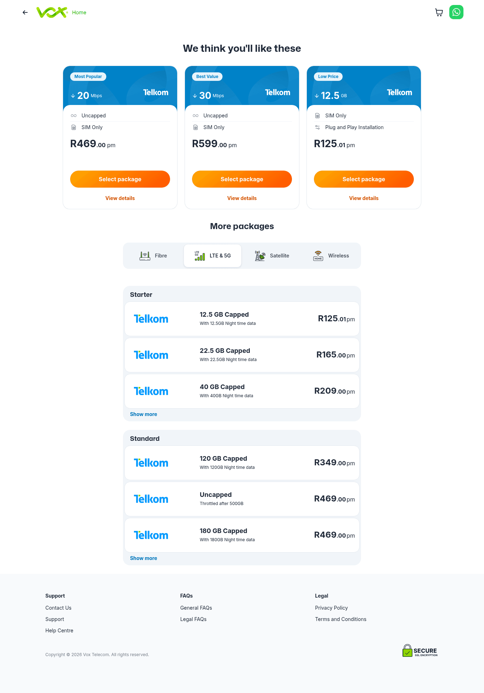
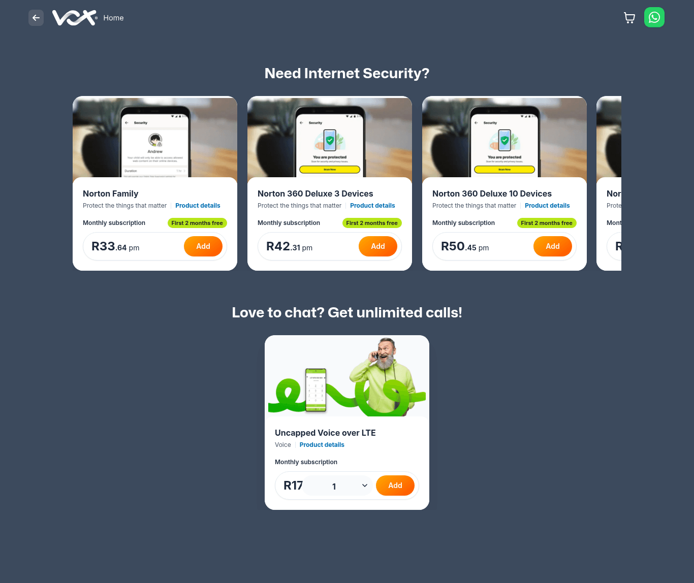
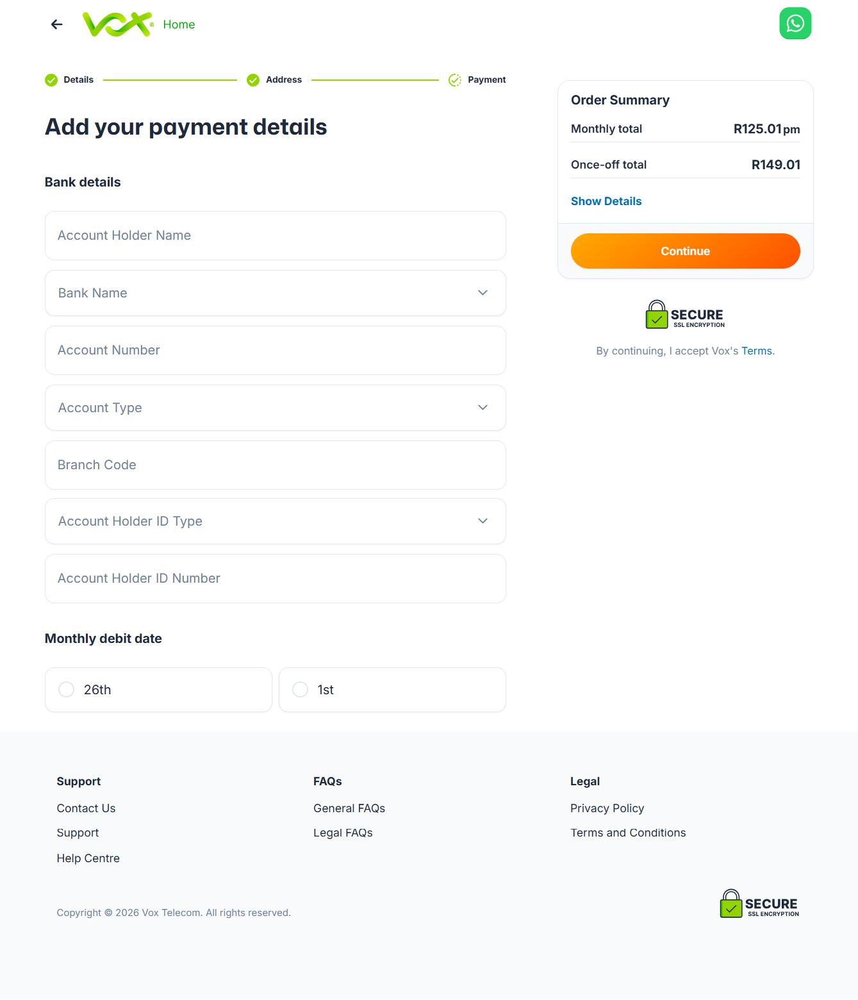
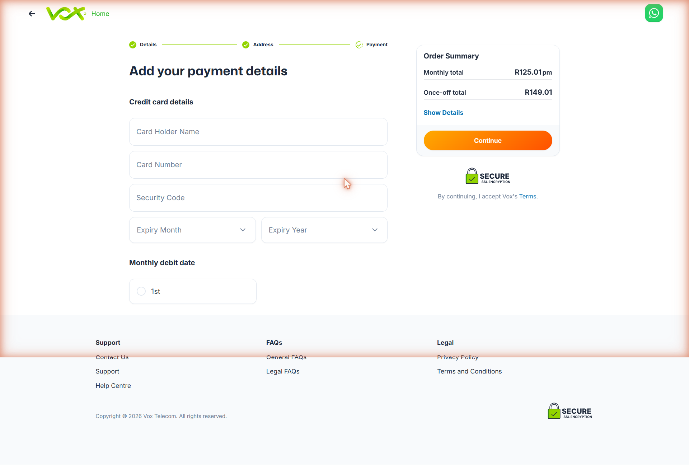
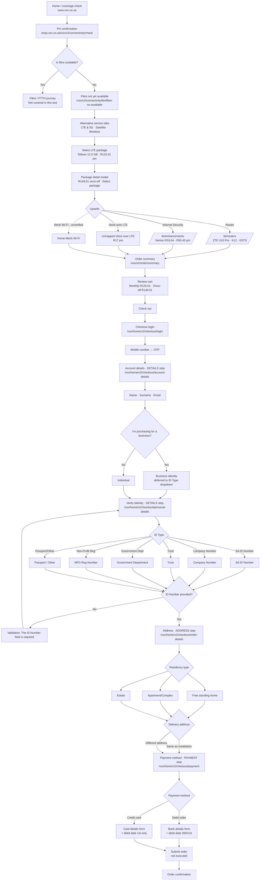

# Vox LTE Order Journey

Competitor reference — Vox Shop **LTE purchase flow** (fibre-not-available fallback path).
Captured as a benchmark for CircleTel's own order journey.

## Verification

| Field | Value |
|-------|-------|
| **Verified** | 2026-06-27, live walkthrough via browser automation |
| **Environment** | Production — `shop.vox.co.za` (entry from `www.vox.co.za`) |
| **Path tested** | Home → coverage check (fibre **not** available) → LTE → checkout → identity → address → **payment (method selection)** |
| **Coverage** | Steps 1–12 visually verified end-to-end. **Order not submitted** — payment-method sub-forms not expanded, no real order placed. |
| **Recording** | `vox-lte-order-journey.gif` (public steps 1–8, on local machine) |
| **Screenshots** | `vox-lte-journey/` — steps **1, 3, 6** captured server-side (Firecrawl) |

### Screenshot coverage

PNGs live in [`./vox-lte-journey/`](./vox-lte-journey/):

| Step | File | Notes |
|------|------|-------|
| 1 — Home / coverage check | `01-home-coverage-check.png` | WordPress page — renders fully |
| 3 — LTE package catalogue | `03-lte-packages.png` | Renders via `?address=&lat=&lng=` query params |
| 6 — Norton + Voice upsells | `06-enhancements-norton-voice.png` | Catalogue renders without a cart item |
| 12 — Payment / Debit order sub-form | `12-payment-debit-order.png` | Auth-gated — captured 2026-06-27 via live authenticated session (blank form, no data entered) |
| 12 — Payment / Credit card sub-form | `12-payment-credit-card.png` | Auth-gated — captured 2026-06-27 (blank form, no data entered) |

> **Why only 3 of 8:** `shop.vox.co.za` is a client-side Vue PWA (`vivica-js`). Catalogue pages
> that are **query-param-driven** (steps 3, 6) render to a server-side scraper; pages that depend on
> **map interaction** (step 2 pin) or **cart/auth session state** (step 4 modal, step 5 routers,
> step 7 summary, step 8 OTP login) render blank and can only be captured live in-browser (which
> saves to the local machine, not this repo).

> **URL change vs prior version of this doc:** the documented `/vox/v2/...` paths no longer
> resolve on `www.vox.co.za` (they 404). The live shop runs on the **`shop.vox.co.za`** host.
> The path segments (`/vox/v2/connectivity/...`, `/order/summary`, `/checkout/...`) are otherwise intact.

## Checkout stage model

Once the user reaches account creation, Vox shows a **3-step progress indicator** that stays fixed
for the rest of the flow. Several distinct pages/routes share the same indicator step:

```
[✓ Details] ───── [✓ Address] ───── [ Payment ]
```

| Indicator step | Pages that live under it |
|----------------|--------------------------|
| **Details** | `/checkout/account-details` (name/email), `/checkout/personal-details` (ID verification) |
| **Address** | `/checkout/order-details` (installation + delivery address) |
| **Payment** | final payment page (not entered) |

> **Route-vs-label mismatch worth noting:** the page at `/checkout/order-details` is visually the
> **Address** step — the route name does not match the indicator label.

---

## Step-by-step — components & layout

### 1. Shop entry / coverage check

- **URL:** `www.vox.co.za` (home)
- **Layout:** Hero banner; centered pill-shaped search bar with a **My Home / My Business** segmented toggle and an **"Enter address to check coverage"** input + arrow submit.
- **Behaviour:** Google-Places-style autocomplete dropdown ("Sandton, South Africa") under the input.
- **On select →** redirects to `shop.vox.co.za/vox/v2/connectivity/check?address=...&lat=...&lng=...`

### 2. Pin confirmation
- **URL:** `shop.vox.co.za/vox/v2/connectivity/check`
- **Layout:** Full-bleed satellite map with a draggable drop-pin; white card overlay **"Is the pin on your roof?"** with primary **"Yes, it is"** and secondary **"Try another address"**.
- **On confirm →** `/vox/v2/connectivity/ftth` (resolves availability), then redirects to the LTE fallback.

### 3. Fibre-not-available fallback ⭐ (key benchmark)

- **URL:** `shop.vox.co.za/vox/v2/connectivity/lte#fibre-no-available`
- **Layout:**
  - Info banner: **"Fibre not yet available"** + cross-sell link ("you might qualify for Hypa Pre-paid Fibre").
  - Heading **"Great internet options available in your area"**.
  - **Service-type tab selector** (3 tabs): `LTE & 5G` (default) · `Satellite` · `Wireless`.
  - Package list grouped by tier (e.g. **"Starter"**) — each row: provider logo (Telkom), data label, monthly price, right-aligned.
- **Verified packages (Starter tier):** Telkom 12.5 GB — **R125.01 pm** · 22.5 GB — **R165.00 pm** · 40 GB — **R209.00 pm** (+ "Show more").

### 4. Package detail modal
- **Trigger:** clicking a package row.
- **Layout:** Centered modal — blue header band with **"Low Price"** chip, data size, provider logo; body shows price (**R125.01 pm**, **R149.01 Once-Off fee**), an **"Included"** list (SIM Only · Plug and Play Installation · Anytime and Night time data), a "Performance and reliability" section, and a sticky **"Select package"** CTA.
- **On select →** `/vox/v2/connectivity/lte/routers`

### 5. Upsell — Router
- **URL:** `shop.vox.co.za/vox/v2/connectivity/lte/routers`
- **Layout:** Heading **"Add a Router"** / "Your LTE package needs a compatible router to get online"; 3 product cards (image carousel, name, "Product details" link, once-off price, orange **Add** button). Cart icon (top-right) increments.
- **Verified routers:** ZTE U10 Pro — R579 · ZTE K12 4G/LTE — R899 · ZTE G5TS (5G) — R2 099.
- **Skip control:** **"Skip, I've got a router"** below the cards.
- **On skip/continue →** `/vox/v2/connectivity/lte/enhancements`

### 6. Upsell — Internet Security (Norton) + Voice

- **URL:** `shop.vox.co.za/vox/v2/connectivity/lte/enhancements`
- **Layout:** Heading **"Need Internet Security?"**; horizontally-scrollable Norton cards — **Norton Family R33.64 pm · Norton 360 Deluxe 3 Devices R42.31 pm · Norton 360 Deluxe 10 Devices R50.45 pm** — each with a **"First 2 months free"** badge and **Add** button.
- **Voice section (same page):** **"Love to chat? Get unlimited calls!"** → **"Uncapped Voice over LTE" R17 pm** with a quantity selector + **Add**.
- **Sticky footer cart bar:** when a package is in the cart — expandable (chevron) totals **Monthly R125.01 / Once-off R149.01** + primary **Continue**.
- **On continue →** `/vox/v2/order/summary`

> The **Voice over LTE** branch is now **verified** (visible on the enhancements page). Only **Mesh
> Wi-Fi** from the original doc was *not* surfaced in this run — it may be package- or
> region-conditional, and remains *unverified* in the diagram.

### 7. Order summary
- **URL:** `shop.vox.co.za/vox/v2/order/summary`
- **Layout:** Two-column. Left: heading **"Review your cart"** + product card (LTE 12.5/12.5 GB, Telkom, green-tick feature list: SIM Only · Not Fixed Service · Best Effort Service · Fair Use Policy · Capped Product Data Breakdown, price). Right: **Order Summary** sidebar (Monthly total R125.01, Once-off total R149.01 "Order processing fee") + **Check out** CTA + "SECURE SSL Encryption" badge.
- **On checkout →** `/vox/home/v2/checkout/login`

### 8. Checkout login (OTP) 🔒
- **URL:** `shop.vox.co.za/vox/home/v2/checkout/login`
- **Layout:** Single centered field **"Please enter your mobile number"** + helper "We'll send a one-time code to this number. No spam." + **Continue**. Footer (Support / FAQs / Legal).
- **Auth:** mobile number → OTP one-time code. *(Gate — entered by the human tester, not automated.)*

### 9. Account details 🔒
- **URL:** `shop.vox.co.za/vox/home/v2/checkout/account-details`
- **Indicator:** Details (active) → Address → Payment.
- **Layout:** Heading **"We just need a few details"**; stacked fields **Name**, **Surname**, **Email address**; checkbox **"I'm purchasing for a business"**. Right sidebar Order Summary (collapsed, "Show Details") + **Continue** + "By continuing, I accept Vox's Terms."
- **Business branch:** ticking the business checkbox shows **no inline extra fields** — the business identity context is deferred to the ID-Type selector on the next page.

### 10. Identity verification 🔒 ⭐
- **URL:** `shop.vox.co.za/vox/home/v2/checkout/personal-details`
- **Layout:** Heading **"Let's verify your identity"**; **ID Type** dropdown + **ID Number** input with live required-field validation; right sidebar restores the full Order Summary breakdown.
- **ID Type options (6):** South African Id Number (default) · Company Number · Trust · Government Department · Non-Profit Reg Number · Passport/Other.
  - The last 5 are the **business / non-individual** identity paths unlocked by step 9's checkbox.
- **Validation (verified):** empty submit → **"The ID Number field is required"** (red, inline).

### 11. Address (installation + delivery) 🔒
- **URL:** `shop.vox.co.za/vox/home/v2/checkout/order-details`
- **Indicator:** Details ✓ → **Address** (active) → Payment.
- **Layout:** Heading **"Check your address"**.
  - **Installation address** card: map thumbnail + geocoded address (pre-filled from the step-1 coverage check) + **Edit** link.
  - **"Select the type of residency"** dropdown → 3 options: **Free standing home · Apartment/Complex · Estate**.
  - **Delivery address** radio: **Same as installation address** / **Different delivery address**. Choosing "same" auto-fills Delivery Address Name, Address Type (e.g. "Single-Dwelling") and Street Address from the install address.
  - Right sidebar Order Summary + **Continue**.

### 12. Payment 🔒 ⭐ (method + both sub-forms verified; not submitted)
- **URL:** `shop.vox.co.za/vox/home/v2/checkout/payment`
- **Indicator:** Details ✓ → Address ✓ → **Payment** (active, final step).
- **Method selection:** Heading **"Add your payment details"**; **"Payment method"** section with two expandable rows — 🏦 **Debit order** (bank icon) · 💳 **Credit card** (card icon).
- **Debit order sub-form (verified):**



  - **Bank details** fields: **Account Holder Name** · **Bank Name** (dropdown) · **Account Number** · **Account Type** (dropdown) · **Branch Code** · **Account Holder ID Type** (dropdown) · **Account Holder ID Number**.
  - **Monthly debit date** radio: **26th** / **1st**.
- **Credit card sub-form (verified):**



  - **Credit card details** fields: **Card Holder Name** · **Card Number** · **Security Code** · **Expiry Month** (dropdown) · **Expiry Year** (dropdown).
  - **Monthly debit date** radio: **1st** only — *narrower than debit order (which also offers 26th)*.
- **Right sidebar:** Order Summary — Monthly total **R125.01 pm** · Once-off total **R149.01** · "Show Details" · active orange **Continue** CTA · **SECURE SSL Encryption** badge · "By continuing, I accept Vox's **Terms**."
- **Status:** Method screen + **both** sub-forms verified (2026-06-27, live authenticated session, blank forms — **no data entered, no order submitted**). Only the final order-confirmation screen remains undocumented (would require submitting a live binding order).
- **CircleTel relevance:** Vox offers **debit order + credit card** at checkout — a direct like-for-like benchmark for CircleTel's NetCash Pay Now (card) + debit-order options. Note the **debit-date asymmetry**: debit order allows 26th **or** 1st, credit card only the 1st.

### 13. Order confirmation (not reached)
- **Status:** Terminal success screen — not reached.

---

## Updated flow diagram



**Legend:** 🔒 = behind OTP auth · ⭐ = key competitor benchmark · dashed nodes = not executed (no real order placed) · dotted edges = upsell branches not surfaced in this run.

---

> Full side-by-side vs CircleTel's shipped + proposed flow:
> [`VOX_VS_CIRCLETEL_ORDER_JOURNEY.md`](./VOX_VS_CIRCLETEL_ORDER_JOURNEY.md)

## CircleTel benchmark takeaways

- **Fibre-not-available is a *conversion* moment, not a dead end.** Vox immediately pivots to LTE/5G/Satellite/Wireless tabs + a fibre cross-sell — no "sorry, no coverage" terminal page.
- **Transparent pricing up front** — prices shown on the package list and persisted in a sticky cart bar through every upsell step.
- **Upsells are skippable, not blocking** — explicit "Skip, I've got a router" and "First 2 months free" framing.
- **Single OTP auth** (mobile number) gates checkout — no password/account creation friction before purchase.
- **Business segmentation is built into one checkout** — the same flow serves individuals and 5 business/non-individual ID types via one dropdown, rather than a separate B2B path.
