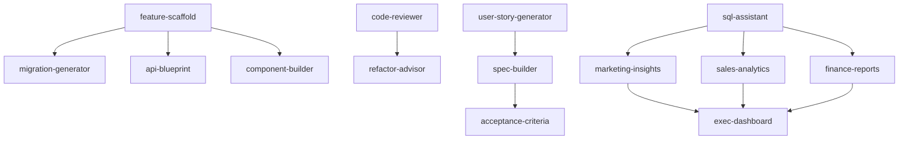

# CircleTel Agent Skills Expansion Plan

> **Purpose**: Leverage Agent Skills to accelerate development, ensure code quality, and empower business teams to manage CircleTel efficiently.

**Date**: 2025-10-20
**Status**: Planning Phase
**Owner**: Development Team + Claude Code

---

## Executive Summary

This document outlines a strategic expansion of CircleTel's Agent Skills system from **6 current skills** to **20+ comprehensive skills** covering development velocity, code quality, business operations, and team collaboration.

**Key Goals**:
1. **Faster Development**: Reduce feature implementation time by 40% through automated workflows
2. **Higher Code Quality**: Enforce standards, refactoring, and testing through proactive skills
3. **Business Enablement**: Give non-technical teams (marketing, sales, ops, finance, exec) self-service tools
4. **Feature Cohesion**: Ensure frontend, backend, and database work together seamlessly
5. **Requirements Clarity**: Transform business needs into well-defined user stories automatically

---

## Current State Analysis

### Existing Skills (6 Total)

| Skill | Category | Purpose | Effectiveness |
|-------|----------|---------|---------------|
| **sql-assistant** | Development | Natural language to SQL | ⭐⭐⭐⭐⭐ High value |
| **deployment-check** | Quality | Pre-deployment validation | ⭐⭐⭐⭐⭐ Critical |
| **coverage-check** | Testing | Multi-provider testing | ⭐⭐⭐⭐ High value |
| **product-import** | Operations | Bulk data import | ⭐⭐⭐ Medium value |
| **admin-setup** | Operations | RBAC configuration | ⭐⭐⭐ Medium value |
| **supabase-fetch** | Development | Pre-defined queries | ⭐⭐⭐ Medium value |

### Gap Analysis

**Missing Capabilities**:

#### Development Velocity
- ❌ No automated feature scaffolding (frontend + backend + DB in one command)
- ❌ No code refactoring guidance or automation
- ❌ No dependency management and security audit
- ❌ No performance profiling automation
- ❌ No migration generation from schema changes

#### Code Quality
- ❌ No automated code review with CircleTel standards
- ❌ No test generation (unit, integration, E2E)
- ❌ No accessibility audit automation
- ❌ No security vulnerability scanning
- ❌ No documentation generation from code

#### Business Operations
- ❌ No self-service reporting for marketing/sales/finance
- ❌ No campaign management automation
- ❌ No customer journey analytics
- ❌ No financial reporting and reconciliation
- ❌ No executive dashboard generation

#### Requirements & Planning
- ❌ No user story generation from business requirements
- ❌ No feature specification automation
- ❌ No acceptance criteria builder
- ❌ No sprint planning assistance
- ❌ No technical debt tracking

---

## Proposed Skills Architecture

### Skill Categories (20+ New Skills)

```
CircleTel Agent Skills System (26 Total)
│
├── 🚀 Development Velocity (7 skills)
│   ├── feature-scaffold          ⭐ NEW
│   ├── migration-generator       ⭐ NEW
│   ├── api-blueprint             ⭐ NEW
│   ├── component-builder         ⭐ NEW
│   ├── dependency-audit          ⭐ NEW
│   ├── performance-profiler      ⭐ NEW
│   └── deployment-check          ✅ Existing
│
├── 🎯 Code Quality (6 skills)
│   ├── code-reviewer             ⭐ NEW
│   ├── test-generator            ⭐ NEW
│   ├── refactor-advisor          ⭐ NEW
│   ├── accessibility-audit       ⭐ NEW
│   ├── security-scanner          ⭐ NEW
│   └── doc-generator             ⭐ NEW
│
├── 📊 Business Operations (7 skills)
│   ├── marketing-insights        ⭐ NEW
│   ├── sales-analytics           ⭐ NEW
│   ├── finance-reports           ⭐ NEW
│   ├── customer-journey-tracker  ⭐ NEW
│   ├── exec-dashboard            ⭐ NEW
│   ├── product-import            ✅ Existing
│   └── admin-setup               ✅ Existing
│
├── 📝 Requirements & Planning (4 skills)
│   ├── user-story-generator      ⭐ NEW
│   ├── spec-builder              ⭐ NEW
│   ├── acceptance-criteria       ⭐ NEW
│   └── tech-debt-tracker         ⭐ NEW
│
└── 🛠️ Database & Testing (2 existing + coverage-check)
    ├── sql-assistant             ✅ Existing
    ├── supabase-fetch            ✅ Existing
    └── coverage-check            ✅ Existing
```

---

## Detailed Skill Specifications

### 🚀 Development Velocity Skills

#### 1. feature-scaffold ⭐ NEW
**Purpose**: Generate complete feature implementations (frontend + backend + database) from specifications

**Triggers**: "scaffold feature", "create new feature", "implement [feature name]"

**Workflow**:
1. Parse feature specification or user story
2. Generate database migration (if needed)
3. Create API routes with TypeScript types
4. Build React components with shadcn/ui
5. Add RBAC permission gates
6. Generate test files (E2E + API)
7. Update documentation automatically

**Success Criteria**:
✅ Generated code passes TypeScript validation
✅ RBAC permissions configured correctly
✅ Tests included and passing
✅ Documentation updated

**Example Usage**:
```bash
/skill feature-scaffold
# Prompt: "Create customer invoice download feature"
# Output: Full implementation with migrations, API routes, UI components, tests
```

---

#### 2. migration-generator ⭐ NEW
**Purpose**: Generate Supabase migrations from schema change descriptions

**Triggers**: "add column", "create table", "modify schema", "database change"

**Workflow**:
1. Analyze current database schema
2. Parse schema change request
3. Generate SQL migration with proper naming (`YYYYMMDDHHMMSS_description.sql`)
4. Include rollback migration
5. Validate with dry-run
6. Update TypeScript types

**Success Criteria**:
✅ Migration syntax valid
✅ Includes rollback script
✅ Types updated
✅ No breaking changes to existing data

**Example Usage**:
```bash
/skill migration-generator
# Prompt: "Add payment_status column to orders table with enum"
# Output: Migration file + rollback + updated types
```

---

#### 3. api-blueprint ⭐ NEW
**Purpose**: Design and generate RESTful API endpoints with validation, error handling, and documentation

**Triggers**: "create API", "new endpoint", "API design"

**Workflow**:
1. Define endpoint structure (path, method, params)
2. Generate TypeScript types for request/response
3. Create route handler with Zod validation
4. Add error handling with proper HTTP codes
5. Generate API documentation
6. Create integration test

**Success Criteria**:
✅ RESTful conventions followed
✅ Validation with Zod schemas
✅ Error handling comprehensive
✅ Documentation generated

---

#### 4. component-builder ⭐ NEW
**Purpose**: Generate React components following CircleTel design system and patterns

**Triggers**: "create component", "build UI", "new React component"

**Workflow**:
1. Identify component type (form, card, modal, etc.)
2. Apply CircleTel design system (Tailwind classes, shadcn/ui)
3. Add TypeScript props interface
4. Include accessibility attributes
5. Generate Storybook story (optional)
6. Add usage example

**Success Criteria**:
✅ Design system compliance
✅ Accessibility built-in
✅ TypeScript types complete
✅ Reusable and composable

---

### 🎯 Code Quality Skills

#### 5. code-reviewer ⭐ NEW
**Purpose**: Automated code review against CircleTel standards and best practices

**Triggers**: "review code", "check quality", "before commit"

**Workflow**:
1. Analyze git diff or specified files
2. Check against CircleTel standards:
   - TypeScript strict mode compliance
   - RBAC permission usage
   - Error handling patterns
   - API response format
   - Component structure
3. Identify code smells and anti-patterns
4. Suggest refactoring opportunities
5. Generate review report with severity levels

**Standards Checked**:
- No `any` types
- Proper error boundaries
- RBAC gates on admin features
- API responses include `success: boolean`
- React hooks dependency arrays
- Tailwind CSS usage (no inline styles)

**Success Criteria**:
✅ All critical issues identified
✅ Actionable suggestions provided
✅ Links to documentation for fixes

---

#### 6. test-generator ⭐ NEW
**Purpose**: Generate unit, integration, and E2E tests from existing code

**Triggers**: "generate tests", "add test coverage", "test this component"

**Workflow**:
1. Analyze code to test (component, API route, service)
2. Identify test scenarios (happy path, edge cases, errors)
3. Generate appropriate test type:
   - React Testing Library for components
   - API route tests with mock data
   - Playwright for E2E flows
4. Include test data fixtures
5. Add coverage goals

**Success Criteria**:
✅ >80% code coverage
✅ All critical paths tested
✅ Edge cases included
✅ Mock data realistic

---

#### 7. refactor-advisor ⭐ NEW
**Purpose**: Identify refactoring opportunities and guide safe refactoring

**Triggers**: "refactor", "improve code", "clean up", "technical debt"

**Workflow**:
1. Analyze codebase section
2. Identify patterns:
   - Duplicated code
   - Long functions (>50 lines)
   - Complex conditionals
   - Missing abstractions
   - Outdated patterns
3. Prioritize by impact
4. Generate refactoring plan
5. Execute with safety checks

**Refactoring Types**:
- Extract component
- Extract hook
- Extract utility function
- Simplify conditionals
- Type improvements
- Performance optimizations

**Success Criteria**:
✅ No functionality changes
✅ Tests still pass
✅ Code more maintainable
✅ Performance not degraded

---

### 📊 Business Operations Skills

#### 8. marketing-insights ⭐ NEW
**Purpose**: Generate marketing analytics and campaign performance reports for marketing team

**Triggers**: "marketing report", "campaign analytics", "promotion performance"

**Workflow**:
1. Query promotions, campaigns, marketing pages from Strapi
2. Analyze engagement metrics (views, clicks, conversions)
3. Calculate ROI for campaigns
4. Identify top-performing content
5. Generate visual reports with charts
6. Export to Excel/PDF

**Reports Provided**:
- Campaign performance summary
- Promotion conversion rates
- Landing page analytics
- Content engagement metrics
- A/B test results
- Monthly/quarterly trends

**Success Criteria**:
✅ Real-time data (no lag)
✅ Exportable formats
✅ Actionable insights
✅ No technical knowledge required

---

#### 9. sales-analytics ⭐ NEW
**Purpose**: Sales team self-service reporting and lead management

**Triggers**: "sales report", "lead analytics", "revenue forecast"

**Workflow**:
1. Query coverage leads, orders, conversions
2. Calculate metrics:
   - Lead-to-customer conversion rate
   - Average deal size
   - Sales cycle duration
   - Revenue by product/region
3. Identify high-value leads
4. Forecast next month revenue
5. Generate territory performance

**Reports Provided**:
- Sales pipeline visualization
- Lead source attribution
- Product popularity trends
- Sales rep performance (if RBAC permits)
- Revenue forecasts

**Success Criteria**:
✅ Daily automatic updates
✅ Drill-down capabilities
✅ Export to CRM (Zoho)
✅ Mobile-friendly

---

#### 10. finance-reports ⭐ NEW
**Purpose**: Financial reporting and reconciliation for finance team

**Triggers**: "financial report", "revenue summary", "reconciliation", "accounting"

**Workflow**:
1. Query orders, payments, invoices
2. Calculate financial metrics:
   - Monthly Recurring Revenue (MRR)
   - Annual Recurring Revenue (ARR)
   - Customer Lifetime Value (CLV)
   - Churn rate
   - Payment success rate
3. Reconcile payments with bank transactions
4. Generate compliance reports
5. Export to accounting software

**Reports Provided**:
- Revenue recognition report
- Payment reconciliation
- Churn analysis
- Tax compliance data
- Profit & loss by product

**Success Criteria**:
✅ Accounting standards compliant
✅ Audit trail included
✅ Automated reconciliation
✅ Export to QuickBooks/Xero

---

#### 11. customer-journey-tracker ⭐ NEW
**Purpose**: Track and analyze complete customer journeys from coverage check to order completion

**Triggers**: "customer journey", "conversion funnel", "user flow"

**Workflow**:
1. Trace user path through system:
   - Coverage check → Packages → Selection → Account → Payment
2. Identify drop-off points
3. Calculate conversion rates per step
4. Analyze time spent per stage
5. Segment by customer type (B2B vs B2C)
6. Generate funnel visualization

**Insights Provided**:
- Conversion bottlenecks
- Average time to purchase
- Most common exit points
- A/B test opportunities
- UX improvement recommendations

**Success Criteria**:
✅ Real-time journey tracking
✅ Segmentation by demographics
✅ Actionable UX recommendations
✅ Visual funnel diagrams

---

#### 12. exec-dashboard ⭐ NEW
**Purpose**: Executive management high-level KPI dashboard (CEO, CFO, COO)

**Triggers**: "executive summary", "KPI dashboard", "business metrics"

**Workflow**:
1. Aggregate cross-functional data:
   - Revenue metrics (finance)
   - Customer acquisition (sales)
   - Product performance (product)
   - System health (operations)
2. Calculate executive KPIs:
   - Total ARR/MRR
   - Customer growth rate
   - Net Promoter Score (NPS)
   - System uptime
   - Support ticket resolution
3. Generate trend analysis
4. Highlight critical alerts
5. Export to PDF/PowerPoint

**Dashboard Sections**:
- Financial summary (revenue, profit)
- Growth metrics (new customers, churn)
- Operational health (system uptime, API performance)
- Product analytics (popular packages)
- Team performance (by department)

**Success Criteria**:
✅ Single-page overview
✅ Updated daily
✅ Role-based visibility (RBAC)
✅ Export for board meetings

---

### 📝 Requirements & Planning Skills

#### 13. user-story-generator ⭐ NEW
**Purpose**: Transform business requirements into well-structured user stories with acceptance criteria

**Triggers**: "create user stories", "requirements to stories", "feature planning"

**Workflow**:
1. Parse business requirement description
2. Identify user personas (admin, customer, manager)
3. Generate user stories in standard format:
   ```
   As a [persona]
   I want to [action]
   So that [benefit]
   ```
4. Add acceptance criteria (Given/When/Then)
5. Estimate story points
6. Identify dependencies
7. Tag with components (frontend/backend/database)

**Output Format**:
```markdown
## User Story: Customer Invoice Download

**As a** customer
**I want to** download my monthly invoices as PDF
**So that** I can keep records for accounting

### Acceptance Criteria
- Given I am logged in
- When I navigate to "My Account" → "Billing"
- Then I see a list of all past invoices
- And each invoice has a "Download PDF" button
- When I click "Download PDF"
- Then a PDF invoice downloads with correct data

### Technical Components
- Frontend: Account page update
- Backend: PDF generation API
- Database: Invoice data retrieval

### Story Points: 5
### Dependencies: Payment system integration
```

**Success Criteria**:
✅ Stories follow standard format
✅ Acceptance criteria testable
✅ Dependencies identified
✅ Story points estimated

---

#### 14. spec-builder ⭐ NEW
**Purpose**: Create comprehensive technical specifications from user stories

**Triggers**: "create spec", "technical specification", "design document"

**Workflow**:
1. Analyze user stories
2. Design database schema changes
3. Define API endpoints (request/response)
4. Specify UI components and layouts
5. Identify third-party integrations
6. Add security considerations (RBAC, validation)
7. Include testing strategy
8. Generate implementation checklist

**Spec Sections**:
1. Overview & Goals
2. User Stories Reference
3. Database Schema
4. API Design
5. Frontend Components
6. Security & Permissions
7. Testing Strategy
8. Implementation Checklist
9. Rollout Plan

**Success Criteria**:
✅ Complete specification document
✅ All layers covered (DB/API/UI)
✅ Security included
✅ Testable requirements

---

#### 15. acceptance-criteria ⭐ NEW
**Purpose**: Generate comprehensive acceptance criteria for features in Given/When/Then format

**Triggers**: "acceptance criteria", "test scenarios", "QA checklist"

**Workflow**:
1. Analyze feature description
2. Identify all user flows
3. Generate test scenarios:
   - Happy path
   - Edge cases
   - Error conditions
   - Boundary values
4. Write in Given/When/Then format
5. Add non-functional requirements (performance, accessibility)
6. Create QA checklist

**Example Output**:
```markdown
## Acceptance Criteria: Customer Login

### Functional
✅ Given valid email and password, when user submits login form, then user is redirected to dashboard
✅ Given invalid password, when user submits login form, then error message displays
✅ Given unregistered email, when user submits login form, then error message displays
✅ Given user clicks "Forgot Password", when email is submitted, then reset link is sent

### Non-Functional
✅ Login completes within 2 seconds
✅ Password is hashed (not stored plain text)
✅ Login form is keyboard navigable
✅ Screen reader announces errors
✅ CAPTCHA after 3 failed attempts

### QA Checklist
- [ ] Test on Chrome, Firefox, Safari
- [ ] Test on mobile devices
- [ ] Test with screen reader
- [ ] Test password reset flow
- [ ] Test session persistence
```

**Success Criteria**:
✅ All scenarios covered
✅ Non-functional requirements included
✅ QA checklist actionable
✅ Testable with automation

---

#### 16. tech-debt-tracker ⭐ NEW
**Purpose**: Identify, prioritize, and track technical debt across the codebase

**Triggers**: "technical debt", "code issues", "refactoring backlog"

**Workflow**:
1. Scan codebase for debt indicators:
   - TODO/FIXME comments
   - Deprecated packages
   - Unused dependencies
   - Complex functions (high cyclomatic complexity)
   - Missing tests
   - Outdated patterns
2. Categorize by severity (critical/high/medium/low)
3. Estimate refactoring effort
4. Prioritize by impact × effort matrix
5. Generate debt report
6. Track progress over time

**Debt Categories**:
- Code quality (duplicates, complexity)
- Dependencies (outdated, security vulnerabilities)
- Testing (missing coverage)
- Documentation (missing/outdated)
- Performance (slow queries, memory leaks)
- Security (vulnerabilities)

**Report Metrics**:
- Total debt items
- Debt by category
- High-priority debt
- Debt trend (increasing/decreasing)
- Estimated hours to resolve

**Success Criteria**:
✅ Comprehensive debt inventory
✅ Actionable prioritization
✅ Progress tracking
✅ Automated monitoring

---

## Implementation Roadmap

### Phase 1: Development Velocity (Weeks 1-2)
**Goal**: Ship features 40% faster

| Skill | Priority | Effort | Impact |
|-------|----------|--------|--------|
| feature-scaffold | 🔥 Critical | 3 days | Very High |
| migration-generator | 🔥 Critical | 2 days | High |
| api-blueprint | ⚠️ High | 2 days | High |
| component-builder | ⚠️ High | 3 days | Medium |

**Week 1**:
- [ ] Build feature-scaffold skill with templates
- [ ] Create migration-generator with schema analysis
- [ ] Test both skills on real features

**Week 2**:
- [ ] Build api-blueprint with validation
- [ ] Create component-builder with design system
- [ ] Integration testing

---

### Phase 2: Code Quality (Weeks 3-4)
**Goal**: Reduce bugs by 60%, improve maintainability

| Skill | Priority | Effort | Impact |
|-------|----------|--------|--------|
| code-reviewer | 🔥 Critical | 3 days | Very High |
| test-generator | 🔥 Critical | 3 days | Very High |
| refactor-advisor | ⚠️ High | 2 days | High |
| security-scanner | ⚠️ High | 2 days | High |

**Week 3**:
- [ ] Build code-reviewer with CircleTel standards
- [ ] Create test-generator for components/APIs
- [ ] Test on existing codebase

**Week 4**:
- [ ] Build refactor-advisor with safe refactoring
- [ ] Create security-scanner with OWASP checks
- [ ] Documentation

---

### Phase 3: Business Operations (Weeks 5-6)
**Goal**: Empower non-technical teams

| Skill | Priority | Effort | Impact |
|-------|----------|--------|--------|
| marketing-insights | 🔥 Critical | 2 days | Very High |
| sales-analytics | 🔥 Critical | 2 days | Very High |
| finance-reports | ⚠️ High | 3 days | High |
| exec-dashboard | ⚠️ High | 3 days | High |
| customer-journey-tracker | ⚠️ Medium | 2 days | Medium |

**Week 5**:
- [ ] Build marketing-insights with Strapi integration
- [ ] Create sales-analytics with conversion tracking
- [ ] Test with marketing/sales teams

**Week 6**:
- [ ] Build finance-reports with accounting standards
- [ ] Create exec-dashboard with KPIs
- [ ] Build customer-journey-tracker
- [ ] User training

---

### Phase 4: Requirements & Planning (Week 7)
**Goal**: Better requirements → better features

| Skill | Priority | Effort | Impact |
|-------|----------|--------|--------|
| user-story-generator | 🔥 Critical | 2 days | Very High |
| spec-builder | ⚠️ High | 2 days | High |
| acceptance-criteria | ⚠️ High | 1 day | High |
| tech-debt-tracker | ⚠️ Medium | 2 days | Medium |

**Week 7**:
- [ ] Build user-story-generator
- [ ] Create spec-builder with templates
- [ ] Build acceptance-criteria generator
- [ ] Create tech-debt-tracker
- [ ] Final documentation and training

---

## Skill Development Guidelines

### Skill Structure Template

```markdown
---
name: skill-name
description: When to trigger this skill (1-2 sentences)
category: development|quality|business|planning
priority: critical|high|medium|low
auto_trigger: ["keyword1", "keyword2"]
---

# Skill Name

## Purpose
What problem does this skill solve?

## Workflow Steps
1. Step 1
2. Step 2
3. Step 3

## Input/Output
**Input**: What data/context needed
**Output**: What the skill produces

## Success Criteria
✅ Criterion 1
✅ Criterion 2

## Usage Examples
```bash
/skill skill-name
# Example scenario
```

## Integration Points
- Related skills
- Systems/APIs used
- Data sources

## Performance Targets
- Execution time: <Xs
- Success rate: >X%
```

---

### Best Practices

#### Progressive Disclosure
Skills should load context in layers:
1. **Metadata** (~100 tokens): Name, description, triggers
2. **Instructions** (<5k tokens): Workflow, examples
3. **Resources** (on-demand): Scripts, data, schemas

#### Proactive Invocation
Skills should auto-trigger based on:
- User language ("deploy", "refactor", "report")
- Context signals (git diff, file changes)
- Workflow stage (pre-commit, pre-deploy)

#### Error Handling
All skills must:
- Validate inputs before execution
- Provide clear error messages
- Offer recovery suggestions
- Log failures for debugging

#### Testing
Each skill needs:
- Unit tests for core logic
- Integration tests with real data
- E2E tests for full workflows
- Performance benchmarks

---

## Success Metrics

### Development Velocity (Phase 1)
- **Feature Implementation Time**: 40% reduction (6 days → 3.6 days average)
- **Migration Generation**: <5 minutes (vs 30 minutes manual)
- **API Endpoint Creation**: <10 minutes (vs 1 hour manual)
- **Component Generation**: <15 minutes (vs 2 hours manual)

### Code Quality (Phase 2)
- **Bug Reduction**: 60% fewer production bugs
- **Test Coverage**: 80%+ across all code
- **Code Review Time**: 50% reduction (2 hours → 1 hour)
- **Security Vulnerabilities**: 100% detection of OWASP Top 10

### Business Enablement (Phase 3)
- **Report Generation Time**: <2 minutes (vs 1 hour manual)
- **Self-Service Adoption**: 80% of reports without dev help
- **Decision Speed**: 2x faster with real-time dashboards
- **Cross-Team Visibility**: 100% teams have access to their metrics

### Requirements Quality (Phase 4)
- **User Story Clarity**: 90% stories require no clarification
- **Spec Completeness**: 95% specs ready for implementation
- **Acceptance Criteria**: 100% features have testable criteria
- **Tech Debt Reduction**: 20% quarterly decrease

---

## Training & Adoption

### Developer Onboarding
**Week 1**: Development Velocity Skills
- feature-scaffold tutorial
- migration-generator practice
- api-blueprint exercises

**Week 2**: Code Quality Skills
- code-reviewer workshop
- test-generator practice
- refactor-advisor case studies

### Business Team Onboarding
**Marketing Team**: marketing-insights, customer-journey-tracker
**Sales Team**: sales-analytics, customer-journey-tracker
**Finance Team**: finance-reports
**Executive Team**: exec-dashboard

### Documentation
- Skill catalog (this document)
- Video tutorials (5-10 minutes each)
- Quick reference cards
- Troubleshooting guides

---

## Security & Compliance

### RBAC Integration
All business operation skills enforce RBAC:
- Marketing insights: `PERMISSIONS.MARKETING.VIEW_ANALYTICS`
- Sales analytics: `PERMISSIONS.SALES.VIEW_REPORTS`
- Finance reports: `PERMISSIONS.FINANCE.VIEW_REPORTS`
- Exec dashboard: `PERMISSIONS.DASHBOARD.VIEW_EXECUTIVE`

### Data Privacy
Skills must:
- Respect RLS policies in Supabase
- Anonymize PII in reports
- Audit all data access
- Comply with GDPR/POPIA

### Audit Logging
All skill executions logged:
- Who invoked skill
- What data accessed
- When executed
- Results produced

---

## Maintenance & Evolution

### Continuous Improvement
- Monthly skill performance review
- User feedback collection
- A/B testing new approaches
- Quarterly roadmap updates

### Skill Versioning
Skills follow semantic versioning:
- Major: Breaking changes
- Minor: New features
- Patch: Bug fixes

### Deprecation Policy
Old skills deprecated with:
- 3-month notice
- Migration guide to new skill
- Parallel support during transition

---

## Next Steps

### Immediate Actions (This Week)
1. ✅ Review this plan with development team
2. ✅ Prioritize Phase 1 skills (feature-scaffold, migration-generator)
3. ✅ Set up skill development environment
4. ✅ Create first skill prototype (feature-scaffold)
5. ✅ Test with real feature implementation

### Short-Term (Next 2 Weeks)
1. Complete Phase 1 skills (development velocity)
2. Test with development team
3. Gather feedback and iterate
4. Begin Phase 2 (code quality)

### Medium-Term (Next 6 Weeks)
1. Complete all 4 phases
2. Train all teams on relevant skills
3. Measure success metrics
4. Document lessons learned
5. Plan Phase 5 (advanced capabilities)

---

## Appendix

### A. Skill Dependencies



### B. Technology Stack

| Layer | Technology | Purpose |
|-------|-----------|---------|
| Skill Execution | Node.js + TypeScript | Script runtime |
| Database Queries | Supabase JS Client | Data access |
| Code Analysis | TypeScript Compiler API | AST parsing |
| Testing | Playwright | E2E automation |
| Reporting | Recharts + D3.js | Data visualization |
| Export | jsPDF + ExcelJS | Document generation |

### C. Resource Requirements

**Development Time**: 7 weeks (1 developer + Claude Code)
**Maintenance**: 4 hours/week ongoing
**Infrastructure**: None (runs on existing stack)
**Cost**: $0 (uses existing tools)

---

**Document Version**: 1.0
**Last Updated**: 2025-10-20
**Next Review**: 2025-11-03 (after Phase 1 completion)
