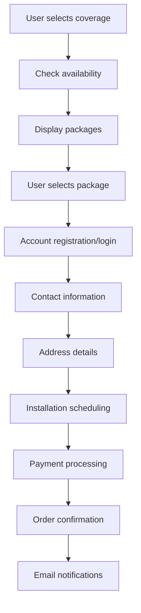
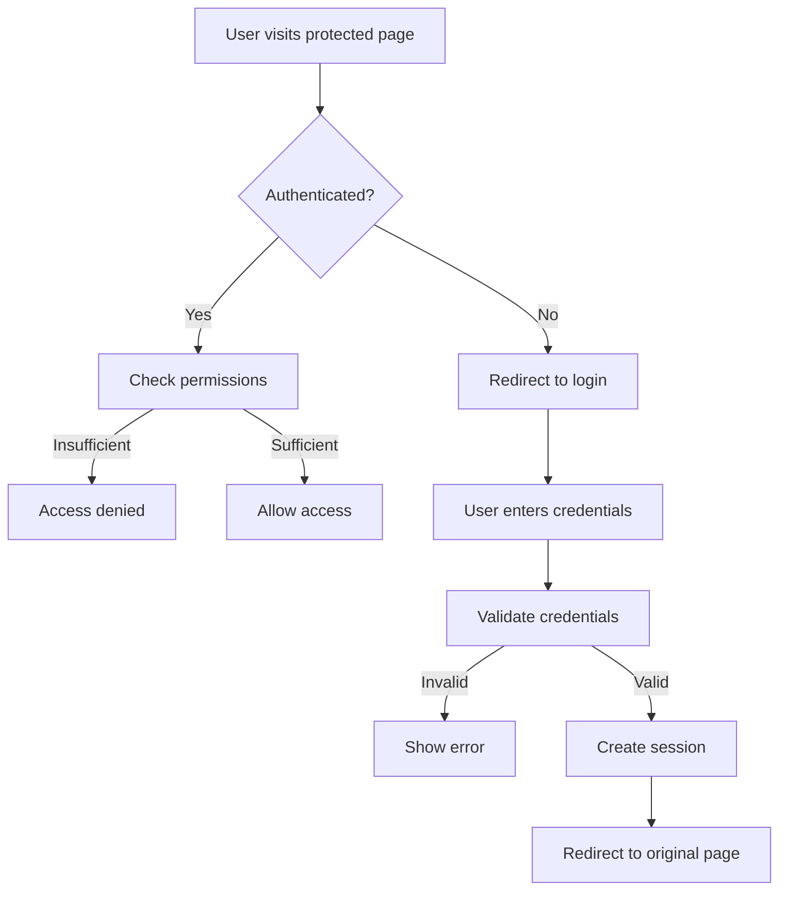

# CircleTel System Architecture Overview

## Overview

CircleTel is a South African telecommunications and IT services platform built with Next.js 15, React 18, and TypeScript. The system provides services for SMEs, SOHOs, and residential customers, focusing on managed IT services, connectivity solutions, and cloud services.

## Current Architecture (As-Built)

### Technology Stack
- **Framework**: Next.js 15 with App Router
- **Frontend**: React 18 with TypeScript
- **Styling**: Tailwind CSS with custom CircleTel branding
- **Database**: Supabase (PostgreSQL)
- **Authentication**: Mock authentication (admin only)
- **State Management**: React hooks (useState, useEffect)
- **Forms**: Custom CircleTel-branded form components

### Current System Components

#### Frontend Structure
```
📁 app/
├── 📁 admin/              # Admin dashboard with mock auth
├── 📁 services/           # Service pages (IT, connectivity, cloud)
├── 📁 connectivity/       # Internet service options
├── 📁 cloud/              # Cloud service pages
├── 📁 bundles/            # Service packages
├── 📁 contact/            # Contact forms
└── 📁 resources/          # Guides and tools

📁 components/
├── 📁 forms/              # Custom CircleTel form components
│   ├── 📁 common/         # FormLayout, FormSection, FormFields
│   └── 📁 clients/        # Specialized forms (Unjani audits)
├── 📁 layout/             # Navbar, Footer components
├── 📁 ui/                 # Base UI components
├── 📁 coverage/           # Coverage checking components
└── 📁 admin/              # Admin-specific components
```

#### Backend Integration
```
📁 lib/
├── 📁 services/           # Supabase integration
└── 📁 utils/              # Utility functions

📁 hooks/
├── 📁 useContactForm.ts   # Simple form state management
├── 📁 useAdminAuth.ts     # Mock authentication
└── 📁 useToast.ts         # Toast notifications
```

### Database Schema (Current)

#### Existing Tables
```sql
-- Healthcare Contract Audits
unjani_contract_audits (
  id, clinic_name, clinical_lead_name, clinic_contact,
  clinic_email, business_registration_number, vat_number,
  head_office_address, clinic_address, services_offered,
  average_monthly_patient_volume, compliance_level,
  healthcare_regulations, it_assessment, operational_requirements,
  technology_readiness, areas_for_improvement, recommendations,
  risk_score, overall_score, migration_priority, priority_reason,
  submitted_at, created_at, updated_at
)

-- Product Catalog
admin_product_catalogue (
  id, name, category, type, status, price, setup_fee,
  description, features, speed_down, speed_up, data_limit,
  target_market, contract_term, availability,
  created_at, updated_at, created_by, last_modified_by
)
```

### Current Features

#### ✅ Implemented
- **Admin Dashboard**: Product catalog management with mock authentication
- **Form System**: Custom CircleTel-branded form components
- **Service Pages**: IT services, connectivity options, cloud services
- **Contact Forms**: Lead generation and inquiry forms
- **Coverage Tools**: Address-based coverage checking
- **Responsive Design**: Mobile-first approach with CircleTel branding

#### 🚧 In Development
- **Authentication**: Real Supabase Auth integration
- **Order Management**: Multi-step ordering flow
- **User Management**: User registration and profiles
- **Payment Integration**: South African payment providers

#### 📋 Planned
- **Order Processing**: Complete order lifecycle management
- **Installation Scheduling**: Technician scheduling system
- **Customer Portal**: User dashboard for service management
- **Advanced Analytics**: Business intelligence and reporting

## Data Flow Architecture

### Order Processing Flow


### Authentication Flow


## Technology Stack

### Core Technologies
- **Framework**: Next.js 15 with App Router
- **Language**: TypeScript 5.x
- **Styling**: Tailwind CSS with Radix UI
- **Database**: Supabase (PostgreSQL)
- **Authentication**: Supabase Auth
- **State Management**: Zustand + TanStack Query

### Development Tools
- **Build Tool**: Next.js with Turbopack
- **Linting**: ESLint with Next.js config
- **Formatting**: Prettier
- **Testing**: Jest + React Testing Library
- **Type Checking**: TypeScript strict mode

### Deployment & Hosting
- **Platform**: Vercel
- **CDN**: Vercel Edge Network
- **Database**: Supabase Cloud
- **Monitoring**: Vercel Analytics + Sentry

## Security Architecture

### Authentication & Authorization
- **JWT Tokens**: Secure session management
- **Role-Based Access**: Admin, user, and guest roles
- **Password Policies**: Strong password requirements
- **Two-Factor Authentication**: Optional 2FA for sensitive operations

### Data Protection
- **Encryption**: AES-256 for sensitive data
- **HTTPS**: SSL/TLS encryption for all communications
- **Input Validation**: Server-side validation for all inputs
- **SQL Injection Prevention**: Parameterized queries

### Payment Security
- **PCI Compliance**: Payment data handling according to standards
- **Tokenization**: Payment information tokenization
- **Fraud Detection**: Basic fraud detection measures
- **Audit Logging**: Transaction audit trails

## Performance Architecture

### Frontend Performance
- **Code Splitting**: Automatic code splitting by Next.js
- **Image Optimization**: Next.js Image component with WebP support
- **Lazy Loading**: Components and routes loaded on demand
- **Caching**: Browser and CDN caching strategies

### Backend Performance
- **Database Optimization**: Query optimization and indexing
- **Edge Functions**: Serverless functions for compute-intensive tasks
- **Real-time Updates**: Supabase real-time subscriptions
- **Background Jobs**: Queue system for heavy operations

## Scalability Considerations

### Horizontal Scaling
- **Stateless Design**: Components designed to be stateless
- **Database Sharding**: Potential for future sharding
- **CDN Distribution**: Global content distribution
- **Load Balancing**: Vercel automatic load balancing

### Vertical Scaling
- **Database Optimization**: Efficient queries and indexing
- **Caching Strategy**: Multi-level caching implementation
- **Code Optimization**: Performance monitoring and optimization
- **Resource Allocation**: Appropriate resource allocation

## Monitoring & Observability

### Application Monitoring
- **Error Tracking**: Sentry for error monitoring
- **Performance Monitoring**: Vercel Analytics and Web Vitals
- **User Analytics**: Google Analytics or similar
- **Custom Metrics**: Business-specific KPI tracking

### Infrastructure Monitoring
- **Uptime Monitoring**: Vercel and Supabase monitoring
- **Database Performance**: Supabase dashboard monitoring
- **API Monitoring**: Response time and error rate tracking
- **Security Monitoring**: Failed login attempts and suspicious activity

## Future Considerations

### Planned Enhancements
- **Microservices**: Potential migration to microservices architecture
- **Event-Driven Architecture**: Implementation of event sourcing
- **AI/ML Integration**: Customer behavior analysis and recommendations
- **Mobile App**: Native mobile application development

### Technology Evolution
- **Framework Updates**: Regular Next.js and React updates
- **Performance Optimization**: Continuous performance improvements
- **Security Updates**: Regular security patches and updates
- **Feature Expansion**: New features based on user feedback

---

## Related Documentation

- [Database Schema](database-schema.md)
- [Component Architecture](component-architecture.md)
- [API Design](api-design.md)
- [Security Standards](../standards/security-standards.md)

---

*This document is maintained by the CircleTel architecture team and should be updated as the system evolves.*
