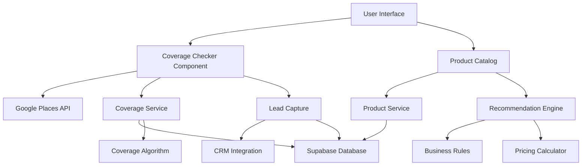

# Epic: CJF-001 - Service Availability & Product Discovery
## BMAD Method Epic Planning Document
### Sprint 42 - October 2025 (Week 1-2)

---

## Epic Overview

**Epic ID**: CJF-001  
**Epic Name**: Service Availability & Product Discovery  
**Priority**: P0 - Critical (MVP Blocker)  
**Timeline**: Sprint 42 (October 1-12, 2025)  
**Team Size**: 2-3 Developers  
**Business Owner**: Product Manager  
**Technical Owner**: Architect Agent  

### Business Value Statement
Enable potential customers to discover CircleTel services, check availability at their location, and explore our product portfolio. This is the critical first step in the customer journey and directly impacts our ability to acquire the target 25 customers for MVP launch.

### Success Metrics
- **Conversion Rate**: 15% of visitors complete coverage check
- **Lead Capture**: 100% of no-coverage areas generate leads
- **Performance**: Coverage check < 2 seconds
- **Product Discovery**: 30% proceed to product browsing
- **Mobile Usage**: 60% successful mobile completions

---

## Business Context (Analyst Agent Input)

### Market Analysis
- **Competition**: Competitors take 5-10 minutes for coverage checks
- **Our Advantage**: Instant results with intelligent recommendations
- **Target Segment**: SMEs (10-50 employees) in urban areas
- **Expected Traffic**: 500-1000 visitors/day at launch

### Customer Journey Mapping
```
Entry Points → Coverage Check → Product Discovery → Quote/Order
     ↓              ↓                ↓                ↓
  Google Ads    Qualification    Recommendations    Conversion
  Direct URL    Lead Capture     Comparison Tool     Cart Entry
  Referrals     Analytics        Bundle Builder      Checkout
```

### Business Requirements
From BRS v2.0 Section 4.1 & 4.2:
- Real-time service availability verification
- Support for all three service types (SkyFibre, HomeFibreConnect, BizFibreConnect)
- Lead capture for expansion planning
- Intelligent product recommendations based on business profile
- Bundle savings calculator

---

## Technical Architecture (Architect Agent Input)

### System Design


### Technology Stack
- **Frontend**: Next.js 15, TypeScript, Tailwind CSS
- **Components**: shadcn/ui + Custom CircleTel components
- **State Management**: Zustand for cart, React Query for data
- **Backend**: Supabase Edge Functions
- **Database**: PostgreSQL (Supabase)
- **APIs**: Google Places, Google Maps
- **Analytics**: Vercel Analytics + Custom events

### Data Models
```typescript
// Coverage Area Model
interface CoverageArea {
  id: string;
  service_type: 'SkyFibre' | 'HomeFibreConnect' | 'BizFibreConnect';
  polygon: GeoJSON;
  available_speeds: Speed[];
  availability_status: 'active' | 'coming_soon' | 'planned';
  estimated_activation_days: number;
}

// Product Model
interface Product {
  id: string;
  name: string;
  category: 'connectivity' | 'it_services' | 'bundle';
  service_type?: ServiceType;
  pricing: {
    monthly: number;
    setup: number;
    currency: 'ZAR';
  };
  features: Feature[];
  requirements?: Requirement[];
  bundle_components?: string[]; // Product IDs
}

// Lead Model
interface Lead {
  id: string;
  email: string;
  phone?: string;
  address: string;
  coordinates: { lat: number; lng: number };
  requested_service: ServiceType;
  source: 'coverage_checker' | 'contact_form' | 'partner';
  created_at: Date;
  status: 'new' | 'contacted' | 'qualified' | 'converted';
}
```

---

## Story Breakdown (Scrum Master Agent Input)

### Story Map
```
Epic CJF-001
├── Story 01: Coverage Checker Component (3 days)
│   ├── Address input with autocomplete
│   ├── Coverage API integration
│   └── Results display
├── Story 02: Product Catalog System (2 days)
│   ├── Product listing
│   ├── Filtering & search
│   └── Category navigation
└── Story 03: Intelligent Recommendations (2 days)
    ├── Business assessment
    ├── Recommendation algorithm
    └── Bundle builder
```

### Sprint Planning
**Sprint 42 Schedule (6 days)**:
- **Day 1-3**: CJF-001-01 Coverage Checker
- **Day 3-4**: CJF-001-02 Product Catalog  
- **Day 5-6**: CJF-001-03 Recommendations
- **Day 6**: Integration testing & deployment

### Dependencies
- ✅ Google Maps API key configured
- ✅ Supabase project ready
- ⚠️ Coverage data imported (needed by Day 1)
- ⚠️ Product data finalized (needed by Day 3)
- ✅ Design system components ready

---

## Implementation Plan (Developer Agent Input)

### Day 1-3: Coverage Checker Component

#### Implementation Checklist
```markdown
## Morning Day 1
- [ ] Set up component structure
- [ ] Implement address input field
- [ ] Add Google Places autocomplete
- [ ] Create geolocation hook
- [ ] Build loading states

## Afternoon Day 1  
- [ ] Create Supabase edge function for coverage check
- [ ] Implement coverage algorithm
- [ ] Set up database queries
- [ ] Add error handling
- [ ] Create API client

## Day 2
- [ ] Build results display component
- [ ] Implement service cards
- [ ] Add animation/transitions
- [ ] Create no-coverage flow
- [ ] Build lead capture form
- [ ] Integrate with Supabase

## Day 3 Morning
- [ ] Add analytics tracking
- [ ] Implement caching
- [ ] Performance optimization
- [ ] Mobile responsiveness
- [ ] Accessibility fixes

## Day 3 Afternoon
- [ ] Unit testing
- [ ] Integration testing
- [ ] Code review
- [ ] Documentation
- [ ] Deploy to staging
```

### Code Structure
```
/components/coverage/
├── CoverageChecker.tsx         # Main component
├── AddressAutocomplete.tsx     # Google Places integration
├── CoverageResults.tsx         # Results display
├── NoCoverageLeadCapture.tsx  # Lead form
├── ServiceCard.tsx             # Service display card
├── CoverageMap.tsx            # Optional map view
└── __tests__/                 # Component tests

/lib/api/
├── coverage.ts                 # Coverage API client
├── leads.ts                   # Lead capture API
└── products.ts                # Product API client

/supabase/functions/
├── check-coverage/            # Coverage check function
├── capture-lead/             # Lead capture function
└── get-products/             # Product fetch function
```

### Day 4-5: Product Catalog System

#### Key Implementation Points
```typescript
// Product Catalog Structure
/components/products/
├── ProductCatalog.tsx         # Main catalog component
├── ProductGrid.tsx           # Grid layout
├── ProductCard.tsx           # Individual product card
├── ProductFilters.tsx        # Filter sidebar
├── ProductSearch.tsx         # Search component
├── ProductComparison.tsx     # Comparison tool
└── CategoryNav.tsx           # Category navigation

// Key Features to Implement
- Virtual scrolling for performance
- Real-time search with debouncing
- Filter state in URL params
- Responsive grid (1-4 columns)
- Lazy loading images
- Price formatting with currency
```

### Day 5-6: Intelligent Recommendations

#### Recommendation Algorithm
```typescript
// Simplified recommendation logic
function getRecommendations(profile: BusinessProfile): Product[] {
  const rules = [
    // Size-based rules
    { 
      condition: (p) => p.employees < 10,
      products: ['SkyFibre-50', 'BasicITSupport'],
      bundle: 'CircleComplete-Starter'
    },
    {
      condition: (p) => p.employees >= 10 && p.employees < 50,
      products: ['BizFibreConnect-100', 'ProITSupport'],
      bundle: 'CircleComplete-Business'
    },
    // Industry-based rules
    {
      condition: (p) => p.industry === 'tech',
      products: ['BizFibreConnect-200', 'CloudBackup', 'Security+'],
      bundle: 'CircleComplete-Tech'
    }
  ];
  
  return applyRules(profile, rules);
}
```

---

## Quality Gates (QA Agent Input)

### Acceptance Criteria Checklist

#### Coverage Checker
- [ ] Address autocomplete works with South African addresses
- [ ] Geolocation accurate to 100m
- [ ] Coverage check returns in < 2 seconds
- [ ] All three service types detected
- [ ] Lead capture form validates email/phone
- [ ] Success rate > 95% for valid addresses

#### Product Catalog  
- [ ] Products load in < 1 second
- [ ] Filters update URL and are shareable
- [ ] Search returns relevant results
- [ ] Categories correctly organized
- [ ] Pricing displays with VAT
- [ ] Mobile layout responsive

#### Recommendations
- [ ] Assessment takes < 30 seconds
- [ ] Recommendations relevant to profile
- [ ] Bundle savings calculated correctly
- [ ] ROI calculator accurate
- [ ] Comparison tool works
- [ ] Results can be saved/shared

### Testing Requirements
```javascript
// Minimum test coverage required
- Unit Tests: 80% coverage
- Integration Tests: All API endpoints
- E2E Tests: Critical user flows
- Performance Tests: Load time < 2s
- Accessibility: WCAG 2.1 AA
- Mobile Tests: iOS Safari, Chrome Android
```

### Performance Benchmarks
| Metric | Target | Critical |
|--------|--------|----------|
| Coverage Check API | < 2s | < 3s |
| Product List Load | < 1s | < 2s |
| First Contentful Paint | < 1.5s | < 2.5s |
| Time to Interactive | < 3s | < 4s |
| Lighthouse Score | > 90 | > 80 |

---

## BMAD Workflow for This Epic

### 1. Planning Phase (Now - Before Sprint Starts)

```bash
# Using BMAD Analyst Agent
*analyst
> Analyze the market requirements for coverage checking
> Review competitor coverage check flows
> Define success metrics for the epic
> Create detailed acceptance criteria

# Using BMAD Architect Agent  
*architect
> Design the technical architecture for coverage system
> Define API contracts and data models
> Review existing components for reuse
> Identify technical risks and mitigation
```

### 2. Story Creation Phase (Sprint Start - Day 0)

```bash
# Using BMAD Scrum Master Agent
*scrum
> Create detailed story for CJF-001-01
> Add full context engineering to story
> Define story-level acceptance criteria
> Assign story points and dependencies
```

### 3. Development Phase (Day 1-6)

```bash
# Using BMAD Developer Agent
*dev
> Open story CJF-001-01
> Follow implementation guide
> Request code review patterns
> Get help with specific implementations

# Daily Check-ins
> Review progress against story
> Update completion status
> Identify blockers
> Request architecture guidance
```

### 4. Quality Assurance Phase (Continuous)

```bash
# Using BMAD QA Agent
*qa
> Review implementation against quality gates
> Generate test cases from acceptance criteria
> Validate performance benchmarks
> Check accessibility compliance
> Verify mobile responsiveness
```

---

## Risk Management

### Technical Risks
| Risk | Impact | Likelihood | Mitigation |
|------|--------|------------|------------|
| Google API quota limits | High | Medium | Implement caching, rate limiting |
| Coverage data accuracy | High | Low | Regular data validation, user feedback |
| Performance on mobile | Medium | Medium | Progressive enhancement, lazy loading |
| Database query performance | High | Low | Indexes, query optimization, caching |

### Business Risks
| Risk | Impact | Likelihood | Mitigation |
|------|--------|------------|------------|
| Low conversion rate | High | Medium | A/B testing, UX improvements |
| Lead quality | Medium | Medium | Qualification questions, validation |
| Competitor features | Medium | Low | Rapid iteration, unique value props |

---

## Success Criteria for Epic Completion

### Definition of Done
- [ ] All 3 stories completed and deployed
- [ ] Quality gates passed for each story
- [ ] Integration testing completed
- [ ] Performance benchmarks met
- [ ] Documentation updated
- [ ] Analytics tracking verified
- [ ] Stakeholder demo completed
- [ ] Production deployment successful

### Epic Acceptance
- [ ] Product Owner sign-off
- [ ] Technical review passed
- [ ] Security review completed
- [ ] Accessibility audit passed
- [ ] Mobile testing completed
- [ ] Load testing performed

---

## Resources and References

### Documentation
- [CircleTel Design System](/docs/design-system)
- [API Documentation](/docs/api)
- [Database Schema](/docs/technical/database-schema)
- [Component Library](https://ui.shadcn.com)

### External Resources
- [Google Places API](https://developers.google.com/maps/documentation/places)
- [Supabase Edge Functions](https://supabase.com/docs/guides/functions)
- [Next.js 15 Documentation](https://nextjs.org/docs)

### Team Contacts
- **Product Owner**: [Via Slack #product]
- **Tech Lead**: [Via Slack #engineering]
- **QA Lead**: [Via Slack #quality]
- **Design**: [Via Slack #design]

---

## Daily Standup Template

```markdown
## CJF-001 Daily Standup - Sprint 42, Day X

### Yesterday
- Completed: [What was finished]
- Blockers: [Any impediments]

### Today  
- Focus: [Story/task for today]
- Goal: [Specific deliverable]

### Help Needed
- [Any assistance required]

### Metrics
- Stories Complete: X/3
- Test Coverage: X%
- Quality Gates: X/Y passed
```

---

*Epic Planning Document - BMAD Method*  
*Created: September 28, 2025*  
*Sprint 42: October 1-12, 2025*  
*Next Review: Daily at 9:00 AM SAST*
