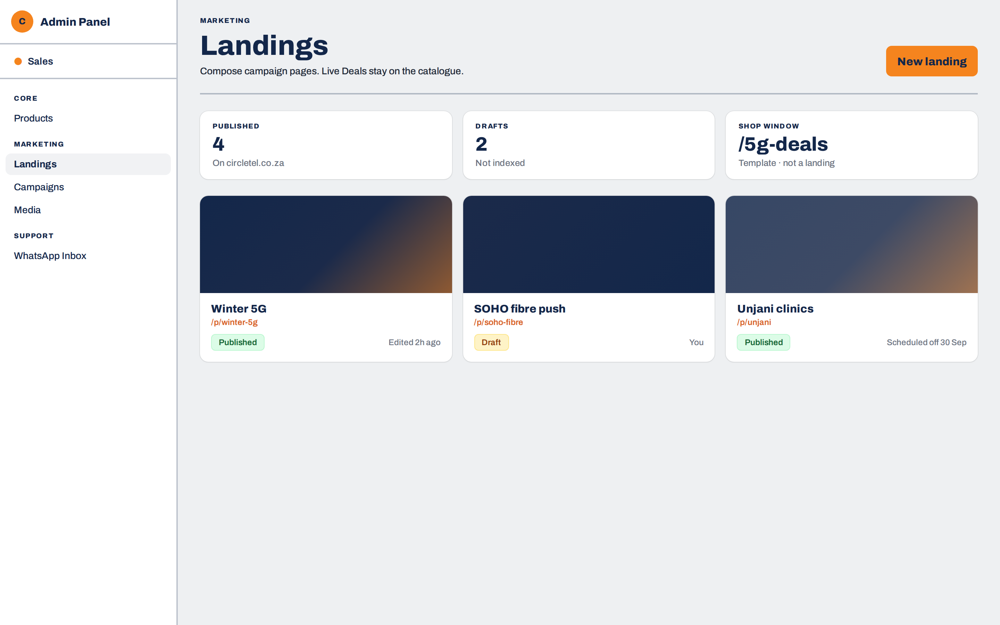
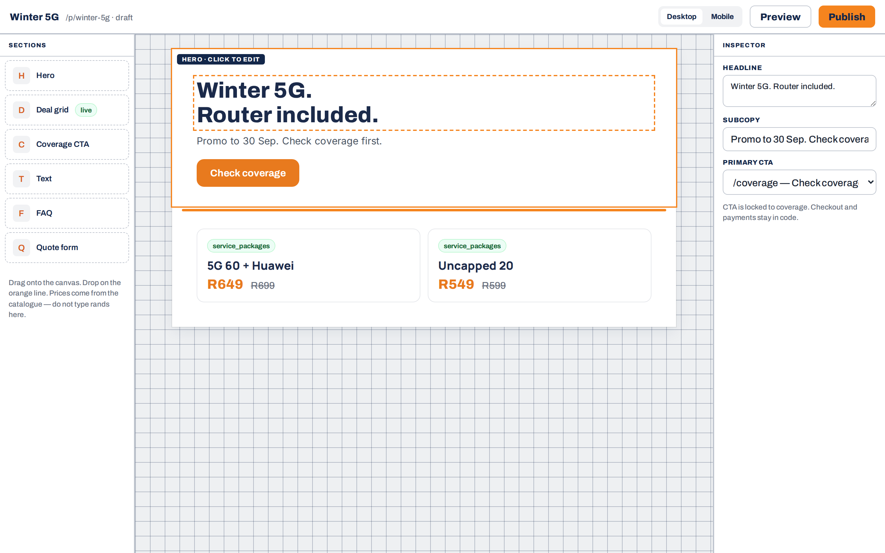
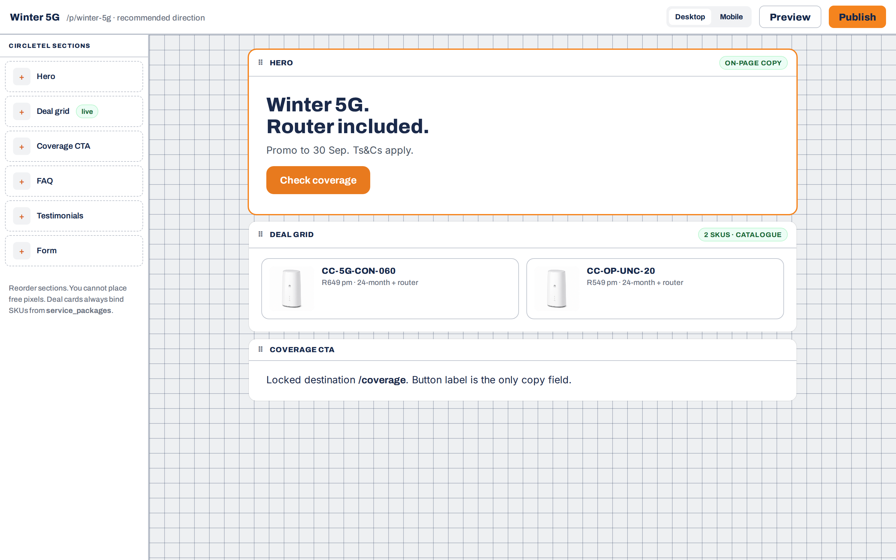
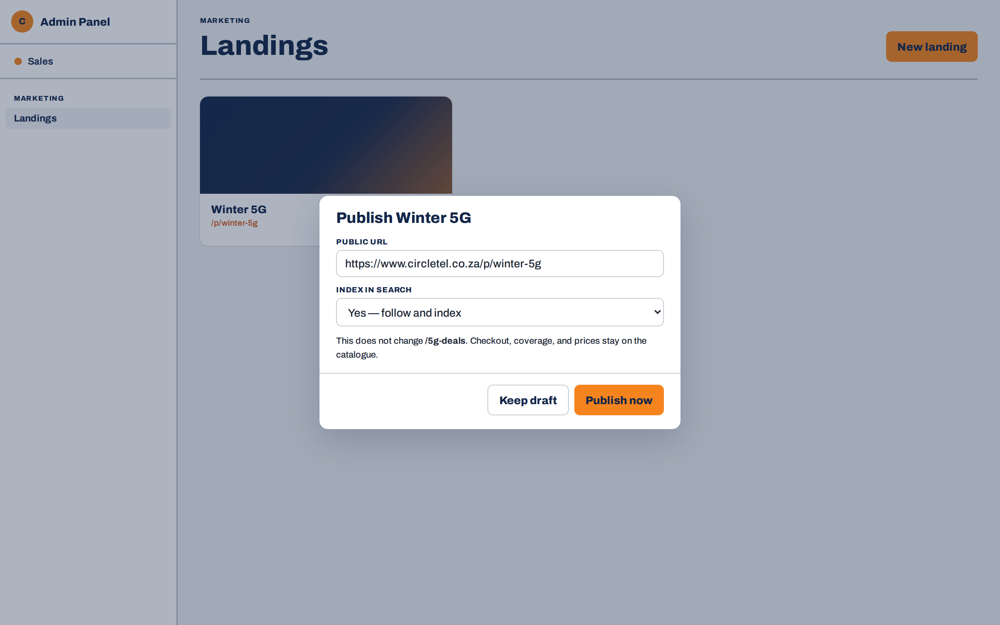
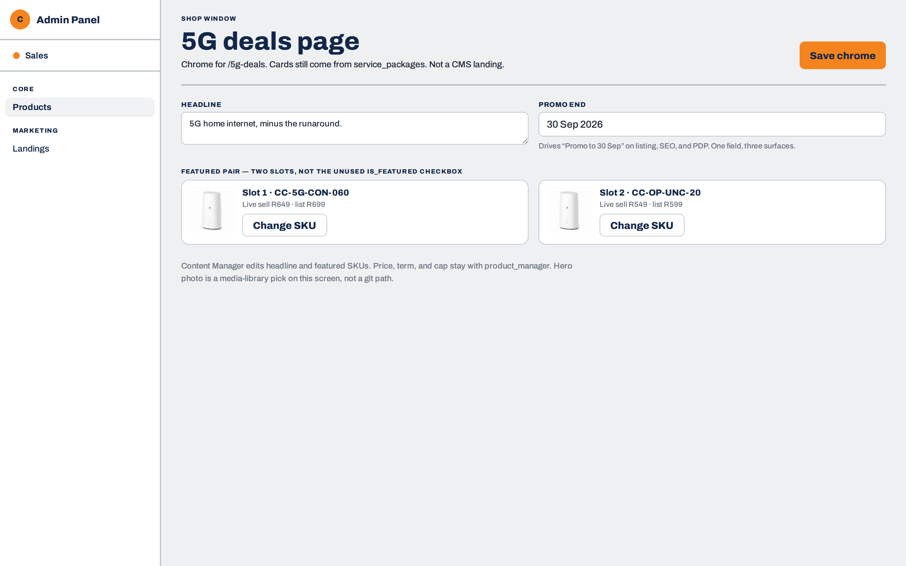
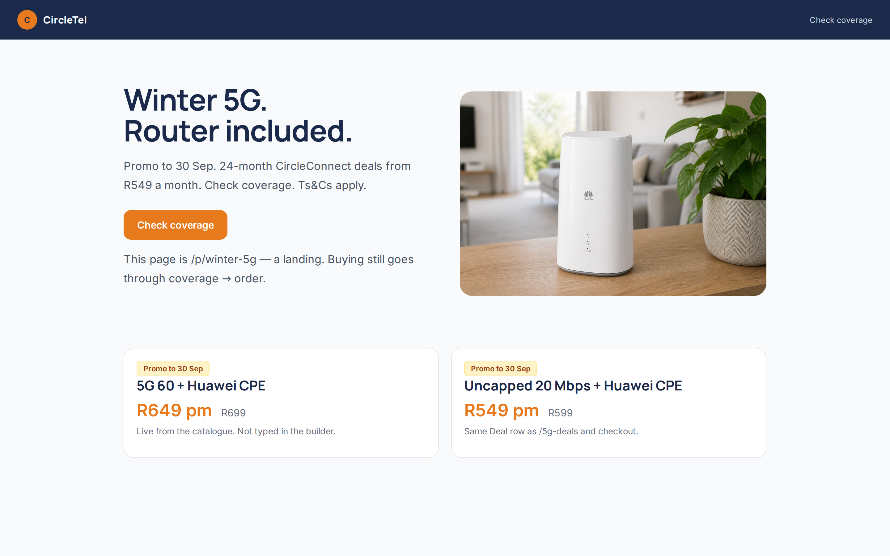
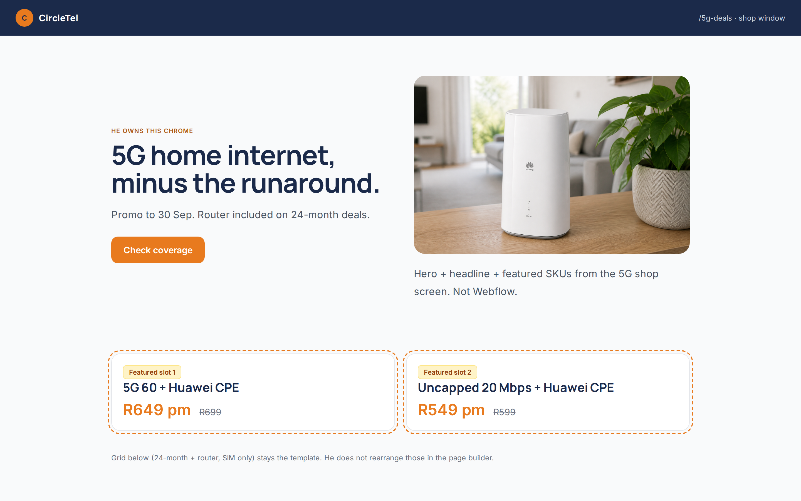

# CMS composer redesign — hi-fi mockups

**Date:** 2026-08-27  
**Status:** Design review — pick direction A or B before implementing  
**Related:** marketing role workspace mapping in the same PR

Admin mockups use the backend UI kit (`docs/design/BACKEND_UI_KIT.md`, `--pm-*`, Archivo). Public mockups use `DESIGN.md` (Manrope / Inter, `#1B2A4A` / `#E87A1E`).

Interactive HTML: [index.html](./index.html)

## Pick one

| | A — Canvas | B — Section kit (recommended) |
|---|---|---|
| Edit | Click-to-type on the page + inspector | Reorder CircleTel sections only |
| Risk | Off-brand freeform | Harder to make ugly |
| Deals | Live `service_packages` SKUs | Same |

## Screens

### Admin

### Public

## Not in this PR

- No rewrite of `lib/cms` or `/admin/cms/builder`
- `/5g-deals` still a code template; mock 05/07 show the merchandising seam only
- `designs/` stays gitignored; these files live here so they can be reviewed
