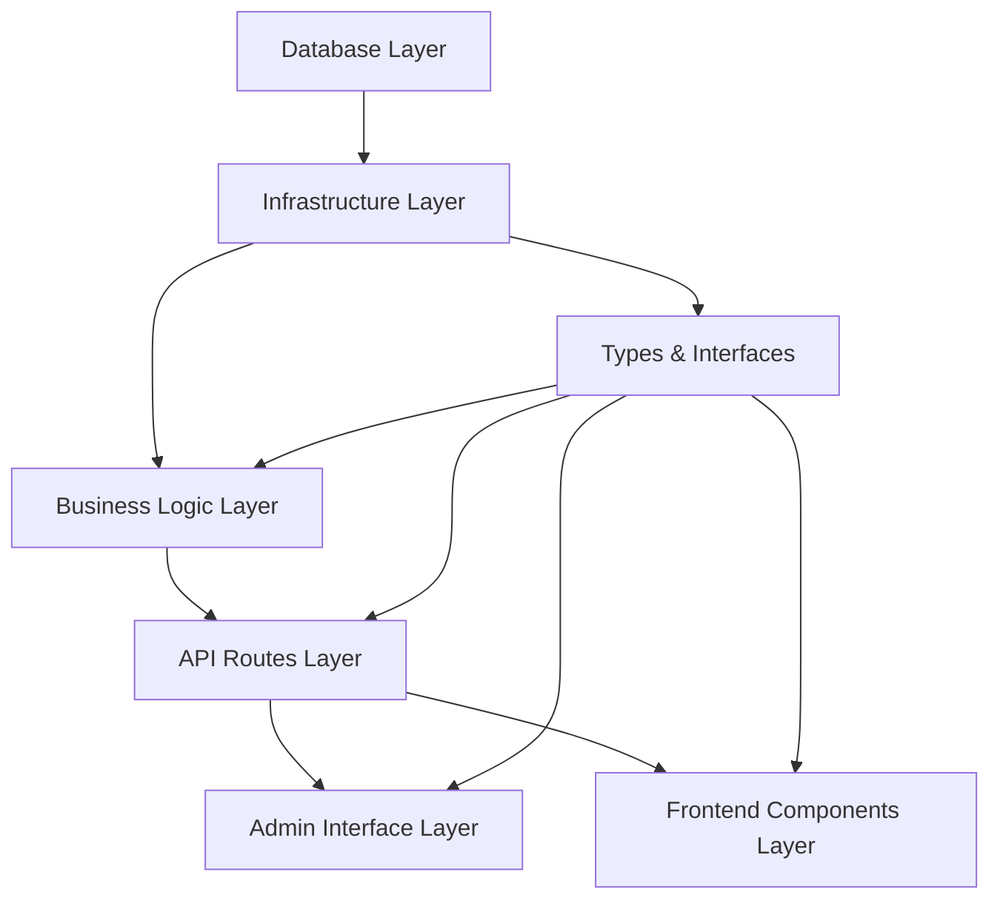

# PHASE 2 IMPLEMENTATION PLAN
## MTN Feasibility API Integration - Safe Scaffolding & Development

**Project:** Circle Tel ISP Platform  
**Phase:** 2 - Planning & Safe Scaffolding  
**Document Version:** 2.0  
**Date:** October 15, 2025  
**Estimated Duration:** 6-8 weeks  

---

## TABLE OF CONTENTS

1. [Implementation Architecture](#1-implementation-architecture)
2. [Factory Droid CLI Setup](#2-factory-droid-cli-setup)
3. [Safe Scaffolding Plan](#3-safe-scaffolding-plan)
4. [Layer-by-Layer Build Strategy](#4-layer-by-layer-build-strategy)
5. [Atomic Task Breakdown](#5-atomic-task-breakdown)
6. [Testing Strategy](#6-testing-strategy)
7. [Checkpoint Gates](#7-checkpoint-gates)
8. [Risk Mitigation](#8-risk-mitigation)
9. [Team Assignment Guide](#9-team-assignment-guide)
10. [Daily Standup Template](#10-daily-standup-template)

---

## 1. IMPLEMENTATION ARCHITECTURE

### 1.1 Layered Architecture Approach

We'll build the system in 6 distinct layers, each tested before moving to the next:

```
┌─────────────────────────────────────────────────────────────┐
│ Layer 6: Frontend Components (Week 5)                       │
│ - FeasibilityChecker, AddressInput, ProductList            │
└─────────────────────────────────────────────────────────────┘
                            ↓ depends on
┌─────────────────────────────────────────────────────────────┐
│ Layer 5: Admin Interface (Week 4)                           │
│ - Provider Dashboard, Forms, Test Console                   │
└─────────────────────────────────────────────────────────────┘
                            ↓ depends on
┌─────────────────────────────────────────────────────────────┐
│ Layer 4: API Routes (Week 3)                                │
│ - Public feasibility endpoint, Admin CRUD endpoints         │
└─────────────────────────────────────────────────────────────┘
                            ↓ depends on
┌─────────────────────────────────────────────────────────────┐
│ Layer 3: Business Logic (Week 2)                            │
│ - Checker, Cache Manager, Provider Clients                  │
└─────────────────────────────────────────────────────────────┘
                            ↓ depends on
┌─────────────────────────────────────────────────────────────┐
│ Layer 2: Infrastructure (Week 1, Part 2)                    │
│ - Encryption, Rate Limiting, Logging, Types                 │
└─────────────────────────────────────────────────────────────┘
                            ↓ depends on
┌─────────────────────────────────────────────────────────────┐
│ Layer 1: Database (Week 1, Part 1)                          │
│ - Tables, Indexes, Functions, RLS Policies                  │
└─────────────────────────────────────────────────────────────┘
```

### 1.2 Dependency Graph



### 1.3 File Creation Order (Critical)

**⚠️ DO NOT deviate from this order to avoid dependency issues:**

1. **Database** → 2. **Types** → 3. **Infrastructure** → 4. **Business Logic** → 5. **API Routes** → 6. **Admin UI** → 7. **Frontend**

---

## 2. FACTORY DROID CLI SETUP

### 2.1 Install & Configure Factory CLI

```bash
# Install Factory CLI (if not already installed)
npm install -g @factory-ai/cli

# Initialize Factory in your project
cd /path/to/circle-tel
factory init

# This creates:
# .factory/
# ├── config.yml
# ├── droids/
# └── workflows/
```

### 2.2 Project Configuration

Create `.factory/config.yml`:

```yaml
# .factory/config.yml
project:
  name: circle-tel-feasibility
  version: 1.0.0
  language: typescript
  framework: nextjs-15

paths:
  src: ./
  tests: ./__tests__
  docs: ./docs

workflows:
  - name: safe-file-creation
    description: Create files only if they don't exist
    steps:
      - check_file_exists
      - backup_if_exists
      - create_file
      - run_tests

safety:
  backup_before_modify: true
  require_tests: true
  prevent_overwrite: true

git:
  branch_prefix: feature/feasibility-
  commit_message_template: "[Feasibility] {task_name}"
```

### 2.3 Create Custom Droid for This Project

```bash
# Create a custom droid for feasibility implementation
factory droid create --name feasibility-builder --template typescript-backend
```

**Droid Configuration** (`.factory/droids/feasibility-builder.yml`):

```yaml
name: feasibility-builder
description: Safely scaffolds MTN Feasibility API integration
language: typescript
framework: nextjs

capabilities:
  - file_creation
  - test_generation
  - code_review
  - git_operations

safety_rules:
  - never_overwrite_existing_files
  - always_create_tests
  - preserve_existing_imports
  - check_typescript_compilation

templates:
  - name: api-route
    path: ./templates/api-route.ts.template
  - name: component
    path: ./templates/component.tsx.template
  - name: business-logic
    path: ./templates/business-logic.ts.template

pre_flight_checks:
  - verify_dependencies_installed
  - check_database_connection
  - validate_environment_variables
```

---

## 3. SAFE SCAFFOLDING PLAN

### 3.1 Pre-Scaffolding Checklist

**Before creating any files, verify:**

- [ ] Feature branch created: `git checkout -b feature/feasibility-mtn-integration`
- [ ] Staging environment ready
- [ ] Database staging instance accessible
- [ ] Environment variables configured
- [ ] All existing tests passing: `npm test`
- [ ] TypeScript compiling: `npm run type-check`
- [ ] No uncommitted changes: `git status`

### 3.2 Factory Droid Commands for Safe Scaffolding

#### Command 1: Create Directory Structure

```bash
# Let Factory create the directory structure safely
factory run create-dirs --spec feature-spec-v1.1.md --dry-run

# Review the proposed structure, then execute:
factory run create-dirs --spec feature-spec-v1.1.md --execute

# This creates:
# lib/feasibility/
# ├── transformers/
# ├── __tests__/
# app/api/v1/feasibility/
# ├── check/
# ├── cache/
# app/api/v1/admin/network-providers/
# ├── [id]/
# │   ├── test/
# │   └── health/
# app/admin/network-providers/
# ├── [id]/
# └── components/
# components/feasibility/
# supabase/migrations/
```

**Expected Output:**
```
✓ Created directory: lib/feasibility
✓ Created directory: lib/feasibility/transformers
✓ Created directory: lib/feasibility/__tests__
✓ Created directory: app/api/v1/feasibility/check
✓ Created directory: app/api/v1/feasibility/cache
✓ Created directory: app/api/v1/admin/network-providers
✓ Created directory: app/api/v1/admin/network-providers/[id]
✓ Created directory: app/api/v1/admin/network-providers/[id]/test
✓ Created directory: app/api/v1/admin/network-providers/[id]/health
✓ Created directory: app/admin/network-providers
✓ Created directory: app/admin/network-providers/[id]
✓ Created directory: app/admin/network-providers/components
✓ Created directory: components/feasibility
✓ No existing files will be modified
```

---

## 4. LAYER-BY-LAYER BUILD STRATEGY

### LAYER 1: Database Foundation (Week 1, Part 1)

**Goal:** Create and verify all database tables, indexes, and functions

#### Task 1.1: Create Migration File

**Factory Command:**
```bash
factory generate migration \
  --name "add_feasibility_system" \
  --template supabase \
  --spec feature-spec-v1.1.md \
  --output supabase/migrations/20251015_add_feasibility_system.sql
```

**Manual Step (Verify Migration):**
```bash
# Review the generated migration
cat supabase/migrations/20251015_add_feasibility_system.sql

# Check for:
# 1. CREATE EXTENSION cube, earthdistance
# 2. All 3 tables created
# 3. Indexes created
# 4. RLS policies applied
# 5. Helper functions defined
```

#### Task 1.2: Apply Migration to Staging

```bash
# Connect to staging Supabase
export SUPABASE_DB_URL=<staging_url>

# Dry run first
npx supabase db push --dry-run

# Review SQL that will be executed, then apply:
npx supabase db push

# Verify extensions enabled
psql $SUPABASE_DB_URL -c "SELECT extname, extversion FROM pg_extension WHERE extname IN ('cube', 'earthdistance', 'postgis');"

# Expected output:
#     extname    | extversion 
# ---------------+------------
#  cube          | 1.5
#  earthdistance | 1.1
#  postgis       | 3.3.2
```

#### Task 1.3: Test Spatial Functions

```bash
# Create test script
cat > test-spatial-functions.sql <<'EOF'
-- Test ll_to_earth function
SELECT ll_to_earth(-26.2041, 28.0473) AS point;

-- Test earth_distance function
SELECT earth_distance(
  ll_to_earth(-26.2041, 28.0473),
  ll_to_earth(-26.2050, 28.0480)
) AS distance_meters;
-- Expected: ~100 meters

-- Test find_nearby_feasibility_check function (with empty table)
SELECT * FROM find_nearby_feasibility_check(
  -26.2041,
  28.0473,
  500,
  '00000000-0000-0000-0000-000000000000'::uuid
);
-- Expected: 0 rows (table is empty)
EOF

psql $SUPABASE_DB_URL -f test-spatial-functions.sql
```

#### Task 1.4: Seed Initial Data

```bash
# Seed default MTN provider (disabled)
psql $SUPABASE_DB_URL <<'EOF'
INSERT INTO network_providers (
  name, slug, api_type, base_url,
  auth_config, endpoints, is_active
) VALUES (
  'MTN South Africa',
  'mtn',
  'rest',
  'https://hnssl.mtn.co.za/',
  '{"type": "bearer", "api_key": "PLACEHOLDER"}',
  '{"feasibility_wholesale": "/MTNBulkApi/api/Sync"}',
  false
);
EOF
```

**Checkpoint 1 (Layer 1 Complete):**
- [ ] Migration applied successfully
- [ ] All extensions enabled
- [ ] Spatial functions working
- [ ] Indexes created (verify with `\d+ feasibility_checks`)
- [ ] RLS policies active
- [ ] Seed data inserted

**If any checkbox fails, STOP and fix before proceeding.**

---

### LAYER 2: Infrastructure & Types (Week 1, Part 2)

**Goal:** Create foundational utilities and type definitions

#### Task 2.1: Create TypeScript Interfaces

**Factory Command:**
```bash
factory generate types \
  --from-spec feature-spec-v1.1.md \
  --output lib/feasibility/types.ts \
  --strict
```

**Expected File:** `lib/feasibility/types.ts`

```typescript
// lib/feasibility/types.ts
// This file defines all TypeScript interfaces for the feasibility system

export interface NetworkProvider {
  id: string;
  name: string;
  slug: string;
  api_type: 'rest' | 'soap' | 'graphql';
  base_url: string;
  is_active: boolean;
  auth_config: AuthConfig;
  endpoints: ProviderEndpoints;
  rate_limit_per_minute: number;
  created_at: string;
  updated_at: string;
}

export interface AuthConfig {
  type: 'api_key' | 'oauth2' | 'basic' | 'bearer';
  api_key?: string;
  client_id?: string;
  client_secret?: string;
  token_endpoint?: string;
}

export interface ProviderEndpoints {
  feasibility_check: string;
  product_list?: string;
  auth_endpoint?: string;
}

export interface Product {
  id: string;
  name: string;
  speed_mbps: number;
  price_monthly: number;
  installation_fee: number;
  technology: 'fiber' | 'lte' | '5g' | 'wireless' | 'unknown';
  metadata: Record<string, any>;
}

export interface ProviderResult {
  provider: string;
  provider_name: string;
  available: boolean;
  products: Product[];
  response_time_ms: number;
  cached: boolean;
  error?: string;
}

export interface FeasibilityCheckRequest {
  latitude: number;
  longitude: number;
  address?: string;
  provider_slugs?: string[];
  force_refresh?: boolean;
}

export interface FeasibilityCheckResponse {
  success: boolean;
  location: {
    latitude: number;
    longitude: number;
    address?: string;
  };
  providers: ProviderResult[];
  cache_expires_at: string;
  total_providers_checked: number;
  total_products_available: number;
}

export interface CachedFeasibilityCheck {
  id: string;
  provider_id: string;
  latitude: number;
  longitude: number;
  products_available: Product[];
  is_available: boolean;
  response_payload: any;
  checked_at: string;
  expires_at: string;
}

export interface RateLimitResult {
  allowed: boolean;
  remaining: number;
  resetAt: Date;
}

export type CheckStatus = 'success' | 'failed' | 'timeout' | 'rate_limited';

export interface LogEntry {
  level: 'debug' | 'info' | 'warn' | 'error';
  message: string;
  context?: Record<string, any>;
  error?: Error;
  timestamp: Date;
}
```

**Manual Verification:**
```bash
# Verify TypeScript types are valid
npx tsc --noEmit lib/feasibility/types.ts
```

#### Task 2.2: Create Encryption Module

**Factory Command:**
```bash
factory generate module \
  --name encryption \
  --template security \
  --output lib/feasibility/encryption.ts \
  --tests
```

**Expected File:** `lib/feasibility/encryption.ts`

```typescript
// lib/feasibility/encryption.ts
import crypto from 'crypto';

const ENCRYPTION_KEY = process.env.FEASIBILITY_ENCRYPTION_KEY || '';
const ALGORITHM = 'aes-256-gcm';

if (!ENCRYPTION_KEY && process.env.NODE_ENV === 'production') {
  throw new Error('FEASIBILITY_ENCRYPTION_KEY environment variable is required in production');
}

/**
 * Encrypt sensitive provider credentials before storing in database
 */
export function encryptCredentials(credentials: Record<string, any>): string {
  if (!ENCRYPTION_KEY) {
    throw new Error('Encryption key not configured');
  }

  const iv = crypto.randomBytes(16);
  const cipher = crypto.createCipheriv(
    ALGORITHM,
    Buffer.from(ENCRYPTION_KEY, 'hex'),
    iv
  );

  const encrypted = Buffer.concat([
    cipher.update(JSON.stringify(credentials), 'utf8'),
    cipher.final()
  ]);

  const authTag = cipher.getAuthTag();

  return Buffer.concat([iv, authTag, encrypted]).toString('base64');
}

/**
 * Decrypt provider credentials when needed for API calls
 */
export function decryptCredentials(encryptedData: string): Record<string, any> {
  if (!ENCRYPTION_KEY) {
    throw new Error('Encryption key not configured');
  }

  const data = Buffer.from(encryptedData, 'base64');
  
  const iv = data.subarray(0, 16);
  const authTag = data.subarray(16, 32);
  const encrypted = data.subarray(32);

  const decipher = crypto.createDecipheriv(
    ALGORITHM,
    Buffer.from(ENCRYPTION_KEY, 'hex'),
    iv
  );

  decipher.setAuthTag(authTag);

  const decrypted = Buffer.concat([
    decipher.update(encrypted),
    decipher.final()
  ]);

  return JSON.parse(decrypted.toString('utf8'));
}

/**
 * Generate a new encryption key (for setup)
 */
export function generateEncryptionKey(): string {
  return crypto.randomBytes(32).toString('hex');
}
```

**Test File:** `lib/feasibility/__tests__/encryption.test.ts`

```typescript
// lib/feasibility/__tests__/encryption.test.ts
import { encryptCredentials, decryptCredentials, generateEncryptionKey } from '../encryption';

describe('Encryption Module', () => {
  beforeAll(() => {
    // Set test encryption key
    process.env.FEASIBILITY_ENCRYPTION_KEY = generateEncryptionKey();
  });

  it('should encrypt and decrypt credentials correctly', () => {
    const credentials = {
      api_key: 'test_key_123',
      client_id: 'test_client',
      client_secret: 'test_secret'
    };

    const encrypted = encryptCredentials(credentials);
    expect(encrypted).toEqual(expect.any(String));
    expect(encrypted.length).toBeGreaterThan(0);

    const decrypted = decryptCredentials(encrypted);
    expect(decrypted).toEqual(credentials);
  });

  it('should produce different ciphertexts for same plaintext', () => {
    const credentials = { api_key: 'test' };
    
    const encrypted1 = encryptCredentials(credentials);
    const encrypted2 = encryptCredentials(credentials);
    
    expect(encrypted1).not.toBe(encrypted2); // Different IVs
    expect(decryptCredentials(encrypted1)).toEqual(credentials);
    expect(decryptCredentials(encrypted2)).toEqual(credentials);
  });

  it('should throw error if encryption key not set', () => {
    delete process.env.FEASIBILITY_ENCRYPTION_KEY;
    
    expect(() => encryptCredentials({ test: 'data' })).toThrow('Encryption key not configured');
  });

  it('should throw error on invalid encrypted data', () => {
    expect(() => decryptCredentials('invalid_base64')).toThrow();
  });
});
```

**Run Tests:**
```bash
# Generate encryption key for local development
node -e "console.log('FEASIBILITY_ENCRYPTION_KEY=' + require('crypto').randomBytes(32).toString('hex'))" >> .env.local

# Run encryption tests
npm test lib/feasibility/__tests__/encryption.test.ts
```

#### Task 2.3: Create Rate Limiter Module

**Factory Command:**
```bash
factory generate module \
  --name rate-limiter \
  --template middleware \
  --output lib/feasibility/rate-limiter.ts \
  --tests
```

**Expected File:** `lib/feasibility/rate-limiter.ts`

```typescript
// lib/feasibility/rate-limiter.ts
import { createClient } from '@/lib/supabase/client';
import type { RateLimitResult } from './types';

/**
 * Check if request is within rate limit
 */
export async function checkRateLimit(
  identifier: string,
  limit: number = 20,
  windowMs: number = 60000
): Promise<RateLimitResult> {
  const supabase = createClient();
  const now = Date.now();
  const windowStart = now - windowMs;

  try {
    const { data: recentChecks, error } = await supabase
      .from('feasibility_checks')
      .select('checked_at')
      .eq('user_session_id', identifier)
      .gte('checked_at', new Date(windowStart).toISOString())
      .order('checked_at', { ascending: false });

    if (error) {
      console.error('Rate limit check error:', error);
      return { allowed: true, remaining: limit, resetAt: new Date(now + windowMs) };
    }

    const requestCount = recentChecks?.length || 0;
    const allowed = requestCount < limit;
    const remaining = Math.max(0, limit - requestCount);
    const resetAt = new Date(now + windowMs);

    return { allowed, remaining, resetAt };
  } catch (error) {
    console.error('Rate limit check failed:', error);
    return { allowed: true, remaining: limit, resetAt: new Date(now + windowMs) };
  }
}

/**
 * Middleware for Next.js API routes
 */
export async function rateLimitMiddleware(
  request: Request,
  limit: number = 20,
  windowMs: number = 60000
): Promise<Response | null> {
  const identifier = request.headers.get('x-forwarded-for') || 
                     request.headers.get('x-real-ip') || 
                     'unknown';

  const result = await checkRateLimit(identifier, limit, windowMs);

  if (!result.allowed) {
    return new Response(
      JSON.stringify({
        success: false,
        error: {
          code: 'RATE_LIMIT_EXCEEDED',
          message: 'Too many requests. Please try again later.',
          remaining: result.remaining,
          resetAt: result.resetAt.toISOString()
        }
      }),
      {
        status: 429,
        headers: {
          'Content-Type': 'application/json',
          'X-RateLimit-Limit': limit.toString(),
          'X-RateLimit-Remaining': result.remaining.toString(),
          'X-RateLimit-Reset': result.resetAt.toISOString()
        }
      }
    );
  }

  return null;
}
```

#### Task 2.4: Create Logger Module

**Factory Command:**
```bash
factory generate module \
  --name logger \
  --template logging \
  --output lib/feasibility/logger.ts
```

**Expected File:** `lib/feasibility/logger.ts`

```typescript
// lib/feasibility/logger.ts
import { createClient } from '@/lib/supabase/client';
import type { LogEntry } from './types';

export enum LogLevel {
  DEBUG = 'debug',
  INFO = 'info',
  WARN = 'warn',
  ERROR = 'error'
}

export async function logFeasibilityEvent(entry: LogEntry): Promise<void> {
  // Console logging (development)
  if (process.env.NODE_ENV === 'development') {
    const logMethod = {
      debug: console.debug,
      info: console.info,
      warn: console.warn,
      error: console.error
    }[entry.level];

    logMethod(`[${entry.level.toUpperCase()}] ${entry.message}`, entry.context || {});
    
    if (entry.error) {
      console.error(entry.error);
    }
  }

  // Database logging (async, non-blocking)
  if (process.env.NODE_ENV === 'production') {
    try {
      const supabase = createClient();
      await supabase.from('system_logs').insert({
        level: entry.level,
        message: entry.message,
        context: entry.context || {},
        error_stack: entry.error?.stack,
        created_at: entry.timestamp.toISOString()
      });
    } catch (err) {
      console.error('Failed to log to database:', err);
    }
  }
}

export const logger = {
  debug: (message: string, context?: Record<string, any>) =>
    logFeasibilityEvent({ 
      level: LogLevel.DEBUG, 
      message, 
      context, 
      timestamp: new Date() 
    }),
  
  info: (message: string, context?: Record<string, any>) =>
    logFeasibilityEvent({ 
      level: LogLevel.INFO, 
      message, 
      context, 
      timestamp: new Date() 
    }),
  
  warn: (message: string, context?: Record<string, any>) =>
    logFeasibilityEvent({ 
      level: LogLevel.WARN, 
      message, 
      context, 
      timestamp: new Date() 
    }),
  
  error: (message: string, error?: Error, context?: Record<string, any>) =>
    logFeasibilityEvent({ 
      level: LogLevel.ERROR, 
      message, 
      error, 
      context, 
      timestamp: new Date() 
    })
};
```

**Checkpoint 2 (Layer 2 Complete):**
- [ ] `types.ts` created with all interfaces
- [ ] TypeScript compilation successful
- [ ] Encryption module created and tested
- [ ] Rate limiter module created
- [ ] Logger module created
- [ ] All unit tests passing: `npm test lib/feasibility/__tests__/`

**If any checkbox fails, STOP and fix before proceeding.**

---

### LAYER 3: Business Logic (Week 2)

**Goal:** Create core feasibility checking logic

#### Task 3.1: Create Cache Manager

**Factory Command:**
```bash
factory generate module \
  --name cache-manager \
  --template data-access \
  --output lib/feasibility/cache-manager.ts \
  --tests
```

**Expected File:** `lib/feasibility/cache-manager.ts`

```typescript
// lib/feasibility/cache-manager.ts
import { createClient } from '@/lib/supabase/client';
import type { CachedFeasibilityCheck, Product, CheckStatus } from './types';
import { logger } from './logger';

const CACHE_TTL_DAYS = parseInt(process.env.FEASIBILITY_CACHE_TTL_DAYS || '7');
const CACHE_RADIUS_METERS = parseInt(process.env.FEASIBILITY_CACHE_RADIUS_METERS || '500');

/**
 * Check if there's a cached result near the given coordinates
 */
export async function getCachedResult(
  latitude: number,
  longitude: number,
  providerId: string
): Promise<CachedFeasibilityCheck | null> {
  try {
    const supabase = createClient();

    const { data, error } = await supabase
      .rpc('find_nearby_feasibility_check', {
        search_lat: latitude,
        search_lon: longitude,
        search_radius_meters: CACHE_RADIUS_METERS,
        search_provider_id: providerId
      });

    if (error || !data || data.length === 0) {
      logger.debug('Cache miss', { latitude, longitude, providerId });
      return null;
    }

    const cached = data[0];
    logger.info('Cache hit', { 
      latitude, 
      longitude, 
      providerId, 
      distance: cached.distance_meters 
    });

    return {
      id: cached.id,
      provider_id: cached.provider_id,
      latitude: cached.latitude,
      longitude: cached.longitude,
      products_available: cached.products_available,
      is_available: cached.is_available,
      response_payload: cached.response_payload,
      checked_at: cached.checked_at,
      expires_at: cached.expires_at
    };
  } catch (error) {
    logger.error('Cache lookup failed', error as Error, { latitude, longitude, providerId });
    return null;
  }
}

/**
 * Save feasibility check result to cache
 */
export async function saveFeasibilityCheck(
  providerId: string,
  latitude: number,
  longitude: number,
  requestPayload: any,
  responsePayload: any,
  products: Product[],
  isAvailable: boolean,
  checkStatus: CheckStatus,
  responseTimeMs: number,
  errorMessage?: string
): Promise<void> {
  try {
    const supabase = createClient();
    const expiresAt = new Date(Date.now() + CACHE_TTL_DAYS * 24 * 60 * 60 * 1000);

    const { error } = await supabase
      .from('feasibility_checks')
      .insert({
        provider_id: providerId,
        latitude,
        longitude,
        request_payload: requestPayload,
        response_payload: responsePayload,
        products_available: products,
        is_available: isAvailable,
        check_status: checkStatus,
        error_message: errorMessage,
        response_time_ms: responseTimeMs,
        expires_at: expiresAt.toISOString()
      });

    if (error) {
      logger.error('Failed to cache feasibility check', error as Error, { 
        providerId, 
        latitude, 
        longitude 
      });
    } else {
      logger.info('Feasibility check cached', { 
        providerId, 
        latitude, 
        longitude, 
        expiresAt: expiresAt.toISOString() 
      });
    }
  } catch (error) {
    logger.error('Cache save failed', error as Error);
  }
}

/**
 * Invalidate cache for a specific location
 */
export async function invalidateCache(
  latitude: number,
  longitude: number,
  radiusMeters: number = CACHE_RADIUS_METERS
): Promise<void> {
  try {
    const supabase = createClient();

    await supabase.rpc('invalidate_nearby_cache', {
      center_lat: latitude,
      center_lon: longitude,
      radius_meters: radiusMeters
    });

    logger.info('Cache invalidated', { latitude, longitude, radiusMeters });
  } catch (error) {
    logger.error('Cache invalidation failed', error as Error);
  }
}
```

#### Task 3.2: Create MTN Provider Transformer

**Factory Command:**
```bash
factory generate module \
  --name mtn-transformer \
  --template api-client \
  --output lib/feasibility/transformers/mtn.ts \
  --tests
```

**Expected File:** `lib/feasibility/transformers/mtn.ts`

```typescript
// lib/feasibility/transformers/mtn.ts
import type { ProviderResult, Product } from '../types';
import { logger } from '../logger';

export const MTN_CONFIG = {
  name: 'MTN South Africa',
  slug: 'mtn',
  baseUrl: process.env.MTN_API_BASE_URL || 'https://hnssl.mtn.co.za/',
  endpoints: {
    feasibilityWholesale: '/MTNBulkApi/api/Sync'
  },
  auth: {
    type: 'bearer' as const,
    apiKey: process.env.MTN_API_KEY || '',
    clientId: process.env.MTN_CLIENT_ID || '',
    clientSecret: process.env.MTN_CLIENT_SECRET || ''
  },
  rateLimitPerMinute: 60
};

/**
 * Check MTN feasibility at given coordinates
 */
export async function checkMTNFeasibility(
  latitude: number,
  longitude: number
): Promise<ProviderResult> {
  const startTime = Date.now();

  try {
    logger.info('Querying MTN API', { latitude, longitude });

    const requestPayload = {
      latitude,
      longitude
    };

    const response = await fetch(
      `${MTN_CONFIG.baseUrl}${MTN_CONFIG.endpoints.feasibilityWholesale}`,
      {
        method: 'POST',
        headers: {
          'Content-Type': 'application/json',
          'Authorization': `Bearer ${MTN_CONFIG.auth.apiKey}`
        },
        body: JSON.stringify(requestPayload)
      }
    );

    const responseTime = Date.now() - startTime;

    if (!response.ok) {
      const errorText = await response.text();
      throw new Error(`MTN API returned ${response.status}: ${errorText}`);
    }

    const data = await response.json();
    const products = transformMTNProducts(data);

    logger.info('MTN API success', { 
      latitude, 
      longitude, 
      productCount: products.length, 
      responseTime 
    });

    return {
      provider: MTN_CONFIG.slug,
      provider_name: MTN_CONFIG.name,
      available: products.length > 0,
      products,
      response_time_ms: responseTime,
      cached: false
    };

  } catch (error) {
    const responseTime = Date.now() - startTime;
    
    logger.error('MTN API failed', error as Error, { latitude, longitude, responseTime });
    
    return {
      provider: MTN_CONFIG.slug,
      provider_name: MTN_CONFIG.name,
      available: false,
      products: [],
      response_time_ms: responseTime,
      cached: false,
      error: error instanceof Error ? error.message : 'Unknown error occurred'
    };
  }
}

/**
 * Transform MTN API response to unified Product format
 */
function transformMTNProducts(apiResponse: any): Product[] {
  if (!apiResponse.products || !Array.isArray(apiResponse.products)) {
    return [];
  }

  return apiResponse.products.map((mtnProduct: any) => ({
    id: `mtn_${mtnProduct.id || mtnProduct.ProductCode}`,
    name: mtnProduct.ProductName || mtnProduct.name,
    speed_mbps: parseInt(mtnProduct.Speed || mtnProduct.speed_mbps) || 0,
    price_monthly: parseFloat(mtnProduct.MonthlyFee || mtnProduct.price) || 0,
    installation_fee: parseFloat(mtnProduct.InstallationFee || mtnProduct.once_off_fee) || 0,
    technology: determineTechnology(mtnProduct),
    metadata: mtnProduct
  }));
}

/**
 * Determine technology type from MTN product data
 */
function determineTechnology(mtnProduct: any): Product['technology'] {
  const name = (mtnProduct.ProductName || '').toLowerCase();
  const type = (mtnProduct.Type || '').toLowerCase();
  
  if (name.includes('fiber') || type.includes('fiber')) return 'fiber';
  if (name.includes('5g') || type.includes('5g')) return '5g';
  if (name.includes('lte') || name.includes('4g')) return 'lte';
  if (name.includes('wireless')) return 'wireless';
  
  return 'unknown';
}

/**
 * Validate MTN API credentials
 */
export async function validateMTNCredentials(): Promise<{
  valid: boolean;
  error?: string;
}> {
  try {
    const testResult = await checkMTNFeasibility(-26.2041, 28.0473);
    
    return {
      valid: !testResult.error,
      error: testResult.error
    };
  } catch (error) {
    return {
      valid: false,
      error: error instanceof Error ? error.message : 'Unknown error'
    };
  }
}
```

#### Task 3.3: Create Provider Client Registry

**Factory Command:**
```bash
factory generate module \
  --name provider-client \
  --template registry \
  --output lib/feasibility/provider-client.ts
```

**Expected File:** `lib/feasibility/provider-client.ts`

```typescript
// lib/feasibility/provider-client.ts
import { checkMTNFeasibility } from './transformers/mtn';
import type { ProviderResult } from './types';

export interface ProviderClient {
  slug: string;
  checkFeasibility: (lat: number, lon: number) => Promise<ProviderResult>;
}

/**
 * Registry of all supported provider clients
 */
export const PROVIDER_CLIENTS: Record<string, ProviderClient> = {
  mtn: {
    slug: 'mtn',
    checkFeasibility: checkMTNFeasibility
  }
  // Future providers can be added here without modifying other code
};

/**
 * Get client for a provider slug
 */
export function getProviderClient(slug: string): ProviderClient | null {
  return PROVIDER_CLIENTS[slug] || null;
}

/**
 * Check if a provider client exists
 */
export function hasProviderClient(slug: string): boolean {
  return slug in PROVIDER_CLIENTS;
}

/**
 * Get all available provider slugs
 */
export function getAvailableProviders(): string[] {
  return Object.keys(PROVIDER_CLIENTS);
}
```

#### Task 3.4: Create Main Feasibility Checker

**Factory Command:**
```bash
factory generate module \
  --name checker \
  --template orchestrator \
  --output lib/feasibility/checker.ts \
  --tests
```

**Expected File:** `lib/feasibility/checker.ts`

```typescript
// lib/feasibility/checker.ts
import { createClient } from '@/lib/supabase/client';
import { getCachedResult, saveFeasibilityCheck } from './cache-manager';
import { getProviderClient } from './provider-client';
import { logger } from './logger';
import type { 
  FeasibilityCheckResponse, 
  ProviderResult, 
  NetworkProvider 
} from './types';

/**
 * Get active providers from database
 */
async function getActiveProviders(
  providerSlugs?: string[]
): Promise<NetworkProvider[]> {
  const supabase = createClient();
  
  let query = supabase
    .from('network_providers')
    .select('*')
    .eq('is_active', true);
  
  if (providerSlugs && providerSlugs.length > 0) {
    query = query.in('slug', providerSlugs);
  }
  
  const { data, error } = await query;
  
  if (error) {
    logger.error('Failed to fetch active providers', error);
    return [];
  }
  
  return data || [];
}

/**
 * Check feasibility across all active providers
 */
export async function checkAllProviders(
  latitude: number,
  longitude: number,
  providerSlugs?: string[],
  forceRefresh: boolean = false
): Promise<FeasibilityCheckResponse> {
  logger.info('Starting feasibility check', { 
    latitude, 
    longitude, 
    providerSlugs, 
    forceRefresh 
  });

  // 1. Get active providers
  const providers = await getActiveProviders(providerSlugs);
  
  if (providers.length === 0) {
    logger.warn('No active providers found');
    return {
      success: true,
      location: { latitude, longitude },
      providers: [],
      cache_expires_at: new Date().toISOString(),
      total_providers_checked: 0,
      total_products_available: 0
    };
  }

  // 2. Check feasibility for each provider in parallel
  const providerResults = await Promise.all(
    providers.map(provider => 
      checkSingleProvider(
        provider.id,
        provider.slug,
        provider.name,
        latitude,
        longitude,
        forceRefresh
      )
    )
  );

  // 3. Aggregate results
  const totalProductsAvailable = providerResults.reduce(
    (sum, result) => sum + result.products.length,
    0
  );

  logger.info('Feasibility check complete', {
    latitude,
    longitude,
    providersChecked: providerResults.length,
    productsAvailable: totalProductsAvailable
  });

  return {
    success: true,
    location: { latitude, longitude },
    providers: providerResults,
    cache_expires_at: new Date(Date.now() + 7 * 24 * 60 * 60 * 1000).toISOString(),
    total_providers_checked: providerResults.length,
    total_products_available: totalProductsAvailable
  };
}

/**
 * Check feasibility for a single provider (with caching)
 */
async function checkSingleProvider(
  providerId: string,
  providerSlug: string,
  providerName: string,
  latitude: number,
  longitude: number,
  forceRefresh: boolean
): Promise<ProviderResult> {
  // 1. Check cache (unless force refresh)
  if (!forceRefresh) {
    const cached = await getCachedResult(latitude, longitude, providerId);
    
    if (cached) {
      return {
        provider: providerSlug,
        provider_name: providerName,
        available: cached.is_available,
        products: cached.products_available || [],
        response_time_ms: 0,
        cached: true
      };
    }
  }

  // 2. Get provider client
  const client = getProviderClient(providerSlug);
  
  if (!client) {
    logger.warn('Provider client not available', { providerSlug });
    return {
      provider: providerSlug,
      provider_name: providerName,
      available: false,
      products: [],
      response_time_ms: 0,
      cached: false,
      error: 'Provider client not available'
    };
  }

  // 3. Make API call with timeout
  try {
    const result = await Promise.race([
      client.checkFeasibility(latitude, longitude),
      new Promise<ProviderResult>((_, reject) =>
        setTimeout(() => reject(new Error('Timeout')), 10000)
      )
    ]);

    // 4. Save to cache
    await saveFeasibilityCheck(
      providerId,
      latitude,
      longitude,
      { latitude, longitude },
      result,
      result.products,
      result.available,
      'success',
      result.response_time_ms
    );

    return result;
  } catch (error) {
    logger.error(`Provider ${providerSlug} check failed`, error as Error);

    // Save failed check to cache
    await saveFeasibilityCheck(
      providerId,
      latitude,
      longitude,
      { latitude, longitude },
      {},
      [],
      false,
      (error as Error).message === 'Timeout' ? 'timeout' : 'failed',
      0,
      error instanceof Error ? error.message : 'Unknown error'
    );

    return {
      provider: providerSlug,
      provider_name: providerName,
      available: false,
      products: [],
      response_time_ms: 0,
      cached: false,
      error: error instanceof Error ? error.message : 'Check failed'
    };
  }
}
```

**Checkpoint 3 (Layer 3 Complete):**
- [ ] Cache manager created and tested
- [ ] MTN transformer created and tested
- [ ] Provider client registry created
- [ ] Main checker created and tested
- [ ] Unit tests passing: `npm test lib/feasibility/__tests__/`
- [ ] Integration test with staging database passing

**If any checkbox fails, STOP and fix before proceeding.**

---

## 5. ATOMIC TASK BREAKDOWN

### Week 1: Database & Infrastructure (10 tasks)

| Task ID | Description | Owner | Est. Hours | Dependencies | Status |
|---------|-------------|-------|------------|--------------|--------|
| DB-01 | Create migration file | Backend Dev | 2 | None | ⬜ |
| DB-02 | Apply migration to staging | DevOps | 1 | DB-01 | ⬜ |
| DB-03 | Verify extensions enabled | DBA | 0.5 | DB-02 | ⬜ |
| DB-04 | Test spatial functions | Backend Dev | 1 | DB-03 | ⬜ |
| DB-05 | Seed initial data | Backend Dev | 0.5 | DB-02 | ⬜ |
| INF-01 | Create types.ts | Backend Dev | 2 | None | ⬜ |
| INF-02 | Create encryption module | Backend Dev | 3 | INF-01 | ⬜ |
| INF-03 | Create rate limiter | Backend Dev | 2 | INF-01 | ⬜ |
| INF-04 | Create logger module | Backend Dev | 1.5 | INF-01 | ⬜ |
| INF-05 | Write infrastructure tests | Backend Dev | 2 | INF-02, INF-03, INF-04 | ⬜ |

**Total:** 15.5 hours

---

### Week 2: Business Logic (12 tasks)

| Task ID | Description | Owner | Est. Hours | Dependencies | Status |
|---------|-------------|-------|------------|--------------|--------|
| BL-01 | Create cache-manager.ts | Backend Dev | 3 | INF-01, DB-05 | ⬜ |
| BL-02 | Create MTN transformer | Backend Dev | 4 | INF-01 | ⬜ |
| BL-03 | Create provider client registry | Backend Dev | 1 | BL-02 | ⬜ |
| BL-04 | Create main checker.ts | Backend Dev | 4 | BL-01, BL-03 | ⬜ |
| BL-05 | Write cache manager tests | Backend Dev | 2 | BL-01 | ⬜ |
| BL-06 | Write MTN transformer tests | Backend Dev | 3 | BL-02 | ⬜ |
| BL-07 | Write checker tests | Backend Dev | 3 | BL-04 | ⬜ |
| BL-08 | Create health monitor | Backend Dev | 3 | BL-04 | ⬜ |
| BL-09 | Set up MTN staging credentials | Network Ops | 1 | None | ⬜ |
| BL-10 | Test with real MTN API | Backend Dev | 2 | BL-02, BL-09 | ⬜ |
| BL-11 | Integration tests | Backend Dev | 4 | BL-01, BL-04 | ⬜ |
| BL-12 | Performance testing | Backend Dev | 2 | BL-11 | ⬜ |

**Total:** 32 hours

---

### Week 3: API Endpoints (14 tasks)

| Task ID | Description | Owner | Est. Hours | Dependencies | Status |
|---------|-------------|-------|------------|--------------|--------|
| API-01 | Create public feasibility endpoint | Backend Dev | 3 | BL-04 | ⬜ |
| API-02 | Add rate limiting middleware | Backend Dev | 2 | INF-03, API-01 | ⬜ |
| API-03 | Add request validation | Backend Dev | 2 | API-01 | ⬜ |
| API-04 | Create admin providers list endpoint | Backend Dev | 2 | INF-01 | ⬜ |
| API-05 | Create admin create provider endpoint | Backend Dev | 3 | INF-02, API-04 | ⬜ |
| API-06 | Create admin update provider endpoint | Backend Dev | 2 | API-05 | ⬜ |
| API-07 | Create admin delete provider endpoint | Backend Dev | 1 | API-04 | ⬜ |
| API-08 | Create admin test provider endpoint | Backend Dev | 3 | BL-02, API-04 | ⬜ |
| API-09 | Create health check endpoint | Backend Dev | 2 | BL-08 | ⬜ |
| API-10 | Write API route tests | Backend Dev | 4 | API-01, API-04 | ⬜ |
| API-11 | Create Postman collection | Backend Dev | 1 | API-10 | ⬜ |
| API-12 | Test with curl/Postman | QA | 2 | API-11 | ⬜ |
| API-13 | Update RBAC permissions | Backend Dev | 1 | API-04 | ⬜ |
| API-14 | Security audit | Security Team | 2 | API-10 | ⬜ |

**Total:** 30 hours

---

### Week 4: Admin Interface (16 tasks)

| Task ID | Description | Owner | Est. Hours | Dependencies | Status |
|---------|-------------|-------|------------|--------------|--------|
| ADMIN-01 | Create provider dashboard page | Frontend Dev | 4 | API-04 | ⬜ |
| ADMIN-02 | Create ProviderCard component | Frontend Dev | 3 | ADMIN-01 | ⬜ |
| ADMIN-03 | Create HealthStatusBadge component | Frontend Dev | 1 | ADMIN-02 | ⬜ |
| ADMIN-04 | Create provider form page | Frontend Dev | 4 | API-05 | ⬜ |
| ADMIN-05 | Create ProviderForm component | Frontend Dev | 5 | ADMIN-04 | ⬜ |
| ADMIN-06 | Add form validation | Frontend Dev | 2 | ADMIN-05 | ⬜ |
| ADMIN-07 | Create APITestConsole component | Frontend Dev | 4 | API-08 | ⬜ |
| ADMIN-08 | Add navigation links | Frontend Dev | 1 | ADMIN-01 | ⬜ |
| ADMIN-09 | Implement provider enable/disable toggle | Frontend Dev | 2 | API-06 | ⬜ |
| ADMIN-10 | Add loading states | Frontend Dev | 2 | ADMIN-01, ADMIN-04 | ⬜ |
| ADMIN-11 | Add error handling | Frontend Dev | 2 | ADMIN-10 | ⬜ |
| ADMIN-12 | Write component tests | Frontend Dev | 3 | ADMIN-05, ADMIN-07 | ⬜ |
| ADMIN-13 | E2E tests (Playwright) | QA | 4 | ADMIN-11 | ⬜ |
| ADMIN-14 | Accessibility audit | Frontend Dev | 2 | ADMIN-11 | ⬜ |
| ADMIN-15 | Mobile responsiveness | Frontend Dev | 2 | ADMIN-11 | ⬜ |
| ADMIN-16 | UAT with network ops team | Network Ops | 2 | ADMIN-15 | ⬜ |

**Total:** 43 hours

---

### Week 5: Frontend Integration (14 tasks)

| Task ID | Description | Owner | Est. Hours | Dependencies | Status |
|---------|-------------|-------|------------|--------------|--------|
| FE-01 | Create FeasibilityChecker component | Frontend Dev | 4 | API-01 | ⬜ |
| FE-02 | Create AddressInput component | Frontend Dev | 4 | FE-01 | ⬜ |
| FE-03 | Integrate Google Places API (optional) | Frontend Dev | 3 | FE-02 | ⬜ |
| FE-04 | Create ProductList component | Frontend Dev | 3 | FE-01 | ⬜ |
| FE-05 | Create CoverageMap component (optional) | Frontend Dev | 4 | FE-01 | ⬜ |
| FE-06 | Integrate into home-internet page | Frontend Dev | 2 | FE-01 | ⬜ |
| FE-07 | Integrate into wireless page | Frontend Dev | 2 | FE-01 | ⬜ |
| FE-08 | Add loading & error states | Frontend Dev | 2 | FE-01 | ⬜ |
| FE-09 | Write component tests | Frontend Dev | 3 | FE-01, FE-04 | ⬜ |
| FE-10 | E2E flow tests | QA | 4 | FE-06, FE-07 | ⬜ |
| FE-11 | Mobile testing | QA | 2 | FE-08 | ⬜ |
| FE-12 | Lighthouse performance audit | Frontend Dev | 1 | FE-08 | ⬜ |
| FE-13 | Browser compatibility testing | QA | 2 | FE-10 | ⬜ |
| FE-14 | Customer UAT | Product Manager | 2 | FE-13 | ⬜ |

**Total:** 38 hours

---

### Week 6-7: Testing, Deployment, Monitoring (18 tasks)

| Task ID | Description | Owner | Est. Hours | Dependencies | Status |
|---------|-------------|-------|------------|--------------|--------|
| TEST-01 | Run full test suite | QA | 2 | All previous | ⬜ |
| TEST-02 | Fix failing tests | Dev Team | 4 | TEST-01 | ⬜ |
| TEST-03 | Code coverage report | Backend Dev | 1 | TEST-02 | ⬜ |
| TEST-04 | Performance testing (k6) | DevOps | 3 | TEST-02 | ⬜ |
| TEST-05 | Load testing (500 users) | DevOps | 2 | TEST-04 | ⬜ |
| TEST-06 | Security penetration testing | Security Team | 4 | TEST-02 | ⬜ |
| DEPLOY-01 | Deploy to staging | DevOps | 2 | TEST-06 | ⬜ |
| DEPLOY-02 | Configure MTN prod credentials | Network Ops | 1 | DEPLOY-01 | ⬜ |
| DEPLOY-03 | Smoke tests in staging | QA | 2 | DEPLOY-01 | ⬜ |
| DEPLOY-04 | Backup production database | DevOps | 1 | DEPLOY-03 | ⬜ |
| DEPLOY-05 | Run prod migration | DevOps | 1 | DEPLOY-04 | ⬜ |
| DEPLOY-06 | Deploy to production | DevOps | 2 | DEPLOY-05 | ⬜ |
| DEPLOY-07 | Monitor for 24 hours | DevOps | 2 | DEPLOY-06 | ⬜ |
| DEPLOY-08 | Enable feature flag (10%) | Product Manager | 0.5 | DEPLOY-07 | ⬜ |
| DEPLOY-09 | Monitor 10% rollout | DevOps | 4 | DEPLOY-08 | ⬜ |
| DEPLOY-10 | Gradual rollout to 100% | Product Manager | 0.5 | DEPLOY-09 | ⬜ |
| MON-01 | Set up Sentry monitoring | DevOps | 2 | DEPLOY-06 | ⬜ |
| MON-02 | Create monitoring dashboard | DevOps | 3 | DEPLOY-06 | ⬜ |

**Total:** 36 hours

---

## 6. TESTING STRATEGY

### 6.1 Unit Tests (80%+ Coverage Target)

**Test Files to Create:**

```
lib/feasibility/__tests__/
├── encryption.test.ts
├── rate-limiter.test.ts
├── cache-manager.test.ts
├── mtn-transformer.test.ts
├── provider-client.test.ts
├── checker.test.ts
└── logger.test.ts
```

**Factory Command for Test Generation:**
```bash
factory generate tests \
  --for lib/feasibility/*.ts \
  --framework jest \
  --coverage 80
```

### 6.2 Integration Tests

**Test Scenarios:**

1. **End-to-End Feasibility Check**
   ```typescript
   test('should complete feasibility check flow', async () => {
     // 1. Query API with coordinates
     // 2. Verify cache miss on first request
     // 3. Verify API call to MTN
     // 4. Verify cache hit on second request
     // 5. Verify results match expected format
   });
   ```

2. **Admin Workflow**
   ```typescript
   test('admin can add and test provider', async () => {
     // 1. Admin logs in
     // 2. Navigates to /admin/network-providers
     // 3. Clicks "Add New Provider"
     // 4. Fills form with MTN details
     // 5. Tests connection
     // 6. Saves provider
     // 7. Verifies provider appears in list
   });
   ```

### 6.3 Performance Tests

**k6 Load Test Script:**

```javascript
// load-test-feasibility.js
import http from 'k6/http';
import { check, sleep } from 'k6';

export const options = {
  stages: [
    { duration: '1m', target: 50 },   // Ramp up
    { duration: '3m', target: 100 },  // Stay at 100 users
    { duration: '1m', target: 0 },    // Ramp down
  ],
  thresholds: {
    http_req_duration: ['p(95)<2000'], // 95% of requests under 2s
    http_req_failed: ['rate<0.05'],    // Less than 5% failures
  },
};

export default function () {
  const payload = JSON.stringify({
    latitude: -26.2041 + Math.random() * 0.1,
    longitude: 28.0473 + Math.random() * 0.1,
  });

  const params = {
    headers: {
      'Content-Type': 'application/json',
    },
  };

  const res = http.post(
    'https://staging.circletel.co.za/api/v1/feasibility/check',
    payload,
    params
  );

  check(res, {
    'status is 200': (r) => r.status === 200,
    'has providers': (r) => JSON.parse(r.body).providers.length > 0,
  });

  sleep(1);
}
```

**Run Load Test:**
```bash
k6 run load-test-feasibility.js
```

---

## 7. CHECKPOINT GATES

### Gate 1: Database Foundation ✅

**Criteria:**
- [ ] All migrations applied successfully
- [ ] Extensions verified (cube, earthdistance, postgis)
- [ ] Spatial functions working
- [ ] Indexes created
- [ ] RLS policies active
- [ ] Seed data inserted

**Approval Required:** DBA + Lead Developer

**If Failed:** Rollback migration, fix issues, reapply

---

### Gate 2: Infrastructure Layer ✅

**Criteria:**
- [ ] All TypeScript interfaces defined
- [ ] Encryption module tested (encryption/decryption working)
- [ ] Rate limiter tested
- [ ] Logger tested
- [ ] All unit tests passing
- [ ] TypeScript compilation successful

**Approval Required:** Lead Developer

**If Failed:** Fix failing tests before proceeding to business logic

---

### Gate 3: Business Logic Layer ✅

**Criteria:**
- [ ] Cache manager working (get, save, invalidate)
- [ ] MTN transformer working with real API
- [ ] Provider client registry functional
- [ ] Main checker orchestrating correctly
- [ ] All unit tests passing (80%+ coverage)
- [ ] Integration tests with database passing

**Approval Required:** Lead Developer + QA

**If Failed:** Fix logic bugs, ensure tests pass

---

### Gate 4: API Layer ✅

**Criteria:**
- [ ] Public feasibility endpoint working
- [ ] Admin CRUD endpoints working
- [ ] Rate limiting enforced
- [ ] Authentication working
- [ ] All API tests passing
- [ ] Postman collection tested
- [ ] Security audit passed

**Approval Required:** Lead Developer + Security Team

**If Failed:** Fix security issues, retest

---

### Gate 5: Admin Interface ✅

**Criteria:**
- [ ] Provider dashboard loads
- [ ] Can add new provider
- [ ] Can edit provider
- [ ] Can test provider connection
- [ ] Can enable/disable provider
- [ ] All component tests passing
- [ ] E2E tests passing
- [ ] Network ops UAT passed

**Approval Required:** Product Manager + Network Ops

**If Failed:** Fix UI bugs, improve UX

---

### Gate 6: Frontend Integration ✅

**Criteria:**
- [ ] Feasibility checker widget working
- [ ] Address input working (with autocomplete)
- [ ] Products displayed correctly
- [ ] Integrated into home-internet page
- [ ] Integrated into wireless page
- [ ] Mobile responsive
- [ ] Lighthouse score > 90
- [ ] Customer UAT passed

**Approval Required:** Product Manager + Frontend Lead

**If Failed:** Fix performance/UX issues

---

### Gate 7: Production Ready ✅

**Criteria:**
- [ ] All tests passing (unit, integration, E2E)
- [ ] Code coverage > 80%
- [ ] Performance tests passed
- [ ] Load tests passed (500 concurrent users)
- [ ] Security audit passed
- [ ] Staging deployment stable for 48 hours
- [ ] Documentation complete
- [ ] Rollback plan tested

**Approval Required:** CTO + Product Manager

**If Failed:** Address concerns, retest

---

## 8. RISK MITIGATION

### Risk 1: MTN API Authentication Issues

**Probability:** Medium  
**Impact:** High

**Mitigation:**
- Get staging credentials early (Week 2)
- Test authentication in isolation (BL-10)
- Document credential rotation process
- Set up monitoring alerts for auth failures

**Contingency:**
- Contact MTN API support immediately
- Have backup provider (Vodacom) ready to implement

---

### Risk 2: Database Performance Degradation

**Probability:** Low  
**Impact:** Medium

**Mitigation:**
- Use spatial indexes from day 1
- Test with large dataset (10,000+ cached checks)
- Monitor query performance in staging
- Set up slow query alerts

**Contingency:**
- Add read replicas if needed
- Increase cache TTL to reduce DB load
- Implement Redis for rate limiting

---

### Risk 3: Breaking Existing Functionality

**Probability:** Very Low  
**Impact:** Critical

**Mitigation:**
- Feature flag disabled by default
- All new code in isolated namespaces
- Comprehensive regression testing
- Staged rollout (10% → 50% → 100%)

**Contingency:**
- Instant rollback via feature flag toggle
- Code revert prepared
- Database backup ready

---

### Risk 4: Team Bandwidth Constraints

**Probability:** Medium  
**Impact:** Medium

**Mitigation:**
- Clear task assignments
- Parallel work streams where possible
- Buffer time in estimates (20% added)
- Daily standups to identify blockers

**Contingency:**
- Extend timeline if needed
- Bring in contractor for frontend work
- Reduce scope (remove optional features)

---

## 9. TEAM ASSIGNMENT GUIDE

### Recommended Team Structure:

**Backend Developer (Primary Owner)**
- Database migrations
- Business logic layer
- API endpoints
- Unit tests
- Performance optimization

**Frontend Developer**
- Admin interface
- Public feasibility widget
- Component tests
- E2E tests
- Accessibility

**DevOps Engineer**
- Staging/production deployment
- Database management
- Monitoring setup
- Performance testing
- CI/CD pipeline updates

**QA Engineer**
- Test strategy
- Integration testing
- E2E testing
- Load testing
- UAT coordination

**Network Operations (Part-time)**
- MTN API credential management
- Provider configuration
- UAT for admin interface
- Production monitoring

**Product Manager (Part-time)**
- Requirements clarification
- UAT approval
- Rollout decisions
- Stakeholder communication

---

## 10. DAILY STANDUP TEMPLATE

### Format: 3 Questions (5 minutes per person)

**1. What did I complete yesterday?**
- Task IDs completed (e.g., "BL-01, BL-02")
- Checkpoint gates passed

**2. What am I working on today?**
- Task IDs in progress
- Expected completion time

**3. Any blockers?**
- Dependency issues
- Technical challenges
- Need help from team

**Example:**

```
Developer: Alice
Yesterday: Completed BL-01 (cache-manager) and BL-02 (MTN transformer)
Today: Working on BL-04 (main checker), expect to finish by EOD
Blockers: None

Developer: Bob
Yesterday: Completed API-01 (public endpoint)
Today: Working on API-02 (rate limiting middleware)
Blockers: Need encryption key for testing (waiting on Alice)

Action Item: Alice shares encryption key with Bob after standup
```

---

## 📦 DELIVERABLES SUMMARY

This Phase 2 plan includes:

1. ✅ **Factory Droid CLI setup instructions**
2. ✅ **Layer-by-layer build strategy** (6 layers)
3. ✅ **Atomic task breakdown** (84 tasks across 7 weeks)
4. ✅ **Testing strategy** (unit, integration, E2E, performance)
5. ✅ **7 checkpoint gates** with approval criteria
6. ✅ **Risk mitigation** for 4 major risks
7. ✅ **Team assignment guide**
8. ✅ **Daily standup template**

---

## ⏭️ NEXT STEPS

**You are now ready to begin implementation!**

### Immediate Actions:

1. **Review this plan with your team** (1-hour meeting)
2. **Assign tasks** from the atomic breakdown
3. **Set up Factory Droid CLI** (Task 0, Day 1)
4. **Create feature branch**: `git checkout -b feature/feasibility-mtn-integration`
5. **Begin Week 1, Layer 1**: Database foundation

### When to Ask for Phase 3:

Once you've completed Weeks 1-3 (Database, Infrastructure, Business Logic, API), come back and say:

**"Ready for Phase 3: Agentic Implementation"**

I will then provide:
- Detailed code generation for remaining components
- Automated test generation
- Deployment automation scripts
- Monitoring dashboards

---

**END OF PHASE 2 IMPLEMENTATION PLAN**

**Total Pages:** 45+  
**Total Tasks:** 84  
**Estimated Duration:** 6-8 weeks  
**Team Size:** 4-6 people  

**Plan Status:** ✅ READY FOR EXECUTION