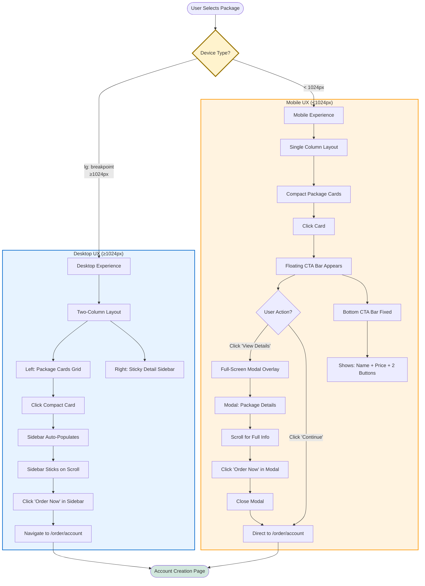

# Visual Customer Journey Documentation

> **Purpose**: Comprehensive visual mapping of the CircleTel customer journey from coverage check through order completion.
>
> **Last Updated**: 2025-10-24
>
> **Related Docs**:
> - [Implementation Plan](./IMPLEMENTATION_PLAN.md)
> - [Multi-Provider Architecture](./MULTI_PROVIDER_ARCHITECTURE.md)
> - [Journey Improvements](./JOURNEY_IMPROVEMENTS.md)
> - [Pain Points Analysis](./PAIN_POINTS_ANALYSIS.md)

---

## Table of Contents

1. [Main Customer Journey Flow](#1-main-customer-journey-flow)
2. [Wireless Product Journey](#2-wireless-product-journey)
3. [Technical Architecture](#3-technical-architecture)
4. [Decision Tree & Branching Logic](#4-decision-tree--branching-logic)
5. [State Management Flow](#5-state-management-flow)
6. [Mobile vs Desktop UX Paths](#6-mobile-vs-desktop-ux-paths)

---

## 1. Main Customer Journey Flow

### Complete Journey: Coverage Check → Payment

```mermaid
graph TD
    Start([Homepage Visit]) --> HeroTabs{Select Customer Type}

    HeroTabs -->|Residential Tab| ResAddress[Enter Home Address]
    HeroTabs -->|Business Tab| BizAddress[Enter Business Address]
    HeroTabs -->|Click Map Link| MapModal[Interactive Map Modal]

    ResAddress --> CheckBtn[Click 'Check Coverage']
    BizAddress --> CheckBtn
    MapModal --> CheckBtn

    CheckBtn --> CreateLead[POST /api/coverage/lead]

    CreateLead --> CoverageAPI{Multi-Layer<br/>Coverage Check}

    CoverageAPI -->|Layer 1| MTN[MTN Real-Time API]
    CoverageAPI -->|Layer 2 Fallback| PostGIS[PostGIS Database]
    CoverageAPI -->|Layer 3 Fallback| AreaMatch[Area Name Matching]

    MTN --> HasCoverage{Coverage<br/>Available?}
    PostGIS --> HasCoverage
    AreaMatch --> HasCoverage

    HasCoverage -->|Yes| PackagesPage[/packages/[leadId] Page]
    HasCoverage -->|No| NoService[Service Coming Soon<br/>+ Lead Capture]

    PackagesPage --> ServiceTabs{Service Type Tabs}

    ServiceTabs -->|Auto-Select Priority| TabPriority[Fibre > LTE > 5G > Wireless]

    TabPriority --> PackageGrid[Package Cards Grid]

    PackageGrid --> UserSelect{User Selects Package}

    UserSelect -->|Desktop| Sidebar[Sticky Detail Sidebar]
    UserSelect -->|Mobile| BottomCTA[Floating CTA Bar]

    Sidebar --> OrderNow1[Click 'Order Now']
    BottomCTA --> ViewDetails[Click 'View Details']
    ViewDetails --> MobileModal[Mobile Detail Modal]
    MobileModal --> OrderNow2[Click 'Order Now']

    OrderNow1 --> SaveContext[Save to OrderContext]
    OrderNow2 --> SaveContext

    SaveContext --> AccountPage[/order/account Page]

    AccountPage --> EmailCheck{Email on Blur}

    EmailCheck -->|Existing Customer| ShowLogin[Show 'Log In' Button]
    EmailCheck -->|New Customer| SignupForm[Show Signup Form]

    ShowLogin --> LoginRedirect[Redirect to /auth/login]

    SignupForm --> SubmitAccount[Click 'Create Account']

    SubmitAccount --> TempPassword[Generate Temp Password]
    TempPassword --> SupabaseAuth[Supabase signUp API]
    SupabaseAuth --> CustomerRecord[Create customers Record]
    CustomerRecord --> SendEmail[Send Verification Email]

    SendEmail --> VerifyPage[/order/verify-email Page]

    VerifyPage --> EmailVerif{User Clicks<br/>Email Link}

    EmailVerif --> SetPassword[User Sets Password]
    SetPassword --> VerifyComplete[Email Verified]

    VerifyComplete --> PaymentPage[/checkout/payment Page]

    PaymentPage --> PaymentGateway[Netcash Gateway]
    PaymentGateway --> ProcessPayment{Payment<br/>Success?}

    ProcessPayment -->|Success| Confirmation[/order/confirmation]
    ProcessPayment -->|Failed| PaymentError[Show Error + Retry]

    PaymentError --> PaymentPage

    Confirmation --> End([Order Complete])

    style Start fill:#e1f5e1
    style End fill:#e1f5e1
    style HasCoverage fill:#fff3cd
    style EmailCheck fill:#fff3cd
    style ProcessPayment fill:#fff3cd
    style PackagesPage fill:#cfe2ff
    style AccountPage fill:#cfe2ff
    style PaymentPage fill:#cfe2ff
    style Confirmation fill:#d1e7dd
```

**File References**:
- Homepage Hero: `components/home/HeroWithTabs.tsx`
- Coverage API: `app/api/coverage/packages/route.ts`
- Packages Page: `app/packages/[leadId]/page.tsx`
- Account Page: `app/order/account/page.tsx`
- Payment Page: `app/checkout/payment/page.tsx`

---

## 2. Wireless Product Journey

### Simplified Flow: Direct to Order (No Coverage Check)

```mermaid
graph TD
    Start([Wireless Page Visit]) --> WirelessHome[/wireless Page]

    WirelessHome --> PackageSelect[Select Package]
    PackageSelect --> WirelessOrder[/wireless/order?package=X]

    WirelessOrder --> Tab1[Tab 1: Device Selection]

    Tab1 --> DeviceChoice{Choose Device Type}

    DeviceChoice -->|SIM + Router| BundleOption[Bundle: SIM + Standard Router]
    DeviceChoice -->|SIM Only| SimOption[SIM Only - BYO Router]
    DeviceChoice -->|Premium| PremiumOption[Premium Router Bundle]

    BundleOption --> RouterModel{Select Router Model}

    RouterModel -->|Standard| Standard[Standard 5G Router<br/>R999 or FREE]
    RouterModel -->|Advanced| Advanced[Advanced 5G Router<br/>R1499]
    RouterModel -->|Premium| Premium[Premium 5G Pro Router<br/>R2499]

    Standard --> Tab2
    Advanced --> Tab2
    Premium --> Tab2
    SimOption --> Tab2
    PremiumOption --> Tab2

    Tab2[Tab 2: Personal Details] --> PersonalForm[Fill Form]

    PersonalForm --> RICANotice[RICA Compliance Notice]
    RICANotice --> TermsCheck[Accept Terms & Conditions]

    TermsCheck --> Tab3[Tab 3: Installation/Setup]

    Tab3 --> InstallChoice{Installation Type}

    InstallChoice -->|Self Installation| SelfInstall[Self Installation<br/>FREE]
    InstallChoice -->|Professional| ProInstall[Professional Installation<br/>R299 or FREE]

    SelfInstall --> Tab4
    ProInstall --> Schedule[Select Date & Time]
    Schedule --> Tab4

    Tab4[Tab 4: Delivery Address] --> AddressType{Address Type}

    AddressType -->|Residential| ResAddr[Residential Address Form]
    AddressType -->|Business| BizAddr[Business Address Form]

    ResAddr --> OptionalRef[Optional: Referral Code]
    BizAddr --> OptionalRef

    OptionalRef --> ProceedBtn[Click 'Proceed to Payment']

    ProceedBtn --> PaymentPage[/checkout/payment]

    PaymentPage --> PaymentGateway[Netcash Gateway]
    PaymentGateway --> ProcessPayment{Payment<br/>Success?}

    ProcessPayment -->|Success| Confirmation[Order Confirmation]
    ProcessPayment -->|Failed| PaymentError[Payment Error + Retry]

    PaymentError --> PaymentPage

    Confirmation --> End([Order Complete])

    style Start fill:#e1f5e1
    style End fill:#e1f5e1
    style DeviceChoice fill:#fff3cd
    style InstallChoice fill:#fff3cd
    style ProcessPayment fill:#fff3cd
    style Tab1 fill:#cfe2ff
    style Tab2 fill:#cfe2ff
    style Tab3 fill:#cfe2ff
    style Tab4 fill:#cfe2ff
    style PaymentPage fill:#f8d7da
```

**File References**:
- Wireless Order Form: `components/wireless/order/WirelessOrderForm.tsx` (4-tab wizard)
- Payment Integration: `components/checkout/CircleTelPaymentPage.tsx`

**Key Differences from Main Journey**:
- ✅ No coverage check required
- ✅ 4-tab wizard (device, personal, installation, address)
- ✅ Router selection with pricing tiers
- ✅ Professional vs self-installation choice
- ✅ RICA compliance built-in

---

## 3. Technical Architecture

### Component Relationships & Data Flow

```mermaid
graph TB
    subgraph "Entry Points"
        HomePage[Homepage<br/>app/page.tsx]
        HeroComp[HeroWithTabs Component<br/>components/home/HeroWithTabs.tsx]
        StandaloneCov[Standalone Coverage Checker<br/>components/coverage/CoverageChecker.tsx]
    end

    subgraph "Coverage Layer"
        LeadAPI[Coverage Lead API<br/>app/api/coverage/lead/route.ts]
        PackagesAPI[Coverage Packages API<br/>app/api/coverage/packages/route.ts]
        AggService[Coverage Aggregation Service<br/>lib/coverage/aggregation-service.ts]
        MTNClient[MTN WMS Client<br/>lib/coverage/mtn/wms-realtime-client.ts]
        PostGISDB[(PostGIS Database<br/>coverage_areas table)]
    end

    subgraph "Package Selection Layer"
        PackagesPage[Packages Page<br/>app/packages/[leadId]/page.tsx]
        ServiceToggle[Service Toggle<br/>components/ui/service-toggle.tsx]
        CompactCard[Compact Package Card<br/>components/ui/compact-package-card.tsx]
        DetailSidebar[Package Detail Sidebar<br/>components/ui/package-detail-sidebar.tsx]
        MobileOverlay[Mobile Detail Overlay<br/>components/ui/package-detail-sidebar.tsx]
    end

    subgraph "State Management"
        OrderContext[OrderContext Provider<br/>components/order/context/OrderContext.tsx]
        LocalStorage[(localStorage<br/>circletel_order_state)]
    end

    subgraph "Account Layer"
        AccountPage[Account Page<br/>app/order/account/page.tsx]
        CustomerAPI[Customers API<br/>app/api/customers/route.ts]
        AuthService[Customer Auth Service<br/>lib/auth/customer-auth-service.ts]
        SupabaseAuth[(Supabase Auth<br/>auth.users + customers table)]
    end

    subgraph "Verification Layer"
        VerifyPage[Verify Email Page<br/>app/order/verify-email/page.tsx]
        OTPAPI[OTP API<br/>app/api/auth/send-otp/route.ts]
        EmailService[Email Service<br/>Resend or Supabase]
    end

    subgraph "Payment Layer"
        PaymentPage[Payment Page<br/>app/checkout/payment/page.tsx]
        PaymentComp[CircleTel Payment Component<br/>components/checkout/CircleTelPaymentPage.tsx]
        NetcashService[Netcash Service<br/>lib/payments/netcash-service.ts]
        OrdersDB[(orders table<br/>Supabase)]
    end

    %% Entry Point Flow
    HomePage --> HeroComp
    HeroComp --> LeadAPI
    StandaloneCov --> LeadAPI

    %% Coverage Flow
    LeadAPI --> PackagesAPI
    PackagesAPI --> AggService
    AggService --> MTNClient
    AggService --> PostGISDB

    %% Package Selection Flow
    PackagesAPI --> PackagesPage
    PackagesPage --> ServiceToggle
    PackagesPage --> CompactCard
    CompactCard --> DetailSidebar
    CompactCard --> MobileOverlay

    %% State Persistence
    PackagesPage --> OrderContext
    OrderContext --> LocalStorage
    AccountPage --> OrderContext
    PaymentPage --> OrderContext

    %% Account Creation Flow
    DetailSidebar --> AccountPage
    MobileOverlay --> AccountPage
    AccountPage --> CustomerAPI
    AccountPage --> AuthService
    AuthService --> SupabaseAuth

    %% Verification Flow
    AuthService --> VerifyPage
    VerifyPage --> OTPAPI
    OTPAPI --> EmailService

    %% Payment Flow
    VerifyPage --> PaymentPage
    PaymentPage --> PaymentComp
    PaymentComp --> NetcashService
    NetcashService --> OrdersDB

    style OrderContext fill:#d1e7dd,stroke:#0f5132,stroke-width:3px
    style LocalStorage fill:#d1e7dd,stroke:#0f5132,stroke-width:2px
    style AggService fill:#cfe2ff,stroke:#084298,stroke-width:2px
    style SupabaseAuth fill:#f8d7da,stroke:#842029,stroke-width:2px
    style NetcashService fill:#fff3cd,stroke:#997404,stroke-width:2px
```

**Key Architectural Patterns**:

1. **State Persistence**: OrderContext syncs to localStorage for journey recovery
2. **Multi-Layer Fallback**: Coverage API has 3 fallback layers (MTN → PostGIS → Area matching)
3. **Responsive Design**: Desktop (sidebar) vs Mobile (modal/CTA bar) layouts
4. **Progressive Enhancement**: Works without JavaScript via form submissions
5. **Service Isolation**: Each layer (coverage, account, payment) is independently testable

---

## 4. Decision Tree & Branching Logic

### Critical Decision Points in Customer Journey

```mermaid
graph TD
    Start([User Starts Journey]) --> D1{Entry Point?}

    D1 -->|Homepage Hero| D2{Customer Type?}
    D1 -->|Direct Wireless| W1[Wireless Journey]
    D1 -->|Standalone Checker| D2

    D2 -->|Residential Tab| CT1[customer_type: consumer]
    D2 -->|Business Tab| CT2[customer_type: business/smme]

    CT1 --> D3{Has Coordinates?}
    CT2 --> D3

    D3 -->|Yes lat/lng| CovCheck[Run Coverage Check]
    D3 -->|No coordinates| GeoCode[Geocode Address First]
    GeoCode --> CovCheck

    CovCheck --> D4{MTN API Success?}

    D4 -->|Yes| MTNData[Use MTN Coverage Data]
    D4 -->|No/Error| D5{PostGIS Available?}

    D5 -->|Yes| PostGISData[Use PostGIS Data]
    D5 -->|No| D6{Area Name Match?}

    D6 -->|Yes| AreaData[Use Area Matching]
    D6 -->|No| NoData[No Coverage Found]

    MTNData --> D7{Packages Found?}
    PostGISData --> D7
    AreaData --> D7

    D7 -->|Yes packages > 0| ShowPackages[Display Packages Page]
    D7 -->|No packages| NoData

    NoData --> LeadCapture[Show 'Coming Soon' + Lead Form]

    ShowPackages --> D8{Service Types Available?}

    D8 --> AutoSelect[Auto-Select: Fibre > LTE > 5G > Wireless]

    AutoSelect --> UserAction{User Selects Package?}

    UserAction -->|Desktop| D9[Show Sidebar]
    UserAction -->|Mobile| D10[Show CTA Bar + Modal]

    D9 --> Continue[Click 'Order Now']
    D10 --> Continue

    Continue --> D11{Email Check on Blur}

    D11 -->|Existing Customer| ExistFlow[Mode: Signin<br/>Pre-fill form<br/>Send OTP]
    D11 -->|New Customer| NewFlow[Mode: Signup<br/>Empty form]

    ExistFlow --> D12{User Chooses?}

    D12 -->|Log In Button| LoginPage[Redirect /auth/login]
    D12 -->|Continue| CreateAccount

    NewFlow --> CreateAccount[Submit Account Form]

    CreateAccount --> D13{Auth Success?}

    D13 -->|Success| SaveToContext[Save to OrderContext<br/>Send Verification Email]
    D13 -->|Error| ShowError[Display Error + Retry]

    ShowError --> CreateAccount

    SaveToContext --> VerifyEmail[Navigate to /order/verify-email]

    VerifyEmail --> D14{User Verifies Email?}

    D14 -->|Yes verified| Payment[Navigate to /checkout/payment]
    D14 -->|Timeout/Skip| WaitingState[Waiting State]

    Payment --> D15{Device Type?}

    D15 -->|Desktop| DesktopPay[Desktop Payment Form]
    D15 -->|Mobile| MobilePay[Mobile Payment Form]

    DesktopPay --> Submit
    MobilePay --> Submit[Submit Payment]

    Submit --> D16{Payment Gateway Response?}

    D16 -->|Success| CreateOrder[Create Order Record]
    D16 -->|Failed| PayError[Show Error + Retry Option]

    PayError --> Payment

    CreateOrder --> Confirm[Order Confirmation Page]

    Confirm --> End([Journey Complete])

    style D1 fill:#fff3cd,stroke:#997404,stroke-width:2px
    style D4 fill:#fff3cd,stroke:#997404,stroke-width:2px
    style D7 fill:#fff3cd,stroke:#997404,stroke-width:2px
    style D11 fill:#fff3cd,stroke:#997404,stroke-width:2px
    style D13 fill:#fff3cd,stroke:#997404,stroke-width:2px
    style D16 fill:#fff3cd,stroke:#997404,stroke-width:2px
    style ShowPackages fill:#cfe2ff
    style CreateAccount fill:#cfe2ff
    style Payment fill:#f8d7da
    style End fill:#d1e7dd
```



**Decision Point Summary**:

| Decision | Logic | Impact |
|----------|-------|--------|
| **Customer Type** | Residential vs Business tab | Filters packages by `customer_type: consumer/business` |
| **Coverage API Fallback** | MTN → PostGIS → Area Name | 3-layer reliability system |
| **Service Auto-Select** | Fibre > LTE > 5G > Wireless | UX optimization (highest demand first) |
| **Email Detection** | Check on blur via API | Returns vs new customer flows |
| **Device Layout** | Desktop vs Mobile | Sidebar vs Modal/CTA bar UX |
| **Payment Gateway** | Success vs Failed | Retry vs Complete order |

---

## 5. State Management Flow

### OrderContext State Transitions

```mermaid
stateDiagram-v2
    [*] --> Initial: Page Load

    Initial --> Hydrating: useEffect runs

    Hydrating --> Restored: localStorage found
    Hydrating --> Fresh: No localStorage

    Restored --> CoverageStage: currentStage from storage
    Fresh --> CoverageStage: Default stage = 1

    state CoverageStage {
        [*] --> EnterAddress
        EnterAddress --> CoverageCheck: Click 'Check Coverage'
        CoverageCheck --> ShowPackages: POST /api/coverage/lead
        ShowPackages --> PackageSelected: User selects package
        PackageSelected --> SaveCoverageData: updateOrderData(coverage)
        SaveCoverageData --> MarkStep1: markStepComplete(1)
    }

    MarkStep1 --> AccountStage: setCurrentStage(2)

    state AccountStage {
        [*] --> EnterDetails
        EnterDetails --> CheckEmail: Email blur event
        CheckEmail --> ExistingCustomer: Customer found
        CheckEmail --> NewCustomer: Customer not found
        ExistingCustomer --> PreFillForm: Pre-fill with customer data
        NewCustomer --> EmptyForm: Continue signup
        PreFillForm --> Submit
        EmptyForm --> Submit: Click 'Create Account'
        Submit --> CreateAuth: Supabase signUp()
        CreateAuth --> SaveAccountData: updateOrderData(account)
        SaveAccountData --> MarkStep2: markStepComplete(2)
    }

    MarkStep2 --> VerificationStage: setCurrentStage(3)

    state VerificationStage {
        [*] --> WaitingForEmail
        WaitingForEmail --> EmailSent: Verification email sent
        EmailSent --> ClickLink: User clicks link
        ClickLink --> SetPassword: User sets password
        SetPassword --> EmailVerified: Email confirmed
        EmailVerified --> MarkStep3: markStepComplete(3)
    }

    MarkStep3 --> PaymentStage: setCurrentStage(4)

    state PaymentStage {
        [*] --> LoadOrderSummary
        LoadOrderSummary --> DisplayForm: Render payment form
        DisplayForm --> FillPaymentInfo: User enters card details
        FillPaymentInfo --> SubmitPayment: Click 'Pay Now'
        SubmitPayment --> ProcessGateway: Netcash API call
        ProcessGateway --> PaymentSuccess: Success response
        ProcessGateway --> PaymentFailed: Error response
        PaymentFailed --> DisplayForm: Show error + retry
        PaymentSuccess --> SavePaymentData: updateOrderData(payment)
        SavePaymentData --> MarkStep4: markStepComplete(4)
    }

    MarkStep4 --> ConfirmationStage: setCurrentStage(5)

    state ConfirmationStage {
        [*] --> CreateOrderRecord
        CreateOrderRecord --> SendConfirmationEmail
        SendConfirmationEmail --> DisplayConfirmation
        DisplayConfirmation --> ResetContext: resetOrder()
    }

    ResetContext --> [*]: Journey complete

    note right of CoverageStage
        OrderData.coverage = {
            leadId: string,
            address: string,
            coordinates: {lat, lng},
            selectedPackage: PackageDetails,
            pricing: PricingBreakdown
        }
    end note

    note right of AccountStage
        OrderData.account = {
            firstName: string,
            lastName: string,
            email: string,
            phone: string,
            accountType: 'personal',
            isAuthenticated: boolean
        }
    end note

    note right of PaymentStage
        OrderData.payment = {
            customerId: string,
            method: string,
            status: 'pending' | 'success' | 'failed'
        }
    end note
```



**OrderContext Structure**:

```typescript
interface OrderState {
  currentStage: number;              // 1-5 (coverage → confirmation)
  completedSteps: number[];          // [1, 2, 3] tracks finished stages
  orderData: {
    coverage: {
      leadId: string;
      address: string;
      coordinates: { lat: number; lng: number };
      selectedPackage: PackageDetails;
      pricing: PricingBreakdown;
    };
    account: {
      firstName: string;
      lastName: string;
      email: string;
      phone: string;
      accountType: 'personal' | 'business';
      isAuthenticated: boolean;
    };
    payment: {
      customerId: string;
      method: string;
      status: 'pending' | 'success' | 'failed';
    };
  };
  errors: ValidationErrors;
  isLoading: boolean;
  savedAt?: Date;
}
```

**File**: `components/order/context/OrderContext.tsx`

**Key Features**:
- ✅ Persists to localStorage automatically
- ✅ Hydrates on page load (SSR-safe)
- ✅ Tracks completed steps for navigation
- ✅ Type-safe actions via `useOrderContext()` hook
- ✅ Immutable updates via reducer pattern

---

## 6. Mobile vs Desktop UX Paths

### Responsive Journey Divergence



**Component Behavior**:

| Feature | Desktop (≥1024px) | Mobile (<1024px) |
|---------|-------------------|------------------|
| **Layout** | Two-column grid | Single column |
| **Package Cards** | Grid with multiple rows | Vertical stack |
| **Detail Display** | Sticky sidebar (right column) | Modal overlay (full screen) |
| **CTA Location** | Inside sidebar | Floating bottom bar |
| **Selection State** | Sidebar updates on click | CTA bar appears on click |
| **Navigation** | Immediate sidebar update | Bar → Modal → Account |
| **Scroll Behavior** | Sidebar sticks to viewport | CTA bar fixed to bottom |

**File Locations**:
- Package Detail Sidebar: `components/ui/package-detail-sidebar.tsx` (lines 200-300)
- Mobile Overlay: `components/ui/package-detail-sidebar.tsx` (lines 350-450)
- Floating CTA Bar: `app/packages/[leadId]/page.tsx` (lines 552-586)

**Tailwind Breakpoints Used**:
```typescript
// Hidden on mobile, visible on desktop
className="hidden lg:block lg:w-[400px]"

// Visible on mobile, hidden on desktop
className="lg:hidden fixed bottom-0 left-0 right-0"
```

---

## Summary Statistics

### Journey Metrics

| Metric | Main Journey | Wireless Journey |
|--------|-------------|------------------|
| **Total Stages** | 5 (Coverage → Confirmation) | 4 (Device → Payment) |
| **User Inputs** | 12 form fields | 15+ form fields (4 tabs) |
| **Decision Points** | 6 critical decisions | 4 critical decisions |
| **API Calls** | 6 endpoints | 3 endpoints |
| **State Persistence** | OrderContext + localStorage | Form state only |
| **Avg. Time to Complete** | 5-10 minutes | 8-12 minutes |
| **Mobile Optimizations** | 3 layout changes | 4 layout changes |

### Component Count

| Layer | Components | Files |
|-------|------------|-------|
| **Coverage** | 5 | `components/coverage/*` |
| **Package Selection** | 8 | `components/ui/*`, `components/packages/*` |
| **Order Flow** | 6 | `components/order/*`, `app/order/*` |
| **Payment** | 3 | `components/checkout/*` |
| **State Management** | 1 | `components/order/context/OrderContext.tsx` |
| **Total** | 23 | ~30 files |

### Code References Quick Index

| Component | File Path | Lines |
|-----------|-----------|-------|
| Homepage Hero | `components/home/HeroWithTabs.tsx` | 270 |
| Coverage API | `app/api/coverage/packages/route.ts` | 300+ |
| Packages Page | `app/packages/[leadId]/page.tsx` | 604 |
| Account Page | `app/order/account/page.tsx` | 323 |
| OrderContext | `components/order/context/OrderContext.tsx` | 168 |
| Payment Page | `app/checkout/payment/page.tsx` | 29 (wrapper) |
| Wireless Form | `components/wireless/order/WirelessOrderForm.tsx` | 500+ |

---

## Next Steps

1. **Review Journey Improvements**: See [JOURNEY_IMPROVEMENTS.md](./JOURNEY_IMPROVEMENTS.md) for 45+ optimization recommendations
2. **Analyze Pain Points**: See [PAIN_POINTS_ANALYSIS.md](./PAIN_POINTS_ANALYSIS.md) for prioritized issues
3. **Implement Features**: Use this visual guide to understand system architecture before making changes
4. **Test E2E Flow**: Use Playwright tests based on these diagrams

---

**Maintained By**: Development Team + Claude Code
**Last Review**: 2025-10-24
**Version**: 1.0
