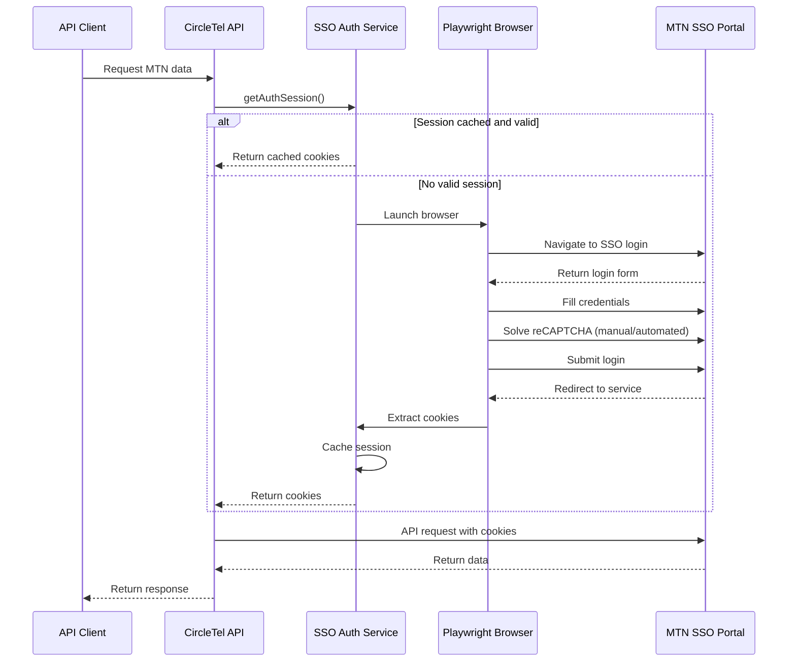

# MTN SSO Authentication Implementation

## Overview

This document describes the MTN SSO (Single Sign-On) authentication implementation for accessing MTN Wholesale APIs. The system uses Playwright to automate the SSO login flow and manage session cookies.

## Architecture

### Components

1. **MTN SSO Auth Service** (`lib/services/mtn-sso-auth.ts`)
   - Singleton service for authentication management
   - Handles Playwright browser automation
   - Manages session cookies and caching
   - Provides cookie headers for API requests

2. **Updated API Endpoints**
   - `/api/mtn-wholesale/products` - Get available wholesale products
   - `/api/mtn-wholesale/feasibility` - Check feasibility at locations
   - `/api/mtn-wholesale/auth` - Manage authentication sessions

3. **Test Script** (`scripts/test-mtn-sso-auth.ts`)
   - Automated testing of authentication flow
   - Manual authentication support (for reCAPTCHA)
   - Session validation and API testing

## Authentication Flow



## Setup

### 1. Environment Variables

Add to `.env.local`:

```env
# MTN SSO Credentials
MTN_USERNAME=Lindokuhle.mdake@circletel.co.za
MTN_PASSWORD=Lwandle@1992*

# Optional: Override SSO URL (default: https://sso.mtnbusiness.co.za/login)
# MTN_SSO_URL=https://custom-sso-url.com
```

**Security Note**: Never commit credentials to version control. The service has defaults for development, but production should use environment variables.

### 2. Install Dependencies

Playwright is already installed. Ensure browsers are installed:

```bash
npx playwright install chromium
```

### 3. Directory Structure

```
circletel-nextjs/
├── lib/
│   └── services/
│       └── mtn-sso-auth.ts          # SSO authentication service
├── app/
│   └── api/
│       └── mtn-wholesale/
│           ├── auth/route.ts         # Auth management endpoint
│           ├── products/route.ts     # Products API (updated)
│           └── feasibility/route.ts  # Feasibility API (updated)
├── scripts/
│   └── test-mtn-sso-auth.ts         # Test script
├── .cache/
│   └── mtn-session.json             # Cached session (auto-generated)
└── docs/
    └── integrations/
        └── MTN_SSO_AUTHENTICATION.md # This file
```

## Usage

### Automated Authentication

The SSO service automatically authenticates when needed:

```typescript
import { mtnSSOAuth } from '@/lib/services/mtn-sso-auth';

// Get authenticated session (uses cache if valid)
const session = await mtnSSOAuth.getAuthSession();

if (session.success) {
  const cookieHeader = await mtnSSOAuth.getCookieHeader();

  // Use cookies in API request
  const response = await fetch('https://asp-feasibility.mtnbusiness.co.za/api/...', {
    headers: {
      'Cookie': cookieHeader,
      // ... other headers
    }
  });
}
```

### Manual Authentication (for reCAPTCHA)

When reCAPTCHA blocks automated login:

```bash
# Run test script with manual mode
npx tsx scripts/test-mtn-sso-auth.ts --manual
```

This will:
1. Open a visible browser window
2. Fill in credentials automatically
3. Wait for you to solve reCAPTCHA
4. Extract and cache session cookies

### API Endpoints

#### Check Authentication Status

```bash
curl http://localhost:3000/api/mtn-wholesale/auth
```

**Response**:
```json
{
  "success": true,
  "authenticated": true,
  "sessionId": "mtn_1760688426664_xyz",
  "expiresAt": "2025-10-17T09:30:00.000Z",
  "cookiesCount": 5
}
```

#### Force Re-authentication

```bash
curl -X POST http://localhost:3000/api/mtn-wholesale/auth \
  -H "Content-Type: application/json" \
  -d '{"manual": false}'
```

#### Clear Session Cache

```bash
curl -X DELETE http://localhost:3000/api/mtn-wholesale/auth
```

### Test MTN APIs

Once authenticated, test the wholesale endpoints:

```bash
# Get available products
curl http://localhost:3000/api/mtn-wholesale/products

# Check feasibility
curl -X POST http://localhost:3000/api/mtn-wholesale/feasibility \
  -H "Content-Type: application/json" \
  -d '{
    "inputs": [{
      "latitude": "-26.2041",
      "longitude": "28.0473",
      "customer_name": "CircleTel Test"
    }],
    "product_names": ["Wholesale Cloud Connect"],
    "requestor": "test@circletel.co.za"
  }'
```

## Session Management

### Caching Strategy

1. **In-Memory Cache**: Active session stored in service instance
2. **File Cache**: Persisted to `.cache/mtn-session.json`
3. **Expiration**: Sessions expire 5 minutes before actual cookie expiry
4. **Auto-Refresh**: Automatically re-authenticates when session expires

### Cache File Format

```json
{
  "cookies": [
    {
      "name": "JSESSIONID",
      "value": "ABC123...",
      "domain": ".mtnbusiness.co.za",
      "path": "/",
      "expires": 1760692000,
      "httpOnly": true,
      "secure": true,
      "sameSite": "Lax"
    }
  ],
  "sessionId": "mtn_1760688426664_xyz",
  "expiresAt": "2025-10-17T09:30:00.000Z"
}
```

### Clearing Cache

**Via API**:
```bash
curl -X DELETE http://localhost:3000/api/mtn-wholesale/auth
```

**Via Script**:
```bash
npx tsx scripts/test-mtn-sso-auth.ts --clear
```

**Manually**:
```bash
rm .cache/mtn-session.json
```

## Testing

### Test Script Options

```bash
# Automated authentication (may fail at reCAPTCHA)
npx tsx scripts/test-mtn-sso-auth.ts

# Manual authentication (visible browser)
npx tsx scripts/test-mtn-sso-auth.ts --manual

# Clear cache before testing
npx tsx scripts/test-mtn-sso-auth.ts --clear

# Test API call with authentication
npx tsx scripts/test-mtn-sso-auth.ts --test-api

# Combined: clear, manual auth, and test API
npx tsx scripts/test-mtn-sso-auth.ts --clear --manual --test-api
```

### Expected Output

**Successful Authentication**:
```
============================================================
MTN SSO Authentication Test
============================================================

🤖 Running AUTOMATED authentication...
⚠️  Note: This may fail at reCAPTCHA step

[MTN SSO] Using cached session

============================================================
Authentication Result
============================================================
✅ Status: SUCCESS

Session Details:
  Session ID: mtn_1760688426664_xyz
  Expires At: 2025-10-17T09:30:00.000Z
  Cookies Count: 5

Cookies:
  - JSESSIONID: ABC123... (expires: 2025-10-17T09:30:00.000Z)
  - TS015f82aa: DEF456... (expires: session)

Cookie Header (first 100 chars):
  JSESSIONID=ABC123...; TS015f82aa=DEF456...

✅ Session cached successfully
   Cached at: .cache/mtn-session.json

Testing cached session retrieval...
✅ Cached session retrieved successfully

============================================================
```

## Troubleshooting

### Issue: reCAPTCHA Blocking Automated Login

**Symptoms**:
- Authentication times out at reCAPTCHA step
- Error: "reCAPTCHA validation failed - submit button did not appear"

**Solutions**:

1. **Use Manual Authentication**:
   ```bash
   npx tsx scripts/test-mtn-sso-auth.ts --manual
   ```

2. **Implement reCAPTCHA Solver Service** (future enhancement):
   - Use 2Captcha, Anti-Captcha, or similar service
   - Add API key to environment variables
   - Update auth service to use solver

3. **Cookie Import** (alternative):
   - Manually login via browser
   - Export cookies using browser extension
   - Import cookies to `.cache/mtn-session.json`

### Issue: Session Expires Quickly

**Symptoms**:
- Frequent re-authentication requests
- "Session appears invalid" messages

**Solutions**:

1. **Check Cookie Expiry**:
   ```bash
   cat .cache/mtn-session.json | jq '.cookies[].expires'
   ```

2. **Adjust Expiry Buffer** (in `mtn-sso-auth.ts`):
   ```typescript
   // Current: 5 minutes buffer
   const bufferMs = 5 * 60 * 1000;

   // Reduce to 1 minute for longer cache
   const bufferMs = 1 * 60 * 1000;
   ```

3. **Monitor Session Duration**:
   - Check MTN SSO session timeout settings
   - May need to implement periodic refresh

### Issue: Connection Reset (ECONNRESET)

**Symptoms**:
- "fetch failed" errors
- "read ECONNRESET"

**Solutions**:

1. **Verify Authentication**:
   ```bash
   curl http://localhost:3000/api/mtn-wholesale/auth
   ```

2. **Check Session Validity**:
   - Clear cache: `npx tsx scripts/test-mtn-sso-auth.ts --clear`
   - Re-authenticate: `npx tsx scripts/test-mtn-sso-auth.ts --manual`

3. **Verify Headers**:
   - Ensure `Cookie`, `Referer`, and `Origin` headers are set
   - Check `User-Agent` matches browser profile

### Issue: 401/403 Unauthorized

**Symptoms**:
- API returns 401 or 403 status
- "Unauthorized" or "Forbidden" errors

**Solutions**:

1. **Session Invalid - Clear and Re-auth**:
   ```bash
   curl -X DELETE http://localhost:3000/api/mtn-wholesale/auth
   npx tsx scripts/test-mtn-sso-auth.ts --manual
   ```

2. **Verify Credentials**:
   - Check `MTN_USERNAME` and `MTN_PASSWORD` in `.env.local`
   - Ensure credentials are correct

3. **Check Account Permissions**:
   - Verify account has access to Wholesale APIs
   - Contact MTN support if needed

## API Reference

### MTN SSO Auth Service

#### `getAuthSession(): Promise<AuthResult>`

Get authenticated session, refreshing if necessary.

**Returns**:
```typescript
{
  success: boolean;
  cookies?: Cookie[];
  sessionId?: string;
  expiresAt?: Date;
  error?: string;
}
```

#### `getCookieHeader(): Promise<string | null>`

Get cookie header string for API requests.

**Returns**: `"JSESSIONID=abc123; TS015f82aa=def456"` or `null`

#### `clearSession(): Promise<void>`

Clear cached session and force re-authentication.

#### `authenticateManual(): Promise<AuthResult>`

Run manual authentication with visible browser (for reCAPTCHA).

### API Endpoints

| Endpoint | Method | Description |
|----------|--------|-------------|
| `/api/mtn-wholesale/auth` | GET | Check authentication status |
| `/api/mtn-wholesale/auth` | POST | Force re-authentication |
| `/api/mtn-wholesale/auth` | DELETE | Clear session cache |
| `/api/mtn-wholesale/products` | GET | Get wholesale products (authenticated) |
| `/api/mtn-wholesale/feasibility` | POST | Check feasibility (authenticated) |

## Security Considerations

1. **Credentials Storage**:
   - Store in environment variables (`.env.local`)
   - Never commit to version control
   - Use secrets management in production (e.g., Vercel secrets)

2. **Session Cache**:
   - `.cache/mtn-session.json` contains sensitive cookies
   - Add to `.gitignore`
   - Protect file permissions in production

3. **Cookie Handling**:
   - Cookies transmitted over HTTPS only
   - `httpOnly` and `secure` flags respected
   - Session cookies cleared on logout

4. **Browser Automation**:
   - Run in headless mode by default
   - Use `--manual` only for debugging
   - Consider IP whitelisting with MTN

## Performance Considerations

1. **Session Caching**:
   - In-memory cache for active requests
   - File cache for server restarts
   - ~0.1s overhead for cached sessions
   - ~10-30s overhead for new authentication

2. **Rate Limiting**:
   - Minimize authentication requests
   - Reuse sessions across API calls
   - Implement request queuing if needed

3. **Browser Automation**:
   - Playwright adds ~2-5s startup overhead
   - Browser instances closed after auth
   - Consider keeping browser alive for frequent auth

## Future Enhancements

1. **reCAPTCHA Solver Integration**:
   - Integrate 2Captcha or Anti-Captcha API
   - Fully automated authentication
   - Fallback to manual on solver failure

2. **Multi-User Support**:
   - Support multiple MTN accounts
   - Account rotation for load distribution
   - User-specific session caching

3. **Session Refresh**:
   - Implement background session refresh
   - Prevent session expiry during long operations
   - Proactive re-authentication before expiry

4. **Monitoring & Alerting**:
   - Track authentication success/failure rates
   - Alert on repeated auth failures
   - Monitor session duration and usage

5. **Distributed Caching**:
   - Use Redis for session sharing across instances
   - Support for horizontal scaling
   - Centralized session management

## Related Documentation

- [MTN API Documentation](../../Documents/MTN_API_Documentation.md)
- [MTN API Test Report](../testing/MTN_API_TEST_REPORT.md)
- [CircleTel Integration Guide](./README.md)

## Support

For issues or questions:

1. **Check Server Logs**: Look for `[MTN SSO]` prefixed messages
2. **Run Test Script**: `npx tsx scripts/test-mtn-sso-auth.ts --manual`
3. **Verify Session**: `curl http://localhost:3000/api/mtn-wholesale/auth`
4. **Clear Cache**: `npx tsx scripts/test-mtn-sso-auth.ts --clear`

If issues persist:
- Review [Troubleshooting](#troubleshooting) section
- Contact MTN Business Support: support@mtnbusiness.co.za
- Check CircleTel development team documentation

---

**Last Updated**: October 17, 2025
**Version**: 1.0
**Author**: CircleTel Development Team
