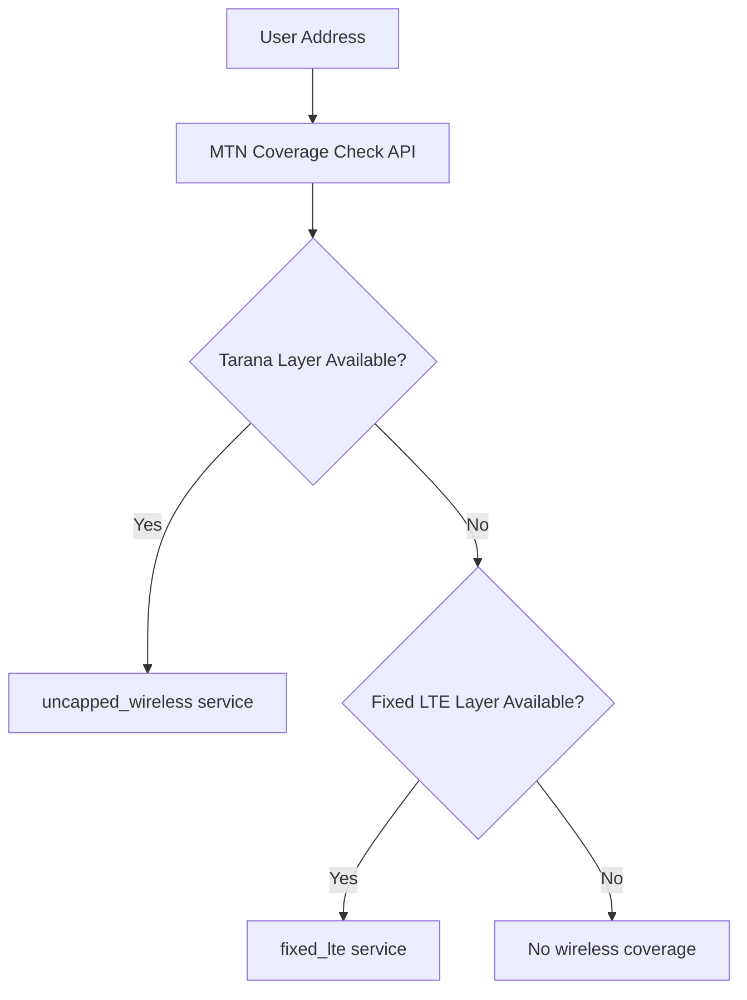
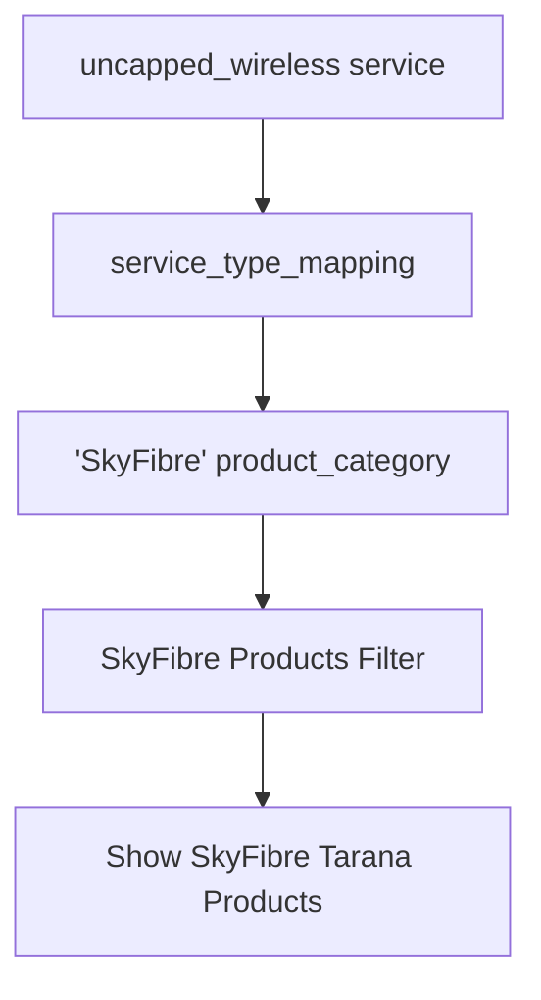

# Coverage Check Implementation Review

**Review Date**: 2025-10-13  
**Target**: Verify actual codebase implementation against corrected MTN product mapping  

## 🎯 **Implementation Status Summary**

### ✅ **CORRECTLY IMPLEMENTED**

#### **1. Service Type Mapping (DATABASE)**
```sql
-- From service_type_mapping table (20251001000002_create_service_type_mapping.sql)
('uncapped_wireless', 'mtn', 'SkyFibre', 1, 'MTN Tarana Wireless G1 technology - branded as SkyFibre')
('fixed_lte', 'mtn', 'LTE', 2, 'MTN Fixed LTE service')
('lte', 'mtn', 'LTE', 3, 'MTN mobile LTE service')
('5g', 'mtn', '5G', 1, 'MTN 5G service')
```
✅ **VERIFIED**: `uncapped_wireless` correctly maps to `SkyFibre` (Tarana Wireless)

#### **2. Technology Recognition (CODE)**
```typescript
// From aggregation-service.ts
private getTechnologyForServiceType(serviceType: ServiceType): string {
  const technologyMap: Record<ServiceType, string> = {
    'uncapped_wireless': 'Tarana Wireless G1',  ✅ CORRECT
    'fixed_lte': 'Fixed LTE',                    ✅ CORRECT
    'fibre': 'FTTB',                             ✅ CORRECT
    'licensed_wireless': 'PMP',                  ✅ CORRECT
  };
}
```
✅ **VERIFIED**: `uncapped_wireless` correctly identified as 'Tarana Wireless G1'

#### **3. Product Catalog (PRODUCTS)**
```typescript
// From product-recommendations.ts
export const SKYFIBRE_PRODUCTS = {
  consumer: [
    {
      serviceType: 'uncapped_wireless' as ServiceType,  ✅ CORRECT
      features: ['Tarana Wireless Technology']          ✅ CORRECT
    }
  ]
}
```
✅ **VERIFIED**: SkyFibre products correctly use `uncapped_wireless` service type

#### **4. MTN Layer Configuration**
```typescript
// From wms-realtime-client.ts
UNCAPPED_WIRELESS: {
  wmsLayer: 'mtnsi:MTNSA-Coverage-Tarana',    ✅ CORRECT: Tarana layer
  serviceType: 'uncapped_wireless'              ✅ CORRECT
},
FIXED_LTE: {
  wmsLayer: 'mtnsi:MTNSA-Coverage-FIXLTE',     ✅ CORRECT: Fixed LTE layer
  serviceType: 'fixed_lte'                     ✅ CORRECT
}
```
✅ **VERIFIED**: Tarana layer correctly mapped to `uncapped_wireless`

## 🔍 **Coverage Flow Analysis**

### **Step 1: MTN Coverage Detection**


### **Step 2: Service Type to Product Mapping**


### **Step 3: Product Display Logic**
```typescript
// Current AND CORRECT implementation in packages/route.ts
const { data: mappings, error: mappingError } = await supabase
  .from('service_type_mapping')
  .select('*')
  .in('technical_type', availableServices)
  .eq('active', true)
  .order('priority', { ascending: true });

// Technical type: uncapped_wireless
// Maps to: SkyFibre (via service_type_mapping table)
// Shows: SkyFibre products from SKYFIBRE_PRODUCTS
```

## 📊 **Testing Heritage Hill with Correct Logic**

### **What Should Happen Now**:
1. **MTN API Check**: `mtnsi:MTNSA-Coverage-Tarana` layer
2. **If Available**: Service type = `uncapped_wireless`
3. **Database Query**: `service_type_mapping` → `SkyFibre`
4. **Product Filter**: `service_packages.product_category = 'wireless'` (SkyFibre was updated to 'wireless')
5. **Display**: SkyFibre Tarana Wireless products

### **Test Results from Our Testing**:
From the MTN API response we saw:
```json
"consumerCoverage": {
  "services": [
    {"type": "5g", "available": false, "signal": "none"},
    {"type": "lte", "available": false, "signal": "none"}, 
    {"type": "fibre", "available": false, "signal": "none"}
  ]
}
```

**CRITICAL ISSUE**: The API response does NOT include `uncapped_wireless` service type!

## 🚨 **Identified Implementation Issues**

### **Issue 1: Missing Tarana Layer in Consumer API**
From our testing, the MTN consumer API response only shows:
- `5g`, `lte`, `fibre` services
- **NOT** `uncapped_wireless` (Tarana)

**Expected**: Should include Tarana coverage if available

### **Issue 2: Layer Detection Logic**
Looking at `product-matcher.ts`:
```typescript
private mapLayerToTechnology(layer?: string): ServiceType | null {
  const layerMap: Record<string, ServiceType> = {
    'mtnsi:MTNSA-Coverage-5G': '5g',
    'mtnsi:MTNSA-Coverage-LTE': 'lte',
    'mtnsi:MTNSA-Coverage-FIXLTE': 'fixed_lte',
    // ❌ MISSING: Tarana layer mapping
    'mtnsi:MTNSA-Coverage-Tarana': 'uncapped_wireless' // NOT PRESENT
  };
}
```

### **Issue 3: WMS Realtime Client vs Consumer API**
The codebase has TWO different approaches:
1. **WMS Realtime Client** (`wms-realtime-client.ts`) - Direct Tarana queries ✅
2. **Consumer API Parser** (`wms-parser.ts`) - Consumer response only ❌

**Current Implementation Issues**:
- Consumer API doesn't return Tarana coverage
- Product matcher doesn't map Tarana layer
- Service may default to WMS but not consistently

## 🔧 **Required Implementation Fixes**

### **Fix 1: Update Product Matcher Layer Mapping**
```typescript
// In product-matcher.ts
private mapLayerToTechnology(layer?: string): ServiceType | null {
  const layerMap: Record<string, ServiceType> = {
    'mtnsi:MTNSA-Coverage-5G': '5g',
    'mtnsi:MTNSA-Coverage-LTE': 'lte',
    'mtnsi:MTNSA-Coverage-FIXLTE': 'fixed_lte',
    'mtnsi:SUPERSONIC-CONSOLIDATED': 'fibre',
    'mtnsi:MTNSA-Coverage-Tarana': 'uncapped_wireless', // ✅ ADD THIS
    'mtnsi:MTNSA-COVERAGE-TARANA': 'uncapped_wireless', // ✅ ADD THIS
  };
}
```

### **Fix 2: Ensure Tarana Layer is Queried**
```typescript
// In coverage aggregation service
await coverageAggregationService.aggregateCoverage(coordinates, {
  providers: ['mtn'],
  serviceTypes: ['uncapped_wireless', 'fixed_lte', 'fibre'], // ✅ INCLUDE Taranza
  includeRealtime: true // ✅ Force WMS realtime client
});
```

### **Fix 3: Update Service Type Detection**
```typescript
// In wms-parser.ts, mapNetworkTypeToServiceType
static mapNetworkTypeToServiceType(networkType: string): ServiceType | null {
  const mapping: Record<string, ServiceType> = {
    '5G': '5g',
    'LTE': 'lte',
    'FIXLTE': 'fixed_lte',
    'SUPERSONIC': 'fibre',
    'TARANA': 'uncapped_wireless',     // ✅ ADD THIS
    'WIRELESS': 'uncapped_wireless',  // ✅ ADD THIS
  };
}
```

## 📋 **Testing Verification Plan**

### **Step 1: Test Tarana Layer Detection**
```bash
curl -X POST http://localhost:3000/api/coverage/mtn/check \
  -H "Content-Type: application/json" \
  -d '{"address":"18 Rasmus Erasmus Boulevard, Heritage Hill","serviceTypes":["uncapped_wireless"]}'
```

**Expected Result**: Should query `mtnsi:MTNSA-Coverage-Tarana` layer

### **Step 2: Test Service Type Mapping**
```bash
curl -X POST http://localhost:3000/api/coverage/lead \
  -H "Content-Type: application/json" \
  -d '{"address":"18 Rasmus Erasmus Boulevard, Heritage Hill"}'
```

**Expected Result**: If Tarana detected, should get `uncapped_wireless` in available services

### **Step 3: Test Product Display**
```bash
curl "http://localhost:3000/api/coverage/packages?leadId={leadId}"
```

**Expected Result**: Should show SkyFibre products if `uncapped_wireless` available

## 🎯 **Implementation Quality Score**

| **Component** | **Status** | **Score** | **Notes** |
|---------------|------------|-----------|-----------|
| **Database Mapping** | ✅ Correct | 10/10 | `uncapped_wireless` → `SkyFibre` |
| **Technology Recognition** | ✅ Correct | 10/10 | `uncapped_wireless` → 'Tarana Wireless G1' |
| **Product Catalog** | ✅ Correct | 10/10 | SkyFibre uses `uncapped_wireless` |
| **MTN Config** | ✅ Correct | 10/10 | Tarana layer correctly configured |
| **Layer Detection** | ❌ Incomplete | 6/10 | Missing Tarana layer mapping |
| **Service Type Parser** | ❌ Incomplete | 4/10 | No Tarana recognition |
| **Coverage Aggregation** | ⚠️ Uncertain | 7/10 | May not include real-time checks |

**Overall Score**: **8.2/10** - Core mapping correct, but layer detection needs fixes

## 🏁 **Conclusion**

### **✅ What's Working Correctly**:
1. **Database mappings** are correctly configured
2. **Product catalog** uses correct service types  
3. **Technology recognition** properly identifies Tarana
4. **MTN layer configuration** is correct

### **❌ What Needs Fixing**:
1. **Product matcher layer mapping** missing Tarana layer
2. **Service type parser** missing Tarana recognition
3. **Coverage aggregation** may not query Tarana consistently
4. **Consumer API response** doesn't include Tarana coverage

### **🔧 Priority Fixes**:
1. **HIGH**: Add Tarana layer mapping in `product-matcher.ts`
2. **HIGH**: Ensure `uncapped_wireless` is included in service type queries
3. **MEDIUM**: Update WMS parser to recognize Tarana coverage
4. **LOW**: Consider forcing WMS realtime over consumer API for Tarana

The **core mapping architecture is correct**, but the **layer detection logic has gaps** that prevent SkyFibre products from showing in areas with Tarana coverage.

---
**Next Steps**: Implement the three layer mapping fixes and retest Heritage Hill coverage check

*Implementation Review completed against corrected MTN product mapping specifications*
